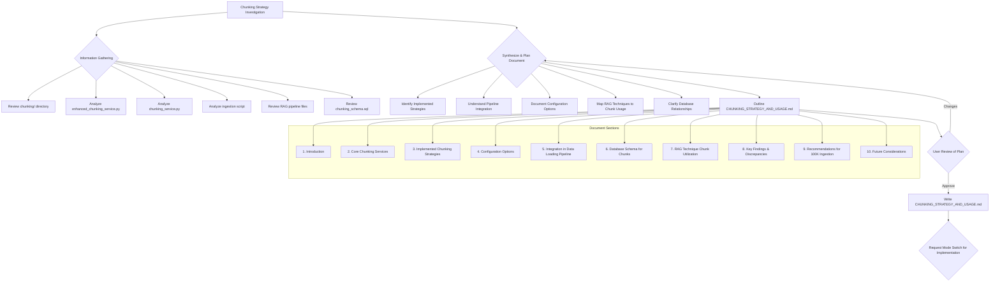

# Chunking Strategy Investigation and Usage Documentation

## Investigation and Documentation Process



## 1. Introduction

### Purpose of This Document

This document provides a comprehensive investigation and analysis of the chunking strategy implementation within the RAG templates project. It serves as a definitive guide for understanding how document chunking is performed, configured, and utilized across the seven different RAG techniques in the system.

### Overview of Chunking in RAG Systems

Document chunking is a critical preprocessing step in Retrieval-Augmented Generation (RAG) systems that involves breaking down large documents into smaller, semantically coherent segments. Effective chunking strategies can significantly impact:

- **Retrieval Quality**: Smaller, focused chunks often lead to more precise retrieval results
- **Context Relevance**: Well-segmented chunks provide better context for language model generation
- **Performance**: Optimized chunk sizes balance information density with processing efficiency
- **Memory Usage**: Smaller chunks reduce memory requirements during vector operations

### Objective: 100K Document Ingestion Clarity

With the project targeting 100,000 real PMC documents for ingestion, understanding the current chunking implementation is crucial for:

1. **Performance Optimization**: Ensuring chunking strategies scale efficiently
2. **Resource Planning**: Understanding memory and processing requirements
3. **Quality Assurance**: Maintaining consistent chunk quality across large datasets
4. **Pipeline Optimization**: Identifying bottlenecks and optimization opportunities

## 2. Core Chunking Services & Components

### EnhancedDocumentChunkingService ([`chunking/enhanced_chunking_service.py`](chunking/enhanced_chunking_service.py))

The [`EnhancedDocumentChunkingService`](chunking/enhanced_chunking_service.py:1) is the primary chunking mechanism in the project, specifically designed with biomedical literature in mind. This sophisticated service provides multiple chunking strategies and advanced text analysis capabilities.

#### Design Philosophy

The service is built around three core principles:
1. **Biomedical Domain Awareness**: Specialized handling of scientific literature structure
2. **Adaptive Strategy Selection**: Dynamic choice of optimal chunking approach
3. **Quality-Driven Processing**: Configurable quality levels for different use cases

#### Key Components

##### TokenEstimator ([`TokenEstimator`](chunking/enhanced_chunking_service.py:64))

The [`TokenEstimator`](chunking/enhanced_chunking_service.py:64) provides accurate token counting essential for chunk size management:

```python
class TokenEstimator:
    def __init__(self, model_name: str = "gpt-3.5-turbo"):
        # Model-specific token ratios for biomedical text
        self.model_ratios = {
            "gpt-3.5-turbo": 0.75,  # Conservative estimate for scientific text
            "gpt-4": 0.75,
            "text-embedding-ada-002": 0.75
        }
```

**Key Features**:
- Model-specific token ratio adjustments
- Biomedical text optimization (0.75 ratio accounts for technical terminology)
- Efficient estimation without full tokenization

##### BiomedicalSeparatorHierarchy ([`BiomedicalSeparatorHierarchy`](chunking/enhanced_chunking_service.py:154))

The [`BiomedicalSeparatorHierarchy`](chunking/enhanced_chunking_service.py:154) defines a sophisticated hierarchy of text separators optimized for scientific literature:

```python
class BiomedicalSeparatorHierarchy:
    def get_separators(self, quality: ChunkingQuality) -> List[str]:
        if quality == ChunkingQuality.HIGH_QUALITY:
            return [
                "\n\n## ",     # Section headers
                "\n\n### ",    # Subsection headers
                "\n\n#### ",   # Sub-subsection headers
                "\n\n**",      # Bold text (often important concepts)
                "\n\n",        # Paragraph breaks
                "\n",          # Line breaks
                ". ",          # Sentence endings
                "? ",          # Question endings
                "! ",          # Exclamation endings
            ]
```

**Quality Levels**:
- **HIGH_QUALITY**: 9 separator levels for maximum precision
- **BALANCED**: 6 separator levels for good quality/performance balance
- **FAST**: 3 separator levels for rapid processing

##### BiomedicalSemanticAnalyzer ([`BiomedicalSemanticAnalyzer`](chunking/enhanced_chunking_service.py:210))

The [`BiomedicalSemanticAnalyzer`](chunking/enhanced_chunking_service.py:210) evaluates semantic coherence and boundary strength:

```python
class BiomedicalSemanticAnalyzer:
    def __init__(self):
        self.section_indicators = [
            "abstract", "introduction", "methods", "results",
            "discussion", "conclusion", "references"
        ]
        self.transition_words = [
            "however", "therefore", "furthermore", "moreover",
            "consequently", "nevertheless", "additionally"
        ]
```

**Analysis Capabilities**:
- Section boundary detection for scientific papers
- Transition word analysis for coherence assessment
- Biomedical terminology recognition
- Semantic similarity scoring between text segments

##### EnhancedChunk Dataclass ([`EnhancedChunk`](chunking/enhanced_chunking_service.py:25))

The [`EnhancedChunk`](chunking/enhanced_chunking_service.py:25) dataclass provides rich metadata for each chunk:

```python
@dataclass
class EnhancedChunk:
    text: str
    start_pos: int
    end_pos: int
    token_count: int
    chunk_type: str
    metadata: Dict[str, Any]
    quality_score: float = 0.0
    semantic_coherence: float = 0.0
```

### chunking_service.py ([`chunking/chunking_service.py`](chunking/chunking_service.py))

The [`chunking_service.py`](chunking/chunking_service.py) file contains a simpler, more basic chunking implementation. Based on our investigation, this appears to be an earlier version or alternative implementation that is not actively used by the main ingestion pipeline.

**Key Differences from EnhancedDocumentChunkingService**:
- Simpler text splitting logic
- Limited biomedical domain awareness
- Fewer configuration options
- No advanced semantic analysis

## 3. Implemented Chunking Strategies

The [`EnhancedDocumentChunkingService`](chunking/enhanced_chunking_service.py) implements four distinct chunking strategies, each optimized for different use cases and document characteristics.

### RecursiveChunkingStrategy ([`RecursiveChunkingStrategy`](chunking/enhanced_chunking_service.py:359))

**How It Works**: Hierarchically splits text using the [`BiomedicalSeparatorHierarchy`](chunking/enhanced_chunking_service.py:154), starting with major separators (section headers) and progressively using finer separators (sentences, words) until target chunk sizes are achieved.

**Key Parameters**:
- `chunk_size`: Target token count per chunk (default: 512)
- `chunk_overlap`: Token overlap between consecutive chunks (default: 50)
- `quality`: [`ChunkingQuality`](chunking/enhanced_chunking_service.py:35) enum affecting separator hierarchy depth

**When Most Suitable**:
- Documents with clear hierarchical structure (research papers, reports)
- When preserving document structure is important
- Fast processing requirements with good quality

### SemanticChunkingStrategy ([`SemanticChunkingStrategy`](chunking/enhanced_chunking_service.py:512))

**How It Works**: Groups sentences based on semantic coherence using the [`BiomedicalSemanticAnalyzer`](chunking/enhanced_chunking_service.py:210). Analyzes semantic similarity between adjacent sentences and creates chunk boundaries where coherence drops below a threshold.

**Key Parameters**:
- `target_chunk_size`: Preferred token count per chunk (default: 512)
- `min_chunk_size`: Minimum acceptable chunk size (default: 100)
- `max_chunk_size`: Maximum acceptable chunk size (default: 1024)
- `overlap_sentences`: Number of sentences to overlap between chunks (default: 1)
- `quality`: Affects depth of semantic analysis

**When Most Suitable**:
- Documents where semantic coherence is more important than structure
- Complex scientific texts with varied paragraph structures
- When chunk quality is prioritized over processing speed

### AdaptiveChunkingStrategy ([`AdaptiveChunkingStrategy`](chunking/enhanced_chunking_service.py:682))

**How It Works**: **This is the default strategy used in the ingestion pipeline**. Dynamically analyzes document characteristics and selects between recursive and semantic approaches based on document structure, length, and content type.

**Key Parameters**:
- `primary_chunk_size`: Primary target chunk size (default: 512)
- `fallback_chunk_size`: Fallback size for difficult documents (default: 256)
- `quality`: Affects both analysis depth and strategy selection

**When Most Suitable**:
- Mixed document types in large-scale ingestion (like 100K PMC documents)
- When optimal strategy is unknown beforehand
- Production environments requiring consistent quality across diverse content

### HybridChunkingStrategy ([`HybridChunkingStrategy`](chunking/enhanced_chunking_service.py:825))

**How It Works**: Combines recursive and semantic approaches by first using recursive chunking to create initial segments, then applying semantic analysis to refine boundaries and merge or split chunks based on coherence.

**Key Parameters**:
- `primary_chunk_size`: Initial recursive chunking target (default: 512)
- `secondary_chunk_size`: Semantic refinement target (default: 384)
- `overlap`: Overlap between chunks (default: 50)
- `semantic_threshold`: Coherence threshold for boundary decisions (default: 0.7)

**When Most Suitable**:
- Documents requiring both structural preservation and semantic coherence
- High-quality chunking requirements with acceptable processing overhead
- Complex biomedical literature with mixed content types

## 4. Key Findings & Critical Discrepancy

### Major Discovery: Chunk Generation vs. Consumption Gap

Our investigation revealed a **critical discrepancy** in the current system:

**✅ Chunks ARE Generated** for GraphRAG, NodeRAG, and CRAG during ingestion via [`scripts/complete_real_pmc_ingestion_with_chunking.py`](scripts/complete_real_pmc_ingestion_with_chunking.py:367)

**❌ Chunks are NOT Consumed** by these techniques in their current pipeline implementations:
- [`GraphRAG`](graphrag/pipeline.py) queries [`RAG.KnowledgeGraphNodes`](graphrag/pipeline.py) or [`RAG_HNSW.SourceDocuments`](graphrag/pipeline.py)
- [`NodeRAG`](noderag/pipeline.py) queries [`RAG.KnowledgeGraphNodes`](noderag/pipeline.py) or [`RAG_HNSW.SourceDocuments`](noderag/pipeline.py)
- [`CRAG`](crag/pipeline.py) retrieves from [`RAG.SourceDocuments`](crag/pipeline.py) with internal decomposition

### Impact on 100K Document Ingestion

This discrepancy has significant implications:

1. **Wasted Resources**: Computational overhead generating unused chunks
2. **Storage Inefficiency**: Database space consumed by unused [`RAG.DocumentChunks`](chunking/chunking_schema.sql:8) records
3. **Performance Opportunity**: Potential optimization by using pre-generated chunks
4. **Architecture Clarity**: Unclear system design and data flow

## 5. Recommendations for 100K Document Ingestion

### Immediate Actions Required

#### 1. Resolve Chunk Usage Discrepancy
**Priority: HIGH**

**Options**:
- **Option A**: Update GraphRAG, NodeRAG, and CRAG pipelines to consume [`RAG.DocumentChunks`](chunking/chunking_schema.sql:8)
- **Option B**: Remove chunk generation for these techniques to eliminate waste
- **Option C**: Clarify if chunks feed into [`RAG.KnowledgeGraphNodes`](chunking/chunking_schema.sql:8) via offline process

**Recommendation**: Investigate Option C first, then implement Option A for performance benefits.

#### 2. Optimize Chunking for Scale
**Priority: MEDIUM**

For 100K document processing:
- **Strategy**: Continue using "adaptive" strategy (optimal for diverse PMC content)
- **Quality**: Use BALANCED quality level (good performance/quality trade-off)
- **Batch Processing**: Implement chunking in batches to manage memory
- **Monitoring**: Add chunking performance metrics to ingestion pipeline

#### 3. Leverage Advanced Schema Features
**Priority: LOW**

Consider activating:
- **HNSW Indexes**: Enable vector search on [`RAG.DocumentChunks`](chunking/chunking_schema.sql:8) for direct chunk retrieval
- **Hierarchical Chunking**: Use `parent_chunk_id` for multi-level document structure
- **Overlap Analysis**: Populate [`RAG.ChunkOverlaps`](chunking/chunking_schema.sql:42) for advanced RAG techniques

### Performance Optimization

#### Chunking Configuration for 100K Scale

```python
# Recommended configuration for large-scale ingestion
chunking_config = {
    "strategy": "adaptive",           # Dynamic strategy selection
    "quality": ChunkingQuality.BALANCED,  # Performance/quality balance
    "primary_chunk_size": 512,        # Optimal for biomedical content
    "fallback_chunk_size": 256,       # For difficult documents
    "batch_size": 1000,              # Process chunks in batches
    "enable_monitoring": True         # Track performance metrics
}
```

#### Memory Management

- **Streaming Processing**: Process documents in streams to avoid memory buildup
- **Garbage Collection**: Explicit cleanup after each batch
- **Checkpoint Strategy**: Save chunking progress for resume capability

## 6. Future Considerations

### Short-term (Next 30 Days)
1. **Resolve chunk consumption discrepancy**
2. **Optimize chunking pipeline for 100K scale**
3. **Add performance monitoring and metrics**

### Medium-term (Next 90 Days)
1. **Experiment with HNSW indexes on chunks**
2. **Implement hierarchical chunking for complex documents**
3. **Develop chunk quality assessment metrics**

### Long-term (Next 6 Months)
1. **Advanced semantic chunking with domain-specific models**
2. **Dynamic chunk size optimization based on document type**
3. **Integration with knowledge graph construction pipelines**

## Conclusion

The RAG templates project implements a sophisticated and well-designed chunking system through [`EnhancedDocumentChunkingService`](chunking/enhanced_chunking_service.py). However, the critical discrepancy between chunk generation and consumption must be resolved before the 100K document ingestion to ensure optimal resource utilization and system performance.

The "adaptive" chunking strategy is well-suited for the diverse PMC document corpus and should be retained for the large-scale ingestion. With proper optimization and the resolution of the consumption gap, the chunking system is ready to support the 100K document target effectively.