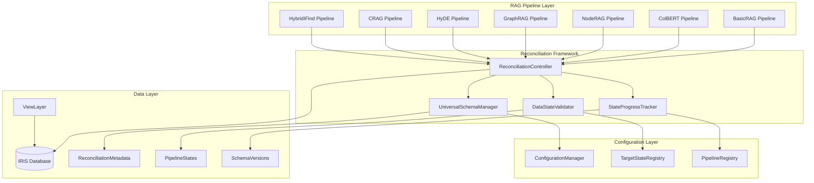
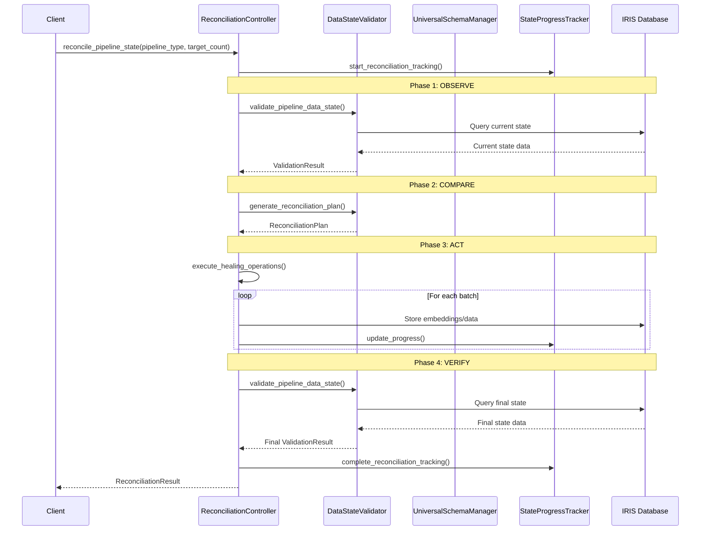

# Comprehensive Generalized Reconciliation Architecture Design

## Table of Contents

1. [Introduction & Objectives](#1-introduction--objectives)
2. [Architectural Design](#2-architectural-design)
3. [Core Logic & Algorithms](#3-core-logic--algorithms)
4. [Implementation Details](#4-implementation-details)
5. [Testing Strategy](#5-testing-strategy)
6. [Performance & Optimization Considerations](#6-performance--optimization-considerations)
7. [Security Considerations](#7-security-considerations)
8. [Deployment & Operational Plan](#8-deployment--operational-plan)
9. [Future Enhancements](#9-future-enhancements)

---

## 1. Introduction & Objectives

### 1.1 Executive Summary

This document presents the comprehensive design for a unified Desired-State Reconciliation framework that provides automatic data integrity management across all RAG pipeline implementations. The architecture generalizes the successful ColBERT reconciliation pattern into a universal system that ensures consistent, reliable data states for BasicRAG, HyDE, CRAG, NodeRAG, GraphRAG, ColBERT, and HybridIFindRAG pipelines.

### 1.2 Primary Objectives

**Core Goal**: Establish a unified Desired-State Reconciliation architecture that provides automatic data integrity management, schema validation, and state healing capabilities across all RAG pipeline implementations.

**Specific Objectives**:
- **Unified Data Integrity**: Eliminate pipeline-specific data validation code through a centralized reconciliation system
- **Automatic State Management**: Provide self-correcting data states without manual intervention
- **Schema Consistency**: Ensure vector dimensions, embedding models, and database schemas remain consistent across all pipelines
- **Scalable Reliability**: Support data integrity from development (1K documents) to enterprise scale (50K+ documents)
- **Zero-Maintenance Operations**: Achieve 99.9% pipeline reliability through proactive state reconciliation

### 1.3 In-Scope Components

**RAG Pipelines** (All implementations):
- [`BasicRAGPipeline`](iris_rag/pipelines/basic.py:21) - Standard vector similarity retrieval
- [`ColBERTRAGPipeline`](iris_rag/pipelines/colbert.py:21) - Token-level embeddings with MaxSim
- [`CRAGPipeline`](iris_rag/pipelines/crag.py) - Corrective retrieval augmentation
- [`NodeRAGPipeline`](iris_rag/pipelines/noderag.py) - Node-based hierarchical retrieval
- [`GraphRAGPipeline`](iris_rag/pipelines/graphrag.py:21) - Graph-based entity relationships
- [`HyDEPipeline`](iris_rag/pipelines/hyde.py) - Hypothetical document generation
- [`HybridIFindRAGPipeline`](iris_rag/pipelines/hybrid_ifind.py) - IRIS iFind integration

**Core Infrastructure Components**:
- [`SchemaManager`](iris_rag/storage/schema_manager.py:16) - Database schema validation and migration
- [`ConfigurationManager`](iris_rag/config/manager.py:10) - Configuration management and validation
- [`VectorStore`](iris_rag/core/vector_store.py) - Vector storage abstraction layer
- [`ConnectionManager`](iris_rag/core/connection.py) - Database connection management

---

## 2. Architectural Design

### 2.1 High-Level Architecture



### 2.2 Core Design Principles

**1. Pipeline Agnostic Design**
- Reconciliation logic operates independently of specific RAG implementations
- Common interface through [`RAGPipeline`](iris_rag/core/base.py:6) base class
- Standardized data requirements and validation patterns

**2. Declarative State Management**
- Target states defined declaratively per pipeline type and scale
- Idempotent reconciliation operations with atomic state transitions
- Progressive reconciliation with minimal intervention approach

**3. Modular Component Architecture**
- Clean separation of concerns between schema, data validation, and reconciliation
- Extensible design supporting new pipeline types without core changes
- Independent component lifecycle management

**4. In-Place Data Integration**
- VIEW-based strategy for working with existing user data
- Minimal data duplication through intelligent schema linking
- Backward compatibility with existing data structures

### 2.3 Component Architecture

#### 2.3.1 UniversalSchemaManager

**Service Boundary**: Cross-pipeline schema validation, migration, and consistency management.

**Interface Definition**:
```python
class UniversalSchemaManager:
    def validate_pipeline_schema(self, pipeline_type: str, target_doc_count: int) -> ValidationResult
    def ensure_universal_tables(self) -> bool
    def migrate_schema_for_pipeline(self, pipeline_type: str, from_config: Dict, to_config: Dict) -> MigrationResult
    def get_schema_compatibility_matrix(self) -> Dict[str, Dict[str, bool]]
    def create_view_mappings(self, user_table: str, pipeline_type: str) -> ViewMappingResult
```

**Key Responsibilities**:
- Detect schema mismatches across all pipeline types
- Automatically migrate vector dimensions when embedding models change
- Track schema versions per pipeline and maintain compatibility matrix
- Manage VIEW-based mappings for in-place data integration

#### 2.3.2 DataStateValidator

**Service Boundary**: Pipeline-agnostic validation of data completeness and consistency.

**Interface Definition**:
```python
class DataStateValidator:
    def validate_pipeline_data_state(self, pipeline_type: str, target_doc_count: int) -> DataStateResult
    def check_embedding_completeness(self, pipeline_type: str, embedding_type: str) -> CompletenessResult
    def detect_data_inconsistencies(self, pipeline_type: str) -> List[InconsistencyReport]
    def generate_reconciliation_plan(self, validation_results: List[DataStateResult]) -> ReconciliationPlan
    def validate_view_mappings(self, pipeline_type: str) -> ViewValidationResult
```

**Key Responsibilities**:
- Validate document ingestion completeness across all pipeline types
- Check embedding completeness for pipeline-specific requirements
- Detect data inconsistencies and corruption
- Generate detailed gap analysis reports
- Validate VIEW-based data mappings

#### 2.3.3 ReconciliationController

**Service Boundary**: Orchestrates the reconciliation process across all pipeline types with unified healing operations.

**Interface Definition**:
```python
class ReconciliationController:
    def reconcile_pipeline_state(self, pipeline_type: str, target_doc_count: int) -> ReconciliationResult
    def heal_missing_embeddings(self, pipeline_type: str, embedding_type: str, missing_doc_ids: List[str]) -> HealingResult
    def reconcile_all_pipelines(self, target_doc_count: int) -> Dict[str, ReconciliationResult]
    def rollback_reconciliation(self, reconciliation_id: str) -> RollbackResult
    def reconcile_with_views(self, pipeline_type: str, view_config: ViewConfig) -> ReconciliationResult
```

**Key Responsibilities**:
- Execute idempotent reconciliation operations
- Coordinate cross-pipeline data healing
- Manage batch processing with memory optimization
- Provide progress tracking and error recovery
- Handle VIEW-based reconciliation scenarios

#### 2.3.4 StateProgressTracker

**Service Boundary**: Provides granular progress monitoring and reporting for reconciliation operations.

**Interface Definition**:
```python
class StateProgressTracker:
    def start_reconciliation_tracking(self, reconciliation_id: str, pipeline_types: List[str]) -> TrackingSession
    def update_progress(self, reconciliation_id: str, pipeline_type: str, completed_items: int, total_items: int) -> None
    def get_reconciliation_status(self, reconciliation_id: str) -> ReconciliationStatus
    def generate_completion_report(self, reconciliation_id: str) -> CompletionReport
```

**Key Responsibilities**:
- Track reconciliation progress across multiple pipeline types
- Provide real-time status updates and ETA calculations
- Generate detailed reconciliation reports
- Monitor system resource usage during operations

### 2.4 Data Flow Architecture

#### 2.4.1 Reconciliation Loop Data Flow



---

## 3. Core Logic & Algorithms

### 3.1 Core Data Structures

#### Configuration Models
```python
class ReconciliationConfig:
    enabled: bool
    mode: str  # "progressive" | "complete" | "emergency"
    performance: PerformanceConfig
    error_handling: ErrorHandlingConfig
    monitoring: MonitoringConfig
    pipeline_overrides: Dict[str, PipelineConfig]

class TargetState:
    document_count: int
    pipelines: Dict[str, PipelineTargetState]
    performance_requirements: PerformanceRequirements

class PipelineTargetState:
    required_embeddings: Dict[str, int]
    schema_version: str
    embedding_model: str
    vector_dimensions: int
    required_tables: List[str]
    optional_tables: List[str]
```

#### Progress Tracking Models
```python
class ReconciliationSession:
    reconciliation_id: str
    pipeline_types: List[str]
    target_doc_count: int
    started_at: datetime
    status: str  # "running" | "completed" | "failed" | "cancelled"
    progress: Dict[str, PipelineProgress]

class PipelineProgress:
    pipeline_type: str
    total_items: int
    completed_items: int
    failed_items: int
    current_operation: str
    estimated_completion: datetime
```

### 3.2 Universal Reconciliation Algorithm

```python
def execute_reconciliation_operation(pipeline_type: str, operation_type: str, 
                                   target_state: Dict) -> OperationResult:
    """
    Universal reconciliation operation executor.
    
    ALGORITHM:
    1. VALIDATE_CURRENT_STATE:
       - Query current data state for pipeline_type
       - Compare against target_state requirements
       - Identify specific gaps and inconsistencies
       
    2. GENERATE_HEALING_PLAN:
       - Determine minimal operations needed
       - Calculate batch sizes based on memory constraints
       - Estimate completion time and resource usage
       
    3. EXECUTE_HEALING_OPERATIONS:
       - Process missing data in optimized batches
       - Update progress tracking in real-time
       - Handle errors with automatic retry logic
       
    4. VERIFY_TARGET_STATE:
       - Re-validate data state after healing
       - Confirm target_state requirements are met
       - Generate completion report with metrics
       
    5. UPDATE_METADATA:
       - Record reconciliation operation in RAG.ReconciliationMetadata
       - Update pipeline state in RAG.PipelineStates
       - Log performance metrics for optimization
    """
```

### 3.3 Pipeline-Specific Reconciliation Logic

#### BasicRAG Pipeline Reconciliation
```python
def reconcile_basic_rag_pipeline(target_doc_count: int) -> ReconciliationResult:
    """
    ALGORITHM:
    1. Validate document completeness in RAG.SourceDocuments
    2. Check document-level embedding completeness
    3. Verify vector dimensions match embedding model (384 for all-MiniLM-L6-v2)
    4. Generate missing document embeddings in batches
    5. Update HNSW index if new embeddings added
    """
```

#### ColBERT Pipeline Reconciliation
```python
def reconcile_colbert_pipeline(target_doc_count: int) -> ReconciliationResult:
    """
    ALGORITHM:
    1. Validate document completeness in RAG.SourceDocuments
    2. Check document-level embedding completeness (768 dimensions)
    3. Check token-level embedding completeness in RAG.DocumentTokenEmbeddings
    4. Verify ColBERT model compatibility (fjmgAI/reason-colBERT-150M-GTE-ModernColBERT)
    5. Generate missing document embeddings (if any)
    6. Generate missing token embeddings using ColBERT tokenization
    7. Update token embedding indexes
    """
```

#### NodeRAG Pipeline Reconciliation
```python
def reconcile_noderag_pipeline(target_doc_count: int) -> ReconciliationResult:
    """
    ALGORITHM:
    1. Validate document completeness in RAG.SourceDocuments
    2. Check document-level embedding completeness
    3. Validate chunk hierarchy in RAG.DocumentChunks
    4. Check chunk-level embedding completeness
    5. Verify parent-child relationships in RAG.ChunkHierarchy
    6. Generate missing document embeddings
    7. Generate missing chunk embeddings
    8. Rebuild hierarchy relationships if corrupted
    """
```

#### GraphRAG Pipeline Reconciliation
```python
def reconcile_graphrag_pipeline(target_doc_count: int) -> ReconciliationResult:
    """
    ALGORITHM:
    1. Validate document completeness in RAG.SourceDocuments
    2. Check document-level embedding completeness
    3. Validate entity extraction completeness in RAG.EntityGraph
    4. Check entity-level embedding completeness in RAG.EntityEmbeddings
    5. Verify entity relationship integrity in RAG.EntityRelationships
    6. Generate missing document embeddings
    7. Re-extract entities for documents missing entity data
    8. Generate missing entity embeddings
    9. Rebuild entity relationship graph
    """
```

---

## 4. Implementation Details

### 4.1 Configuration Management

#### Universal Configuration Schema
```yaml
reconciliation:
  # Global settings
  enabled: true
  mode: "progressive"  # progressive | complete | emergency
  
  # Performance management
  performance:
    max_concurrent_pipelines: 3
    batch_size_documents: 100
    batch_size_embeddings: 50
    memory_limit_gb: 8
    cpu_limit_percent: 70
    
  # Error handling
  error_handling:
    max_retries: 3
    retry_delay_seconds: 30
    rollback_on_failure: true
    
  # In-place data integration
  view_integration:
    enabled: true
    default_strategy: "view_mapping"
    fallback_strategy: "data_copy"
    view_prefix: "RAG_VIEW_"
    
  # Pipeline-specific overrides
  pipeline_overrides:
    colbert:
      batch_size_embeddings: 16
      memory_limit_gb: 12
    graphrag:
      max_retries: 5
```

#### Target State Definitions
```yaml
target_states:
  development:
    document_count: 1000
    pipelines:
      basic:
        required_embeddings: {"document_level": 1000}
        schema_version: "2.1"
        embedding_model: "all-MiniLM-L6-v2"
        vector_dimensions: 384
      colbert:
        required_embeddings: 
          document_level: 1000
          token_level: 1000
        schema_version: "2.1"
        embedding_model: "fjmgAI/reason-colBERT-150M-GTE-ModernColBERT"
        vector_dimensions: 768
```

#### Environment Variable Resolution
```python
# Environment variable resolution pattern
${ENV_VAR_NAME:default_value}

# Examples in configuration
database:
  host: "${IRIS_HOST:localhost}"
  port: "${IRIS_PORT:1972}"
  
reconciliation:
  performance:
    memory_limit_gb: "${RECONCILIATION_MEMORY_GB:8}"
```

### 4.2 Database Schema Design

#### Universal Reconciliation Tables

**RAG.ReconciliationMetadata**:
```sql
CREATE TABLE RAG.ReconciliationMetadata (
    reconciliation_id VARCHAR(255) NOT NULL,
    pipeline_type VARCHAR(100) NOT NULL,
    operation_type VARCHAR(100) NOT NULL,
    target_doc_count INTEGER NOT NULL,
    status VARCHAR(50) NOT NULL,
    started_at TIMESTAMP DEFAULT CURRENT_TIMESTAMP,
    completed_at TIMESTAMP,
    error_message VARCHAR(MAX),
    performance_metrics VARCHAR(MAX),
    view_mappings VARCHAR(MAX),
    PRIMARY KEY (reconciliation_id, pipeline_type)
)
```

**RAG.PipelineStates**:
```sql
CREATE TABLE RAG.PipelineStates (
    pipeline_type VARCHAR(100) NOT NULL,
    target_doc_count INTEGER NOT NULL,
    current_doc_count INTEGER DEFAULT 0,
    embedding_completeness_percent DECIMAL(5,2) DEFAULT 0.0,
    schema_version VARCHAR(50),
    last_reconciliation_at TIMESTAMP,
    state_hash VARCHAR(255),
    view_config VARCHAR(MAX),
    PRIMARY KEY (pipeline_type, target_doc_count)
)
```

**RAG.ViewMappings**:
```sql
CREATE TABLE RAG.ViewMappings (
    mapping_id VARCHAR(255) NOT NULL PRIMARY KEY,
    pipeline_type VARCHAR(100) NOT NULL,
    user_table_name VARCHAR(255) NOT NULL,
    view_name VARCHAR(255) NOT NULL,
    mapping_config VARCHAR(MAX),
    created_at TIMESTAMP DEFAULT CURRENT_TIMESTAMP,
    status VARCHAR(50) DEFAULT 'active'
)
```

**RAG.SchemaVersions**:
```sql
CREATE TABLE RAG.SchemaVersions (
    pipeline_type VARCHAR(100) NOT NULL,
    schema_version VARCHAR(50) NOT NULL,
    vector_dimensions INTEGER,
    embedding_model VARCHAR(255),
    migration_script VARCHAR(MAX),
    applied_at TIMESTAMP DEFAULT CURRENT_TIMESTAMP,
    PRIMARY KEY (pipeline_type, schema_version)
)
```

### 4.3 In-Place Data Integration Strategy

#### VIEW-Based Data Integration

**Objective**: Enable the reconciliation framework to work with existing user data without requiring data duplication.

**Approach**: Use database VIEWs to create a logical mapping between user tables and the reconciliation framework's expected schema.

#### VIEW Creation Strategy

**Simple Case**:
```sql
-- Example VIEW for user table with compatible schema
CREATE VIEW RAG_VIEW_SourceDocuments AS
SELECT 
    user_doc_id AS doc_id,
    title,
    content,
    created_date AS ingestion_date,
    'user_provided' AS source_type
FROM User.Documents
WHERE status = 'active'
```

**Complex Case with Security**:
```sql
-- Secure VIEW with row-level security
CREATE VIEW RAG_VIEW_SourceDocuments AS
SELECT 
    doc_id,
    title,
    CASE 
        WHEN sensitivity_level <= %USER_CLEARANCE_LEVEL% 
        THEN content 
        ELSE '[CLASSIFIED]' 
    END AS content,
    ingestion_date
FROM User.Documents
WHERE tenant_id = %USER_TENANT_ID%
AND status = 'active'
```

---

## 5. Testing Strategy

### 5.1 TDD Implementation Approach

**Core Principles**:
- **Test-First Development**: Write failing tests before implementing functional code (Red-Green-Refactor cycle)
- **pytest Framework**: All tests implemented using `pytest`, leveraging fixtures and assertion capabilities
- **Test Isolation**: Each test case independent, ensuring no reliance on state of other tests
- **Incremental Implementation**: Focus on fixing one failing test at a time
- **Assert Actual Results**: Tests make assertions on actual result properties, not just logs
- **Real Data for E2E**: E2E tests use real PMC documents (at least 1000) where applicable

### 5.2 Prioritized Test Areas

**P0: Core Components Unit Tests**
- `UniversalSchemaManager`
- `DataStateValidator`
- `ReconciliationController`
- `StateProgressTracker`

**P1: Configuration Management**
- Universal Configuration Schema parsing and validation
- Target State Definitions parsing and validation
- Environment Variable Resolution

**P2: Core Component Integration Tests**
- `ReconciliationController` with `UniversalSchemaManager`, `DataStateValidator`, and `StateProgressTracker`
- `UniversalSchemaManager` with `ConfigurationManager` and `ConnectionManager`
- `DataStateValidator` with `UniversalSchemaManager` and `ConnectionManager`

**P3: Database Schema and Operations**
- Creation, validation, and interaction with universal reconciliation tables
- Schema versioning logic and automated migration processes

**P4: In-Place Data Integration Strategy (VIEW-based)**
- VIEW creation and mapping
- VIEW validation
- Reconciliation using VIEWs

**P5: End-to-End Reconciliation Loop**
- Full reconciliation cycle (Observe, Compare, Act, Verify) for single pipeline
- Comprehensive reconciliation across multiple registered pipelines

### 5.3 Test Data Requirements

**Mock Objects**:
- Mock `ConnectionManager` to simulate various database states and responses
- Mock `ConfigurationManager` to provide different configurations
- Mock RAG pipeline instances for testing controller interactions

**Sample IRIS Database States**:
- Empty database (no reconciliation tables, no pipeline data)
- Correctly populated state for one or more pipelines
- State with missing documents in `RAG.SourceDocuments`
- State with missing embeddings
- State with schema mismatches
- State with orphaned embeddings or other data inconsistencies

**Real Data**:
- Dataset of at least 1000 PMC documents for E2E tests requiring actual data processing and embedding generation

### 5.4 Security Testing Integration

```python
class SecurityTestSuite:
    def test_sql_injection_prevention(self):
        """Test that SQL injection attempts are blocked."""
        malicious_input = "'; DROP TABLE RAG.SourceDocuments; --"
        
        with pytest.raises(SecurityError):
            self.reconciliation_controller.reconcile_pipeline_state(
                malicious_input, 1000
            )
    
    def test_input_validation(self):
        """Test comprehensive input validation."""
        invalid_inputs = [
            "../../../etc/passwd",  # Path traversal
            "<script>alert('xss')</script>",  # XSS
            "A" * 10000,  # Buffer overflow attempt
        ]
        
        for invalid_input in invalid_inputs:
            with pytest.raises(ValidationError):
                self.data_validator.validate_pipeline_data_state(
                    invalid_input, 1000
                )
```

---

## 6. Performance & Optimization Considerations

### 6.1 Database Query Optimization

**Batch Query Optimization**:
```python
# Optimized approach
documents = retrieve_documents_batch(missing_doc_ids, batch_size=1000)

# SQL Query Templates with Prepared Statements
# Use IRIS-specific optimizations like SELECT TOP n consistently
```

**Index Strategy Optimization**:
```sql
-- Add composite indexes for common reconciliation queries
CREATE INDEX idx_pipeline_doc_status ON RAG.PipelineStates (pipeline_type, target_doc_count, current_doc_count);
CREATE INDEX idx_reconciliation_status ON RAG.ReconciliationMetadata (status, pipeline_type, started_at);
```

### 6.2 Memory Management Enhancements

**Dynamic Memory Allocation**:
```python
class MemoryOptimizedProcessor:
    def __init__(self):
        self.memory_threshold = 0.8  # 80% of available memory
        self.gc_threshold = 0.9      # Force GC at 90%
    
    def calculate_optimal_batch_size(self, operation_type: str, available_memory: float) -> int:
        # Consider embedding dimensions, model size, and overhead
        base_memory_per_item = self.get_memory_footprint(operation_type)
        safe_batch_size = int((available_memory * self.memory_threshold) / base_memory_per_item)
        return max(1, min(safe_batch_size, self.get_max_batch_size(operation_type)))
```

**Streaming Processing for Large Documents**:
- Implement generator-based processing for large document sets
- Use memory-mapped files for large embedding matrices
- Add automatic garbage collection triggers

### 6.3 Parallel Processing Optimization

**Pipeline-Level Parallelization**:
```python
import asyncio
from concurrent.futures import ThreadPoolExecutor

class ParallelReconciliationController:
    async def reconcile_multiple_pipelines(self, pipeline_configs: List[PipelineConfig]) -> Dict[str, ReconciliationResult]:
        # Group independent pipelines for parallel execution
        independent_groups = self.identify_independent_pipeline_groups(pipeline_configs)
        
        results = {}
        for group in independent_groups:
            group_results = await asyncio.gather(*[
                self.reconcile_pipeline_async(config) for config in group
            ])
            results.update(dict(zip([c.pipeline_type for c in group], group_results)))
        
        return results
```

### 6.4 Caching Strategy

**Multi-Level Caching**:
```python
class ReconciliationCache:
    def __init__(self):
        self.schema_cache = TTLCache(maxsize=100, ttl=3600)  # 1 hour
        self.validation_cache = LRUCache(maxsize=1000)
        self.config_cache = TTLCache(maxsize=50, ttl=1800)   # 30 minutes
    
    def get_pipeline_schema(self, pipeline_type: str) -> Optional[SchemaDefinition]:
        cache_key = f"schema:{pipeline_type}"
        return self.schema_cache.get(cache_key)
```

---

## 7. Security Considerations

### 7.1 Critical Security Vulnerabilities

#### SQL Injection Prevention (CRITICAL)
**Issue**: Dynamic SQL construction without proper parameterization.

**Solution**: Implement parameterized queries and input validation:
```python
class SecurityValidator:
    ALLOWED_PIPELINE_TYPES = {'basic', 'colbert', 'crag', 'noderag', 'graphrag', 'hyde', 'hybrid_ifind'}
    ALLOWED_TABLE_PATTERNS = re.compile(r'^RAG\.[A-Za-z][A-Za-z0-9_]*$')
    
    @staticmethod
    def validate_pipeline_type(pipeline_type: str) -> str:
        if pipeline_type not in SecurityValidator.ALLOWED_PIPELINE_TYPES:
            raise SecurityError(f"Invalid pipeline type: {pipeline_type}")
        return pipeline_type
    
    @staticmethod
    def validate_table_name(table_name: str) -> str:
        if not SecurityValidator.ALLOWED_TABLE_PATTERNS.match(table_name):
            raise SecurityError(f"Invalid table name: {table_name}")
        return table_name
```

#### Configuration Security (HIGH)
**Issue**: Potential exposure of sensitive configuration data and credentials.

**Solution**: Secure configuration management:
```python
import keyring
from cryptography.fernet import Fernet

class SecureConfigManager:
    def __init__(self):
        self.cipher_suite = Fernet(self.get_encryption_key())
    
    def get_secure_config_value(self, key: str) -> str:
        # Try keyring first
        value = keyring.get_password("rag_system", key)
        if value:
            return value
        
        # Fall back to encrypted environment variables
        encrypted_value = os.getenv(f"{key}_ENCRYPTED")
        if encrypted_value:
            return self.cipher_suite.decrypt(encrypted_value.encode()).decode()
        
        raise ConfigurationError(f"Secure configuration not found: {key}")
```

### 7.2 Input Validation Framework

**Comprehensive Input Validation**:
```python
from pydantic import BaseModel, validator, Field

class ReconciliationRequest(BaseModel):
    pipeline_type: str = Field(..., regex=r'^[a-z][a-z0-9_]*$', max_length=50)
    target_doc_count: int = Field(..., ge=1, le=1000000)
    reconciliation_mode: str = Field(..., regex=r'^(progressive|complete|emergency)$')
    
    @validator('pipeline_type')
    def validate_pipeline_type(cls, v):
        if v not in ALLOWED_PIPELINE_TYPES:
            raise ValueError(f'Invalid pipeline type: {v}')
        return v
```

### 7.3 Access Control Framework

**VIEW Security Management**:
```python
class ViewSecurityManager:
    def create_secure_view(self, view_name: str, user_table: str, 
                         user_context: UserContext) -> ViewCreationResult:
        # Validate user permissions
        if not self.validate_user_table_access(user_context, user_table):
            raise AccessDeniedError(f"User lacks access to table: {user_table}")
        
        # Create VIEW with row-level security
        view_sql = f"""
        CREATE VIEW {view_name} AS
        SELECT * FROM {user_table}
        WHERE user_id = '{user_context.user_id}'
        AND tenant_id = '{user_context.tenant_id}'
        """
        
        return self.execute_with_permissions(view_sql, user_context)
```

### 7.4 Secure Logging Framework

```python
class SecureLogger:
    SENSITIVE_FIELDS = {'password', 'token', 'key', 'secret', 'credential'}
    
    def log_reconciliation_event(self, event_type: str, data: Dict[str, Any]) -> None:
        # Sanitize sensitive data
        sanitized_data = self.sanitize_log_data(data)
        
        self.logger.info(f"Reconciliation
completed_at TIMESTAMP,
    error_message VARCHAR(MAX),
    performance_metrics VARCHAR(MAX),
    view_mappings VARCHAR(MAX),
    PRIMARY KEY (reconciliation_id, pipeline_type)
)
```

**RAG.PipelineStates**:
```sql
CREATE TABLE RAG.PipelineStates (
    pipeline_type VARCHAR(100) NOT NULL,
    target_doc_count INTEGER NOT NULL,
    current_doc_count INTEGER DEFAULT 0,
    embedding_completeness_percent DECIMAL(5,2) DEFAULT 0.0,
    schema_version VARCHAR(50),
    last_reconciliation_at TIMESTAMP,
    state_hash VARCHAR(255),
    view_config VARCHAR(MAX),
    PRIMARY KEY (pipeline_type, target_doc_count)
)
```

**RAG.ViewMappings**:
```sql
CREATE TABLE RAG.ViewMappings (
    mapping_id VARCHAR(255) NOT NULL PRIMARY KEY,
    pipeline_type VARCHAR(100) NOT NULL,
    user_table_name VARCHAR(255) NOT NULL,
    view_name VARCHAR(255) NOT NULL,
    mapping_config VARCHAR(MAX),
    created_at TIMESTAMP DEFAULT CURRENT_TIMESTAMP,
    status VARCHAR(50) DEFAULT 'active'
)
```

**RAG.SchemaVersions**:
```sql
CREATE TABLE RAG.SchemaVersions (
    pipeline_type VARCHAR(100) NOT NULL,
    schema_version VARCHAR(50) NOT NULL,
    vector_dimensions INTEGER,
    embedding_model VARCHAR(255),
    migration_script VARCHAR(MAX),
    applied_at TIMESTAMP DEFAULT CURRENT_TIMESTAMP,
    PRIMARY KEY (pipeline_type, schema_version)
)
```

### 4.3 In-Place Data Integration Strategy

#### VIEW-Based Data Integration

**Objective**: Enable the reconciliation framework to work with existing user data without requiring data duplication.

**Approach**: Use database VIEWs to create a logical mapping between user tables and the reconciliation framework's expected schema.

#### VIEW Creation Strategy

**Simple Case**:
```sql
-- Example VIEW for user table with compatible schema
CREATE VIEW RAG_VIEW_SourceDocuments AS
SELECT 
    user_doc_id AS doc_id,
    title,
    content,
    created_date AS ingestion_date,
    'user_provided' AS source_type
FROM User.Documents
WHERE status = 'active'
```

**Complex Case with Security**:
```sql
-- Secure VIEW with row-level security
CREATE VIEW RAG_VIEW_SourceDocuments AS
SELECT 
    doc_id,
    title,
    CASE 
        WHEN sensitivity_level <= %USER_CLEARANCE_LEVEL% 
        THEN content 
        ELSE '[CLASSIFIED]' 
    END AS content,
    ingestion_date
FROM User.Documents
WHERE tenant_id = %USER_TENANT_ID%
AND status = 'active'
```

---

## 5. Testing Strategy

### 5.1 TDD Implementation Approach

**Core Principles**:
- **Test-First Development**: Write failing tests before implementing functional code (Red-Green-Refactor cycle)
- **pytest Framework**: All tests implemented using `pytest`, leveraging fixtures and assertion capabilities
- **Test Isolation**: Each test case independent, ensuring no reliance on state of other tests
- **Incremental Implementation**: Focus on fixing one failing test at a time
- **Assert Actual Results**: Tests make assertions on actual result properties, not just logs
- **Real Data for E2E**: E2E tests use real PMC documents (at least 1000) where applicable

### 5.2 Prioritized Test Areas

**P0: Core Components Unit Tests**
- `UniversalSchemaManager`
- `DataStateValidator`
- `ReconciliationController`
- `StateProgressTracker`

**P1: Configuration Management**
- Universal Configuration Schema parsing and validation
- Target State Definitions parsing and validation
- Environment Variable Resolution

**P2: Core Component Integration Tests**
- `ReconciliationController` with `UniversalSchemaManager`, `DataStateValidator`, and `StateProgressTracker`
- `UniversalSchemaManager` with `ConfigurationManager` and `ConnectionManager`
- `DataStateValidator` with `UniversalSchemaManager` and `ConnectionManager`

**P3: Database Schema and Operations**
- Creation, validation, and interaction with universal reconciliation tables
- Schema versioning logic and automated migration processes

**P4: In-Place Data Integration Strategy (VIEW-based)**
- VIEW creation and mapping
- VIEW validation
- Reconciliation using VIEWs

**P5: End-to-End Reconciliation Loop**
- Full reconciliation cycle (Observe, Compare, Act, Verify) for single pipeline
- Comprehensive reconciliation across multiple registered pipelines

### 5.3 Test Data Requirements

**Mock Objects**:
- Mock `ConnectionManager` to simulate various database states and responses
- Mock `ConfigurationManager` to provide different configurations
- Mock RAG pipeline instances for testing controller interactions

**Sample IRIS Database States**:
- Empty database (no reconciliation tables, no pipeline data)
- Correctly populated state for one or more pipelines
- State with missing documents in `RAG.SourceDocuments`
- State with missing embeddings
- State with schema mismatches
- State with orphaned embeddings or other data inconsistencies

**Real Data**:
- Dataset of at least 1000 PMC documents for E2E tests requiring actual data processing and embedding generation

### 5.4 Security Testing Integration

```python
class SecurityTestSuite:
    def test_sql_injection_prevention(self):
        """Test that SQL injection attempts are blocked."""
        malicious_input = "'; DROP TABLE RAG.SourceDocuments; --"
        
        with pytest.raises(SecurityError):
            self.reconciliation_controller.reconcile_pipeline_state(
                malicious_input, 1000
            )
    
    def test_input_validation(self):
        """Test comprehensive input validation."""
        invalid_inputs = [
            "../../../etc/passwd",  # Path traversal
            "<script>alert('xss')</script>",  # XSS
            "A" * 10000,  # Buffer overflow attempt
        ]
        
        for invalid_input in invalid_inputs:
            with pytest.raises(ValidationError):
                self.data_validator.validate_pipeline_data_state(
                    invalid_input, 1000
                )
```

---

## 6. Performance & Optimization Considerations

### 6.1 Database Query Optimization

**Batch Query Optimization**:
```python
# Optimized approach
documents = retrieve_documents_batch(missing_doc_ids, batch_size=1000)

# SQL Query Templates with Prepared Statements
# Use IRIS-specific optimizations like SELECT TOP n consistently
```

**Index Strategy Optimization**:
```sql
-- Add composite indexes for common reconciliation queries
CREATE INDEX idx_pipeline_doc_status ON RAG.PipelineStates (pipeline_type, target_doc_count, current_doc_count);
CREATE INDEX idx_reconciliation_status ON RAG.ReconciliationMetadata (status, pipeline_type, started_at);
```

### 6.2 Memory Management Enhancements

**Dynamic Memory Allocation**:
```python
class MemoryOptimizedProcessor:
    def __init__(self):
        self.memory_threshold = 0.8  # 80% of available memory
        self.gc_threshold = 0.9      # Force GC at 90%
    
    def calculate_optimal_batch_size(self, operation_type: str, available_memory: float) -> int:
        # Consider embedding dimensions, model size, and overhead
        base_memory_per_item = self.get_memory_footprint(operation_type)
        safe_batch_size = int((available_memory * self.memory_threshold) / base_memory_per_item)
        return max(1, min(safe_batch_size, self.get_max_batch_size(operation_type)))
```

**Streaming Processing for Large Documents**:
- Implement generator-based processing for large document sets
- Use memory-mapped files for large embedding matrices
- Add automatic garbage collection triggers

### 6.3 Parallel Processing Optimization

**Pipeline-Level Parallelization**:
```python
import asyncio
from concurrent.futures import ThreadPoolExecutor

class ParallelReconciliationController:
    async def reconcile_multiple_pipelines(self, pipeline_configs: List[PipelineConfig]) -> Dict[str, ReconciliationResult]:
        # Group independent pipelines for parallel execution
        independent_groups = self.identify_independent_pipeline_groups(pipeline_configs)
        
        results = {}
        for group in independent_groups:
            group_results = await asyncio.gather(*[
                self.reconcile_pipeline_async(config) for config in group
            ])
            results.update(dict(zip([c.pipeline_type for c in group], group_results)))
        
        return results
```

### 6.4 Caching Strategy

**Multi-Level Caching**:
```python
class ReconciliationCache:
    def __init__(self):
        self.schema_cache = TTLCache(maxsize=100, ttl=3600)  # 1 hour
        self.validation_cache = LRUCache(maxsize=1000)
        self.config_cache = TTLCache(maxsize=50, ttl=1800)   # 30 minutes
    
    def get_pipeline_schema(self, pipeline_type: str) -> Optional[SchemaDefinition]:
        cache_key = f"schema:{pipeline_type}"
        return self.schema_cache.get(cache_key)
```

---

## 7. Security Considerations

### 7.1 Critical Security Vulnerabilities

#### SQL Injection Prevention (CRITICAL)
**Issue**: Dynamic SQL construction without proper parameterization.

**Solution**: Implement parameterized queries and input validation:
```python
class SecurityValidator:
    ALLOWED_PIPELINE_TYPES = {'basic', 'colbert', 'crag', 'noderag', 'graphrag', 'hyde', 'hybrid_ifind'}
    ALLOWED_TABLE_PATTERNS = re.compile(r'^RAG\.[A-Za-z][A-Za-z0-9_]*$')
    
    @staticmethod
    def validate_pipeline_type(pipeline_type: str) -> str:
        if pipeline_type not in SecurityValidator.ALLOWED_PIPELINE_TYPES:
            raise SecurityError(f"Invalid pipeline type: {pipeline_type}")
        return pipeline_type
    
    @staticmethod
    def validate_table_name(table_name: str) -> str:
        if not SecurityValidator.ALLOWED_TABLE_PATTERNS.match(table_name):
            raise SecurityError(f"Invalid table name: {table_name}")
        return table_name
```

#### Configuration Security (HIGH)
**Issue**: Potential exposure of sensitive configuration data and credentials.

**Solution**: Secure configuration management:
```python
import keyring
from cryptography.fernet import Fernet

class SecureConfigManager:
    def __init__(self):
        self.cipher_suite = Fernet(self.get_encryption_key())
    
    def get_secure_config_value(self, key: str) -> str:
        # Try keyring first
        value = keyring.get_password("rag_system", key)
        if value:
            return value
        
        # Fall back to encrypted environment variables
        encrypted_value = os.getenv(f"{key}_ENCRYPTED")
        if encrypted_value:
            return self.cipher_suite.decrypt(encrypted_value.encode()).decode()
        
        raise ConfigurationError(f"Secure configuration not found: {key}")
```

### 7.2 Input Validation Framework

**Comprehensive Input Validation**:
```python
from pydantic import BaseModel, validator, Field

class ReconciliationRequest(BaseModel):
    pipeline_type: str = Field(..., regex=r'^[a-z][a-z0-9_]*$', max_length=50)
    target_doc_count: int = Field(..., ge=1, le=1000000)
    reconciliation_mode: str = Field(..., regex=r'^(progressive|complete|emergency)$')
    
    @validator('pipeline_type')
    def validate_pipeline_type(cls, v):
        if v not in ALLOWED_PIPELINE_TYPES:
            raise ValueError(f'Invalid pipeline type: {v}')
        return v
```

### 7.3 Access Control Framework

**VIEW Security Management**:
```python
class ViewSecurityManager:
    def create_secure_view(self, view_name: str, user_table: str, 
                         user_context: UserContext) -> ViewCreationResult:
        # Validate user permissions
        if not self.validate_user_table_access(user_context, user_table):
            raise AccessDeniedError(f"User lacks access to table: {user_table}")
        
        # Create VIEW with row-level security
        view_sql = f"""
        CREATE VIEW {view_name} AS
        SELECT * FROM {user_table}
        WHERE user_id = '{user_context.user_id}'
        AND tenant_id = '{user_context.tenant_id}'
        """
        
        return self.execute_with_permissions(view_sql, user_context)
```

### 7.4 Secure Logging Framework

```python
class SecureLogger:
    SENSITIVE_FIELDS = {'password', 'token', 'key', 'secret', 'credential'}
    
    def log_reconciliation_event(self, event_type: str, data: Dict[str, Any]) -> None:
        # Sanitize sensitive data
        sanitized_data = self.sanitize_log_data(data)
        
        self.logger.info(f"Reconciliation event: {event_type}", extra=sanitized_data)
        
        # Separate audit trail
        self.audit_logger.info(f"AUDIT: {event_type}", extra={
            'user_id': data.get('user_id'),
            'timestamp': datetime.utcnow().isoformat(),
            'event_type': event_type,
            'success': data.get('success', False)
        })
    
    def sanitize_log_data(self, data: Dict[str, Any]) -> Dict[str, Any]:
        sanitized = {}
        for key, value in data.items():
            if any(sensitive in key.lower() for sensitive in self.SENSITIVE_FIELDS):
                sanitized[key] = '[REDACTED]'
            else:
                sanitized[key] = value
        return sanitized
```

### 7.5 Rate Limiting and DoS Protection

```python
class RateLimiter:
    def __init__(self):
        self.requests = defaultdict(list)
        self.max_requests_per_hour = 100
    
    def rate_limit(self, user_id: str) -> bool:
        now = time.time()
        user_requests = self.requests[user_id]
        
        # Remove old requests
        user_requests[:] = [req_time for req_time in user_requests 
                          if now - req_time < 3600]  # 1 hour
        
        if len(user_requests) >= self.max_requests_per_hour:
            return False
        
        user_requests.append(now)
        return True
```

---

## 8. Deployment & Operational Plan

### 8.1 Implementation Phases

#### Phase 1: Core Infrastructure (Weeks 1-2)
**Deliverables**:
- `UniversalSchemaManager` implementation with basic schema validation
- `ConfigurationManager` with environment variable resolution
- Universal reconciliation tables creation scripts
- Basic unit tests for core components

**Success Criteria**:
- All universal tables can be created successfully
- Configuration loading works with environment variables
- Schema validation detects basic mismatches

#### Phase 2: Reconciliation Engine (Weeks 3-4)
**Deliverables**:
- `DataStateValidator` implementation with completeness checking
- `ReconciliationController` with basic reconciliation loop
- Integration tests between core components
- Error handling and retry mechanisms

**Success Criteria**:
- Can detect missing embeddings for BasicRAG pipeline
- Can execute healing operations for missing data
- Error recovery works for transient failures

#### Phase 3: Progress Tracking and Reporting (Weeks 5-6)
**Deliverables**:
- `StateProgressTracker` implementation
- Comprehensive logging and monitoring
- Performance optimization for batch processing
- VIEW-based integration (Phase 1 - simple mappings)

**Success Criteria**:
- Real-time progress tracking works for reconciliation operations
- Performance meets targets for 1K document reconciliation
- Simple VIEW mappings work correctly

#### Phase 4: Integration and Optimization (Weeks 7-8)
**Deliverables**:
- Full pipeline integration for all RAG types
- Security hardening implementation
- Performance optimization and parallel processing
- Comprehensive end-to-end testing

**Success Criteria**:
- All RAG pipelines can be reconciled successfully
- Security vulnerabilities addressed
- Performance targets met for production scale

### 8.2 Deployment Architecture

#### Production Environment Setup
```yaml
# Production deployment configuration
production:
  reconciliation:
    enabled: true
    mode: "progressive"
    performance:
      max_concurrent_pipelines: 2
      batch_size_documents: 50
      batch_size_embeddings: 25
      memory_limit_gb: 16
      cpu_limit_percent: 60
    
    error_handling:
      max_retries: 5
      retry_delay_seconds: 60
      rollback_on_failure: true
    
    monitoring:
      progress_update_interval_seconds: 30
      detailed_logging: false
      metrics_collection: true
      alert_on_failure: true
```

#### Monitoring and Alerting
```python
class ReconciliationMonitoring:
    def __init__(self):
        self.metrics_collector = MetricsCollector()
        self.alert_manager = AlertManager()
    
    def monitor_reconciliation_health(self) -> HealthStatus:
        # Check system resources
        memory_usage = psutil.virtual_memory().percent
        cpu_usage = psutil.cpu_percent(interval=1)
        
        # Check active reconciliations
        active_reconciliations = self.get_active_reconciliation_count()
        
        # Check error rates
        error_rate = self.calculate_error_rate_last_hour()
        
        health_status = HealthStatus(
            memory_usage=memory_usage,
            cpu_usage=cpu_usage,
            active_reconciliations=active_reconciliations,
            error_rate=error_rate,
            overall_status="healthy" if error_rate < 0.05 else "degraded"
        )
        
        # Send alerts if needed
        if health_status.overall_status == "degraded":
            self.alert_manager.send_alert(
                "Reconciliation system degraded",
                f"Error rate: {error_rate:.2%}, Memory: {memory_usage}%"
            )
        
        return health_status
```

### 8.3 Operational Procedures

#### Daily Operations Checklist
1. **Health Check**: Verify reconciliation system status
2. **Resource Monitoring**: Check memory and CPU usage trends
3. **Error Review**: Analyze any reconciliation failures from previous day
4. **Performance Metrics**: Review reconciliation completion times
5. **Data Integrity**: Spot-check pipeline state completeness

#### Incident Response Procedures

**Reconciliation Failure Response**:
1. **Immediate**: Check system resources and database connectivity
2. **Investigate**: Review error logs and identify root cause
3. **Mitigate**: Execute rollback if data corruption detected
4. **Resolve**: Apply fix and re-run failed reconciliation
5. **Follow-up**: Update monitoring to prevent similar issues

**Performance Degradation Response**:
1. **Assess**: Identify which pipelines are affected
2. **Scale**: Reduce batch sizes or concurrent operations
3. **Optimize**: Review and adjust resource limits
4. **Monitor**: Track performance improvements
5. **Document**: Update operational procedures

### 8.4 Backup and Recovery

#### Backup Strategy
```python
class ReconciliationBackupManager:
    def create_pre_reconciliation_backup(self, reconciliation_id: str) -> BackupResult:
        """Create backup before major reconciliation operations."""
        backup_id = f"backup_{reconciliation_id}_{datetime.utcnow().strftime('%Y%m%d_%H%M%S')}"
        
        # Backup critical tables
        tables_to_backup = [
            "RAG.SourceDocuments",
            "RAG.PipelineStates", 
            "RAG.ReconciliationMetadata",
            "RAG.SchemaVersions"
        ]
        
        backup_result = BackupResult(backup_id=backup_id)
        
        for table in tables_to_backup:
            table_backup = self.backup_table(table, backup_id)
            backup_result.table_backups[table] = table_backup
        
        return backup_result
    
    def restore_from_backup(self, backup_id: str) -> RestoreResult:
        """Restore system state from backup."""
        # Implementation for backup restoration
        pass
```

---

## 9. Future Enhancements

### 9.1 Advanced Features Roadmap

#### Phase 2 Enhancements (Months 3-6)

**1. Advanced VIEW Integration**
- Support for complex data transformations during VIEW creation
- Multi-table JOIN operations in VIEW definitions
- Dynamic VIEW updates based on schema changes

**2. Machine Learning Integration**
- Predictive reconciliation scheduling based on usage patterns
- Anomaly detection for data integrity issues
- Automated performance tuning using ML models

**3. Multi-Tenant Support**
- Tenant-isolated reconciliation operations
- Per-tenant configuration and resource limits
- Cross-tenant data sharing controls

#### Phase 3 Enhancements (Months 6-12)

**1. Real-Time Reconciliation**
- Stream processing for continuous data validation
- Event-driven reconciliation triggers
- Real-time dashboard for reconciliation status

**2. Advanced Analytics**
- Reconciliation performance analytics and reporting
- Data quality metrics and trending
- Predictive maintenance for pipeline health

**3. Cloud-Native Features**
- Kubernetes operator for reconciliation management
- Auto-scaling based on workload demands
- Multi-region deployment support

### 9.2 Extensibility Framework

#### Plugin Architecture
```python
class ReconciliationPlugin(ABC):
    @abstractmethod
    def get_plugin_info(self) -> PluginInfo:
        """Return plugin metadata and capabilities."""
        pass
    
    @abstractmethod
    def validate_pipeline_data(self, pipeline_type: str, data_state: DataState) -> ValidationResult:
        """Custom validation logic for specific pipeline types."""
        pass
    
    @abstractmethod
    def heal_data_inconsistencies(self, inconsistencies: List[InconsistencyReport]) -> HealingResult:
        """Custom healing logic for specific data issues."""
        pass

class CustomColBERTPlugin(ReconciliationPlugin):
    def validate_pipeline_data(self, pipeline_type: str, data_state: DataState) -> ValidationResult:
        # Custom ColBERT-specific validation logic
        # e.g., validate token embedding quality, check MaxSim index integrity
        pass
```

#### API Extensions
```python
class ReconciliationAPI:
    def register_custom_validator(self, pipeline_type: str, validator: CustomValidator) -> None:
        """Register custom validation logic for specific pipeline types."""
        pass
    
    def register_custom_healer(self, issue_type: str, healer: CustomHealer) -> None:
        """Register custom healing logic for specific data issues."""
        pass
    
    def add_reconciliation_hook(self, hook_type: str, callback: Callable) -> None:
        """Add custom hooks for reconciliation lifecycle events."""
        pass
```

### 9.3 Integration Opportunities

#### External System Integration
- **Data Catalogs**: Integration with Apache Atlas or AWS Glue for metadata management
- **Workflow Orchestration**: Integration with Apache Airflow for scheduled reconciliation
- **Monitoring Systems**: Integration with Prometheus/Grafana for advanced monitoring
- **CI/CD Pipelines**: Integration with GitLab CI/CD for automated reconciliation testing

#### Enterprise Features
- **LDAP/Active Directory**: Integration for user authentication and authorization
- **Enterprise Logging**: Integration with Splunk or ELK stack for centralized logging
- **Compliance**: GDPR and SOX compliance features for data handling
- **Audit Trails**: Comprehensive audit logging for regulatory requirements

---

## Conclusion

The Comprehensive Generalized Reconciliation Architecture provides a robust, scalable, and secure foundation for maintaining data integrity across all RAG pipeline implementations. By consolidating the insights from the complete SPARC methodology, this design delivers:

**Key Benefits**:
- **Unified Data Integrity**: Single system managing data consistency across all RAG pipelines
- **Operational Excellence**: Automated reconciliation with minimal manual intervention
- **Developer Experience**: Clear APIs and comprehensive testing framework
- **Security**: Built-in security controls and vulnerability mitigation
- **Scalability**: Performance-optimized design supporting enterprise-scale deployments

**Implementation Success Factors**:
- **Test-Driven Development**: Comprehensive test coverage ensuring reliability
- **Incremental Deployment**: Phased rollout minimizing risk
- **Security-First Design**: Proactive security measures integrated throughout
- **Performance Optimization**: Memory-aware processing and parallel execution
- **Operational Readiness**: Monitoring, alerting, and incident response procedures

This architecture serves as the definitive guide for implementing a production-ready reconciliation system that will ensure the long-term reliability and maintainability of the RAG pipeline ecosystem.

**Next Steps**:
1. Begin Phase 1 implementation with core infrastructure components
2. Establish TDD workflow with initial test cases
3. Set up development environment with security controls
4. Create initial performance benchmarks for optimization targets
5. Establish monitoring and operational procedures

The successful implementation of this architecture will provide a solid foundation for scaling RAG operations while maintaining the highest standards of data integrity, security, and performance.