# Comprehensive RAG System Improvement Action Plan

This plan is designed to systematically address the issues identified in the RAGAS benchmark, focusing on getting all RAG techniques fully functional and improving overall system performance and answer quality.

## Workflow Diagram

```mermaid
graph TD
    A[Start] --> B{Analyze Benchmark Results & Code};
    B --> C[Identify Immediate Fixes];
    C --> D[Implement Retrieval Threshold Fixes];
    D --> E[Implement LLM Response Handling Fix];
    E --> F[Implement ColBERT Encoder Fix];
    F --> G[Implement HNSW Indexing];
    G --> H{Immediate Fixes Complete?};
    H -- Yes --> I[Implement Performance Improvements];
    I --> J[Optimize Embedding Quality];
    J --> K[Improve Answer Generation Quality];
    K --> L[Enhance Document Retrieval Relevance];
    L --> M{Performance Improvements Complete?};
    M -- Yes --> N[System Validation];
    N --> O[Re-run Comprehensive Benchmarks];
    O --> P[Validate RAGAS Improvements];
    P --> Q[Document Performance Gains];
    Q --> R{System Validation Complete?};
    R -- Yes --> S[Long-term Enhancements];
    S --> T[Consider Better Embedding Models];
    T --> U[Implement Advanced Retrieval Strategies];
    U --> V[Add Monitoring and Alerting];
    V --> W[End];
```



## Detailed Action Plan

### 1. Immediate Fixes (Priority 1)

These fixes are critical to get all RAG techniques working and to resolve fundamental errors.

*   **1.1. Fix Retrieval Thresholds for HyDE, CRAG, ColBERT, NodeRAG**
    *   **Issue**: Hardcoded `similarity_threshold` values (e.g., `0.1`) are too high for current embedding approaches, leading to zero document retrieval.
    *   **Technical Steps**:
        1.  **Make Thresholds Configurable**: Modify the `retrieve_documents` methods in `hyde/pipeline_v2.py`, `crag/pipeline_v2.py`, `noderag/pipeline_v2.py`, and `basic_rag/pipeline_v2.py` to accept `similarity_threshold` as a parameter with a sensible default (e.g., `0.0` or a very low positive value like `0.001` initially, to ensure documents are always retrieved).
        2.  **Dynamic Adjustment (CRAG)**: For CRAG, ensure its corrective mechanism (lowering the threshold if not enough documents are found) is working as intended and can go below the current `0.1` floor.
        3.  **Testing**: Manually test each pipeline with a very low threshold to confirm documents are retrieved.

*   **1.2. Resolve LLM Response Format Issues**
    *   **Issue**: The `llm_func` in `common/utils.py` sometimes returns a plain string and sometimes an object with a `.content` attribute, causing errors.
    *   **Technical Steps**:
        1.  **Standardize LLM Output**: Modify the `query_llm` wrapper function in `common/utils.py` (lines 194-198) to always return a string, regardless of the underlying LLM's raw response format. Ensure it gracefully handles cases where `response` might not have a `.content` attribute.
        2.  **Example Fix**:
            ```python
            <<<<<<< SEARCH
            :start_line:194
            -------
                def query_llm(prompt: str) -> str:
                    response = _llm_instance.invoke(prompt)
                    if hasattr(response, 'content'):
                        return response.content
                    return str(response)
            =======
                def query_llm(prompt: str) -> str:
                    response = _llm_instance.invoke(prompt)
                    # Ensure the response is always a string
                    if hasattr(response, 'content'):
                        return str(response.content)
                    return str(response)
            >>>>>>> REPLACE
            ```
        3.  **Testing**: Run a simple test for each pipeline to ensure LLM responses are processed without errors.

*   **1.3. Implement HNSW Indexing for Vector Search Optimization**
    *   **Issue**: HybridIFindRAG is slow (8.81s avg) due to lack of HNSW indexing. While `scripts/performance/create_iris_hnsw_index_final.py` exists, its successful application and verification are crucial.
    *   **Technical Steps**:
        1.  **Execute HNSW Creation Script**: Run `scripts/performance/create_iris_hnsw_index_final.py` to ensure HNSW indexes are created on `RAG.SourceDocuments` (and potentially other relevant tables like `DocumentChunks` if they are used for vector search in other pipelines).
        2.  **Verify HNSW Index Existence**: Use the `verify_hnsw_index` function within the same script or a direct SQL query to confirm the indexes are active.
        3.  **Integrate HNSW into Pipelines**: Confirm that all pipelines (especially `hybrid_ifind_rag`, `basic_rag`, `hyde`, `noderag`, `crag`) are correctly leveraging the HNSW indexes in their SQL queries (e.g., `VECTOR_COSINE` with `AS HNSW` or implicitly if the index is on the `VECTOR` column). The current code already uses `VECTOR_COSINE` which should leverage HNSW if the index is present.
        4.  **Performance Re-evaluation**: After ensuring HNSW is active, re-run performance tests for HybridIFindRAG to confirm speed improvements.

*   **1.4. Fix ColBERT Encoder**
    *   **Issue**: The `create_working_128d_encoder` in `colbert/pipeline.py` uses a hash-based approach that does not capture semantic meaning, rendering ColBERT ineffective.
    *   **Technical Steps**:
        1.  **Replace Mock Encoder**: Replace the mock encoder in `colbert/pipeline.py` with a proper semantic token embedding model. This will likely involve integrating a real `sentence-transformers` or similar model capable of generating meaningful token embeddings.
        2.  **Update `get_colbert_query_encoder_func` and `get_colbert_doc_encoder_func_adapted`**: Modify these functions to load and use a pre-trained ColBERT-compatible model (e.g., from HuggingFace). This might require adding new dependencies.
        3.  **Example (Conceptual)**:
            ```python
            # In common/utils.py or a new colbert_utils.py
            from transformers import AutoTokenizer, AutoModel

            _colbert_model_cache = {}

            def get_real_colbert_encoder(model_name: str = "colbertv2"):
                if model_name not in _colbert_model_cache:
                    # Load a real ColBERT model and tokenizer
                    # This is a placeholder, actual ColBERT loading is more complex
                    tokenizer = AutoTokenizer.from_pretrained("colbertv2")
                    model = AutoModel.from_pretrained("colbertv2")
                    _colbert_model_cache[model_name] = (tokenizer, model)
                else:
                    tokenizer, model = _colbert_model_cache[model_name]

                def encode_text(text: str) -> List[List[float]]:
                    # Implement actual ColBERT token encoding logic
                    # This involves tokenizing, passing through model, and extracting embeddings
                    inputs = tokenizer(text, return_tensors="pt", truncation=True, padding=True)
                    outputs = model(**inputs)
                    # Example: return last hidden states for tokens
                    return outputs.last_hidden_state[0].tolist()

                return encode_text

            # In colbert/pipeline.py, update create_colbert_pipeline
            # encoder_func = get_real_colbert_encoder()
            ```
        4.  **Testing**: Verify that ColBERT now retrieves relevant documents and its RAGAS scores improve.

### 2. Performance Improvements (Priority 2)

Once immediate fixes are in place, focus on enhancing the quality and efficiency of the RAG system.

*   **2.1. Optimize Embedding Quality and Similarity Calculations**
    *   **Action**: This is largely addressed by fixing the ColBERT encoder (1.4). For other pipelines, ensure the `DEFAULT_EMBEDDING_MODEL` in `common/utils.py` (`sentence-transformers/all-MiniLM-L6-v2`) is appropriate and consider fine-tuning if necessary.
    *   **Technical Steps**:
        1.  **Review Embedding Model**: Confirm `all-MiniLM-L6-v2` is suitable for the domain. If not, research and switch to a more appropriate model (e.g., `e5-large-v2` for better performance, or a domain-specific model).
        2.  **Embedding Normalization**: Ensure embeddings are properly normalized (e.g., L2 normalization) before storage and similarity calculation, as cosine similarity assumes normalized vectors. `common/utils.py` already includes normalization.

*   **2.2. Improve Answer Generation Quality to Boost RAGAS Scores**
    *   **Action**: This will naturally improve with better retrieval (more relevant context). Additionally, refine LLM prompts.
    *   **Technical Steps**:
        1.  **Prompt Engineering**: Review and refine the prompts used in `generate_answer` functions across all pipelines (`hyde/pipeline_v2.py`, `crag/pipeline_v2.py`, `noderag/pipeline_v2.py`, `basic_rag/pipeline_v2.py`, `hybrid_ifind_rag/pipeline_v2.py`). Focus on clarity, conciseness, and explicit instructions for using retrieved context.
        2.  **Context Window Management**: Ensure that the amount of context passed to the LLM is within its token limit and that the most relevant parts are prioritized. The `_limit_content_size` in `colbert/pipeline.py` is a good example.

*   **2.3. Enhance Document Retrieval Relevance**
    *   **Action**: Beyond threshold adjustments, consider re-ranking and more sophisticated retrieval.
    *   **Technical Steps**:
        1.  **Post-retrieval Re-ranking**: Implement a re-ranking step for pipelines that retrieve many documents. This could involve a smaller, more powerful cross-encoder model to re-score the top-k retrieved documents based on query relevance.
        2.  **Hybrid Scoring Refinement**: For `hyde/pipeline_v2.py` and `hybrid_ifind_rag/pipeline_v2.py`, experiment with different weighting (e.g., `0.7 * hyde_score + 0.3 * query_score`) in the `combined_score` to find optimal balance.

### 3. System Validation (Priority 3)

Verify the effectiveness of the implemented fixes and improvements.

*   **3.1. Re-run Comprehensive Benchmarks after Fixes**
    *   **Action**: Execute the `eval/comprehensive_rag_benchmark_with_ragas.py` script.
    *   **Technical Steps**:
        1.  **Full Benchmark Run**: Run the comprehensive benchmark script to get updated RAGAS scores and performance metrics for all 6 techniques.
        2.  **Monitor Resource Usage**: Pay attention to CPU, memory, and network usage during the benchmark to identify any new bottlenecks.

*   **3.2. Validate RAGAS Improvements**
    *   **Action**: Compare new RAGAS scores against the initial low scores.
    *   **Technical Steps**:
        1.  **Score Comparison**: Analyze the `answer_relevancy`, `faithfulness`, `semantic_similarity`, `answer_correctness`, and `context_precision` scores. Expect significant improvements, especially in `faithfulness` and `context_precision` (currently 0.0000).
        2.  **Qualitative Review**: Manually review a sample of generated answers to ensure they are coherent, accurate, and directly address the query using the provided context.

*   **3.3. Document Performance Gains**
    *   **Action**: Update documentation with new performance metrics.
    *   **Technical Steps**:
        1.  **Update Reports**: Generate new benchmark reports (e.g., markdown and spider charts) and update relevant documentation (e.g., `IMPLEMENTATION_PLAN.md` or a new `PERFORMANCE_REPORT.md`).
        2.  **Highlight Improvements**: Clearly articulate the speed improvements from HNSW and the quality improvements from RAGAS scores.

### 4. Long-term Enhancements (Priority 4)

Future considerations for continuous improvement.

*   **4.1. Consider Better Embedding Models**
    *   **Action**: Research and evaluate more advanced embedding models.
    *   **Technical Steps**:
        1.  **Model Research**: Investigate state-of-the-art embedding models (e.g., OpenAI embeddings, Cohere embeddings, or larger open-source models like `bge-large-en-v1.5`) that offer higher semantic understanding.
        2.  **Integration Plan**: Develop a plan for integrating and testing new embedding models, considering their dimensionality and computational requirements.

*   **4.2. Implement Advanced Retrieval Strategies**
    *   **Action**: Explore and integrate more sophisticated RAG techniques.
    *   **Technical Steps**:
        1.  **Multi-hop Retrieval**: For complex queries, implement multi-hop retrieval where initial retrieved documents inform subsequent retrieval steps.
        2.  **Query Expansion**: Beyond HyDE, explore other query expansion techniques (e.g., using an LLM to generate multiple reformulations of the query).
        3.  **Contextual Compression**: Implement techniques to extract only the most relevant sentences or passages from retrieved documents before passing them to the LLM.

*   **4.3. Add Monitoring and Alerting for Performance Regression**
    *   **Action**: Set up continuous monitoring for key RAG metrics.
    *   **Technical Steps**:
        1.  **Metric Tracking**: Integrate tools to track query latency, document retrieval count, LLM response time, and RAGAS scores over time.
        2.  **Alerting**: Configure alerts for significant performance degradations or drops in RAGAS scores.