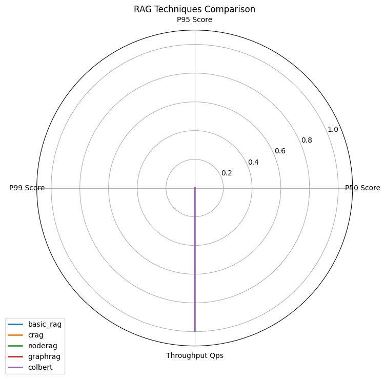
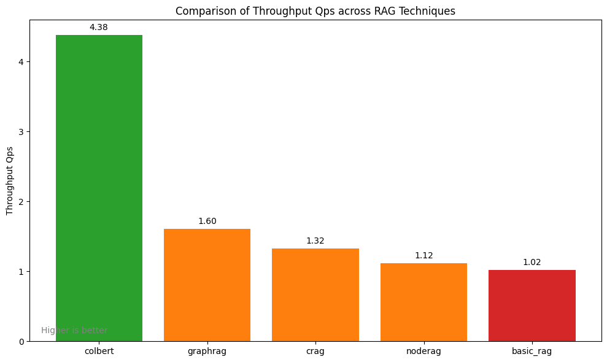

# RAG Techniques Benchmark Report

Generated on: 2025-05-14 09:15:39

## Benchmark Summary

The following RAG techniques were benchmarked:

- **basic_rag**
- **crag**
- **noderag**
- **graphrag**
- **colbert**

## Best Performing Techniques

- **Best for Performance**: colbert

## Key Metrics

### Retrieval Quality

| Technique | Context Recall | Precision At 5 | Precision At 10 |
| --- | --- | --- | --- |
| basic_rag | N/A | N/A | N/A |
| crag | N/A | N/A | N/A |
| noderag | N/A | N/A | N/A |
| graphrag | N/A | N/A | N/A |
| colbert | N/A | N/A | N/A |

### Answer Quality

| Technique | Answer Faithfulness | Answer Relevance |
| --- | --- | --- |
| basic_rag | N/A | N/A |
| crag | N/A | N/A |
| noderag | N/A | N/A |
| graphrag | N/A | N/A |
| colbert | N/A | N/A |

### Performance

| Technique | Latency P50 | Latency P95 | Throughput Qps |
| --- | --- | --- | --- |
| basic_rag | N/A | N/A | 1.02 q/s |
| crag | N/A | N/A | 1.32 q/s |
| noderag | N/A | N/A | 1.12 q/s |
| graphrag | N/A | N/A | 1.60 q/s |
| colbert | N/A | N/A | 4.38 q/s |

## Visualizations

### Overall Comparison

### Throughput Qps Comparison

## Conclusion

**colbert** emerged as the overall best technique in our benchmarks, leading in 1 out of 3 categories. For specific use cases, consider the following recommendations:

- **For retrieval-critical applications**: No clear winner
- **For answer quality focus**: No clear winner
- **For performance-critical systems**: Use colbert

Performance may vary with different datasets, configurations, and specific application requirements. These results should be used as guidelines for initial technique selection, with additional testing recommended for your specific use case.
