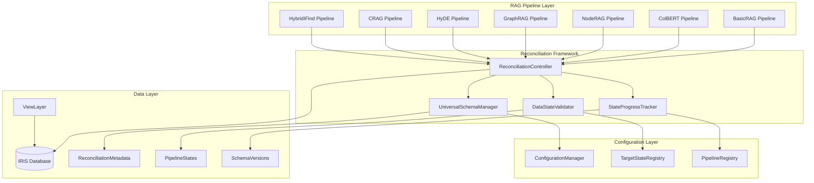
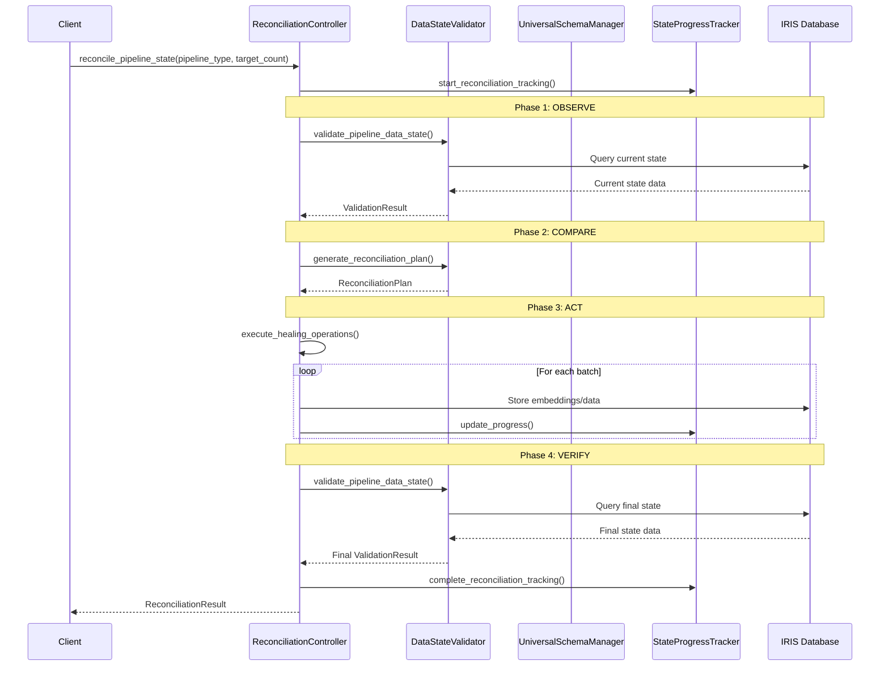
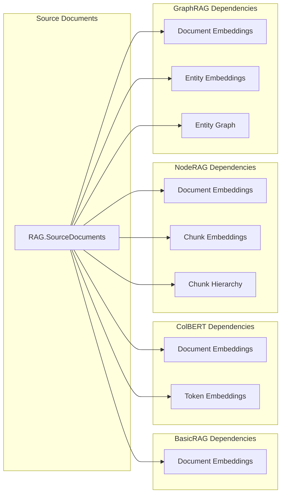
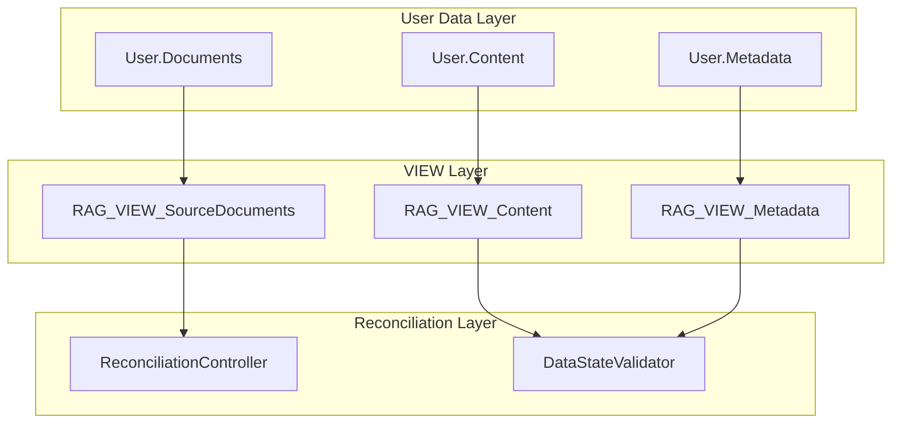
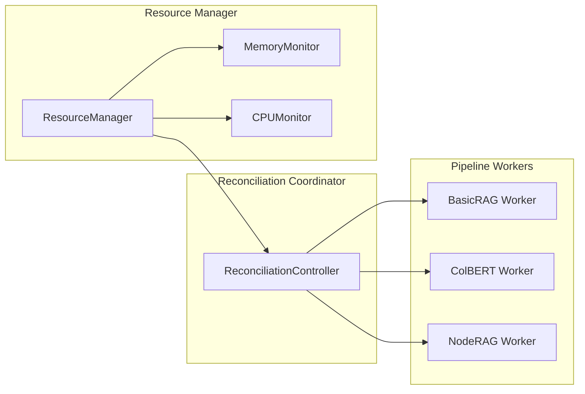

# Generalized Desired-State Reconciliation Architecture Design

## Executive Summary

This document presents the architectural design for a unified Desired-State Reconciliation framework that provides automatic data integrity management across all RAG pipeline implementations. The architecture generalizes the successful ColBERT reconciliation pattern into a universal system that ensures consistent, reliable data states for BasicRAG, HyDE, CRAG, NodeRAG, GraphRAG, ColBERT, and HybridIFindRAG pipelines.

## 1. System Architecture Overview

### 1.1 High-Level Architecture



### 1.2 Core Design Principles

**1. Pipeline Agnostic Design**
- Reconciliation logic operates independently of specific RAG implementations
- Common interface through [`RAGPipeline`](iris_rag/core/base.py:6) base class
- Standardized data requirements and validation patterns

**2. Declarative State Management**
- Target states defined declaratively per pipeline type and scale
- Idempotent reconciliation operations with atomic state transitions
- Progressive reconciliation with minimal intervention approach

**3. Modular Component Architecture**
- Clean separation of concerns between schema, data validation, and reconciliation
- Extensible design supporting new pipeline types without core changes
- Independent component lifecycle management

**4. In-Place Data Integration**
- VIEW-based strategy for working with existing user data
- Minimal data duplication through intelligent schema linking
- Backward compatibility with existing data structures

## 2. Component Architecture

### 2.1 UniversalSchemaManager

**Service Boundary**: Cross-pipeline schema validation, migration, and consistency management.

**Interface Definition**:
```python
class UniversalSchemaManager:
    def validate_pipeline_schema(self, pipeline_type: str, target_doc_count: int) -> ValidationResult
    def ensure_universal_tables(self) -> bool
    def migrate_schema_for_pipeline(self, pipeline_type: str, from_config: Dict, to_config: Dict) -> MigrationResult
    def get_schema_compatibility_matrix(self) -> Dict[str, Dict[str, bool]]
    def create_view_mappings(self, user_table: str, pipeline_type: str) -> ViewMappingResult
```

**Key Responsibilities**:
- Detect schema mismatches across all pipeline types
- Automatically migrate vector dimensions when embedding models change
- Track schema versions per pipeline and maintain compatibility matrix
- Manage VIEW-based mappings for in-place data integration

**Dependencies**: [`ConnectionManager`](iris_rag/core/connection.py), [`ConfigurationManager`](iris_rag/config/manager.py:10)

### 2.2 DataStateValidator

**Service Boundary**: Pipeline-agnostic validation of data completeness and consistency.

**Interface Definition**:
```python
class DataStateValidator:
    def validate_pipeline_data_state(self, pipeline_type: str, target_doc_count: int) -> DataStateResult
    def check_embedding_completeness(self, pipeline_type: str, embedding_type: str) -> CompletenessResult
    def detect_data_inconsistencies(self, pipeline_type: str) -> List[InconsistencyReport]
    def generate_reconciliation_plan(self, validation_results: List[DataStateResult]) -> ReconciliationPlan
    def validate_view_mappings(self, pipeline_type: str) -> ViewValidationResult
```

**Key Responsibilities**:
- Validate document ingestion completeness across all pipeline types
- Check embedding completeness for pipeline-specific requirements
- Detect data inconsistencies and corruption
- Generate detailed gap analysis reports
- Validate VIEW-based data mappings

**Dependencies**: [`ConnectionManager`](iris_rag/core/connection.py), [`UniversalSchemaManager`](#21-universalschemamanager)

### 2.3 ReconciliationController

**Service Boundary**: Orchestrates the reconciliation process across all pipeline types with unified healing operations.

**Interface Definition**:
```python
class ReconciliationController:
    def reconcile_pipeline_state(self, pipeline_type: str, target_doc_count: int) -> ReconciliationResult
    def heal_missing_embeddings(self, pipeline_type: str, embedding_type: str, missing_doc_ids: List[str]) -> HealingResult
    def reconcile_all_pipelines(self, target_doc_count: int) -> Dict[str, ReconciliationResult]
    def rollback_reconciliation(self, reconciliation_id: str) -> RollbackResult
    def reconcile_with_views(self, pipeline_type: str, view_config: ViewConfig) -> ReconciliationResult
```

**Key Responsibilities**:
- Execute idempotent reconciliation operations
- Coordinate cross-pipeline data healing
- Manage batch processing with memory optimization
- Provide progress tracking and error recovery
- Handle VIEW-based reconciliation scenarios

**Dependencies**: [`UniversalSchemaManager`](#21-universalschemamanager), [`DataStateValidator`](#22-datastatevalidator), [`StateProgressTracker`](#24-stateprogresstracker)

### 2.4 StateProgressTracker

**Service Boundary**: Provides granular progress monitoring and reporting for reconciliation operations.

**Interface Definition**:
```python
class StateProgressTracker:
    def start_reconciliation_tracking(self, reconciliation_id: str, pipeline_types: List[str]) -> TrackingSession
    def update_progress(self, reconciliation_id: str, pipeline_type: str, completed_items: int, total_items: int) -> None
    def get_reconciliation_status(self, reconciliation_id: str) -> ReconciliationStatus
    def generate_completion_report(self, reconciliation_id: str) -> CompletionReport
```

**Key Responsibilities**:
- Track reconciliation progress across multiple pipeline types
- Provide real-time status updates and ETA calculations
- Generate detailed reconciliation reports
- Monitor system resource usage during operations

**Dependencies**: [`ConnectionManager`](iris_rag/core/connection.py)

## 3. Data Flow Architecture

### 3.1 Reconciliation Loop Data Flow



### 3.2 Cross-Pipeline Data Dependencies



## 4. Configuration Management Strategy

### 4.1 Universal Configuration Schema

```yaml
reconciliation:
  # Global settings
  enabled: true
  mode: "progressive"  # progressive | complete | emergency
  
  # Performance management
  performance:
    max_concurrent_pipelines: 3
    batch_size_documents: 100
    batch_size_embeddings: 50
    memory_limit_gb: 8
    cpu_limit_percent: 70
    
  # Error handling
  error_handling:
    max_retries: 3
    retry_delay_seconds: 30
    rollback_on_failure: true
    
  # In-place data integration
  view_integration:
    enabled: true
    default_strategy: "view_mapping"
    fallback_strategy: "data_copy"
    view_prefix: "RAG_VIEW_"
    
  # Pipeline-specific overrides
  pipeline_overrides:
    colbert:
      batch_size_embeddings: 16
      memory_limit_gb: 12
    graphrag:
      max_retries: 5
```

### 4.2 Target State Definitions

```yaml
target_states:
  development:
    document_count: 1000
    pipelines:
      basic:
        required_embeddings: {"document_level": 1000}
        schema_version: "2.1"
        embedding_model: "all-MiniLM-L6-v2"
        vector_dimensions: 384
      colbert:
        required_embeddings: 
          document_level: 1000
          token_level: 1000
        schema_version: "2.1"
        embedding_model: "fjmgAI/reason-colBERT-150M-GTE-ModernColBERT"
        vector_dimensions: 768
```

### 4.3 Environment Variable Resolution

The framework supports dynamic configuration through environment variables:

```python
# Environment variable resolution pattern
${ENV_VAR_NAME:default_value}

# Examples in configuration
database:
  host: "${IRIS_HOST:localhost}"
  port: "${IRIS_PORT:1972}"
  
reconciliation:
  performance:
    memory_limit_gb: "${RECONCILIATION_MEMORY_GB:8}"
```

## 5. Database Schema Design

### 5.1 Universal Reconciliation Tables

**RAG.ReconciliationMetadata**:
```sql
CREATE TABLE RAG.ReconciliationMetadata (
    reconciliation_id VARCHAR(255) NOT NULL,
    pipeline_type VARCHAR(100) NOT NULL,
    operation_type VARCHAR(100) NOT NULL,
    target_doc_count INTEGER NOT NULL,
    status VARCHAR(50) NOT NULL,
    started_at TIMESTAMP DEFAULT CURRENT_TIMESTAMP,
    completed_at TIMESTAMP,
    error_message VARCHAR(MAX),
    performance_metrics VARCHAR(MAX),
    view_mappings VARCHAR(MAX),
    PRIMARY KEY (reconciliation_id, pipeline_type)
)
```

**RAG.PipelineStates**:
```sql
CREATE TABLE RAG.PipelineStates (
    pipeline_type VARCHAR(100) NOT NULL,
    target_doc_count INTEGER NOT NULL,
    current_doc_count INTEGER DEFAULT 0,
    embedding_completeness_percent DECIMAL(5,2) DEFAULT 0.0,
    schema_version VARCHAR(50),
    last_reconciliation_at TIMESTAMP,
    state_hash VARCHAR(255),
    view_config VARCHAR(MAX),
    PRIMARY KEY (pipeline_type, target_doc_count)
)
```

**RAG.ViewMappings**:
```sql
CREATE TABLE RAG.ViewMappings (
    mapping_id VARCHAR(255) NOT NULL PRIMARY KEY,
    pipeline_type VARCHAR(100) NOT NULL,
    user_table_name VARCHAR(255) NOT NULL,
    view_name VARCHAR(255) NOT NULL,
    mapping_config VARCHAR(MAX),
    created_at TIMESTAMP DEFAULT CURRENT_TIMESTAMP,
    status VARCHAR(50) DEFAULT 'active'
)
```

### 5.2 Schema Versioning Strategy

```sql
CREATE TABLE RAG.SchemaVersions (
    pipeline_type VARCHAR(100) NOT NULL,
    schema_version VARCHAR(50) NOT NULL,
    vector_dimensions INTEGER,
    embedding_model VARCHAR(255),
    migration_script VARCHAR(MAX),
    applied_at TIMESTAMP DEFAULT CURRENT_TIMESTAMP,
    PRIMARY KEY (pipeline_type, schema_version)
)
```

## 6. In-Place Data Integration Strategy

### 6.1 VIEW-Based Data Integration

**Objective**: Enable the reconciliation framework to work with existing user data without requiring data duplication.

**Approach**: Use database VIEWs to create a logical mapping between user tables and the reconciliation framework's expected schema.

### 6.2 VIEW Mapping Architecture



### 6.3 VIEW Creation Strategy

**Simple Case (Feasible for Initial Implementation)**:
```sql
-- Example VIEW for user table with compatible schema
CREATE VIEW RAG_VIEW_SourceDocuments AS
SELECT 
    user_doc_id AS doc_id,
    title,
    content,
    created_date AS ingestion_date,
    'user_provided' AS source_type
FROM User.Documents
WHERE status = 'active'
```

**Complex Case (Phased Approach)**:
- **Phase 1**: Support tables with direct column mapping
- **Phase 2**: Support tables requiring data transformation
- **Phase 3**: Support tables requiring complex joins

### 6.4 Impact on Core Components

**UniversalSchemaManager**:
- New method: `create_view_mappings(user_table: str, pipeline_type: str)`
- Enhanced validation to work with VIEWs
- VIEW-aware schema migration capabilities

**DataStateValidator**:
- New method: `validate_view_mappings(pipeline_type: str)`
- Enhanced data completeness checks for VIEW-based data
- Support for validating derived data consistency

**ReconciliationController**:
- New method: `reconcile_with_views(pipeline_type: str, view_config: ViewConfig)`
- Enhanced healing operations that respect VIEW constraints
- VIEW-aware batch processing

### 6.5 Feasibility Assessment

**Immediately Feasible**:
- Tables with direct column mapping to RAG.SourceDocuments schema
- Read-only reconciliation operations (validation, reporting)
- Simple embedding generation from VIEW data

**Requires Phased Implementation**:
- Complex data transformations during VIEW creation
- Write operations through VIEWs (may require triggers)
- Cross-table relationships in user schema

**Potential Limitations**:
- Performance impact of complex VIEWs
- IRIS-specific VIEW capabilities and limitations
- Transactional consistency across VIEW boundaries

## 7. Extensibility and Modularity

### 7.1 Pipeline Registration System

```python
# Pipeline registry for dynamic pipeline discovery
class PipelineRegistry:
    def register_pipeline(self, pipeline_type: str, pipeline_class: type, config: Dict) -> None
    def get_pipeline_requirements(self, pipeline_type: str) -> PipelineRequirements
    def get_registered_pipelines(self) -> List[str]
    def validate_pipeline_compatibility(self, pipeline_type: str) -> bool
```

### 7.2 Plugin Architecture

```python
# Extensible reconciliation operations
class ReconciliationPlugin:
    def can_handle(self, pipeline_type: str, operation_type: str) -> bool
    def execute_operation(self, context: ReconciliationContext) -> OperationResult
    def get_resource_requirements(self) -> ResourceRequirements
```

### 7.3 Configuration Extension Points

```yaml
# Custom reconciliation strategies
reconciliation:
  custom_strategies:
    - name: "enterprise_colbert"
      plugin: "plugins.enterprise.ColBERTReconciliation"
      config:
        batch_size: 32
        memory_optimization: true
```

## 8. Performance and Scalability

### 8.1 Memory-Aware Processing

```python
# Adaptive batch sizing based on available memory
class MemoryAwareBatchProcessor:
    def calculate_optimal_batch_size(self, pipeline_type: str, operation_type: str) -> int
    def monitor_memory_usage(self) -> MemoryMetrics
    def adjust_batch_size_dynamically(self, current_usage: float) -> int
```

### 8.2 Parallel Processing Strategy



### 8.3 Scaling Considerations

**Development Scale (1K documents)**:
- Single-threaded processing acceptable
- Memory usage < 2GB
- Processing time < 5 minutes

**Production Scale (10K+ documents)**:
- Multi-threaded processing required
- Memory usage < 16GB
- Processing time < 30 minutes
- Horizontal scaling through worker processes

## 9. Implementation Phases

### 9.1 Phase 1: Core Infrastructure (Weeks 1-2)
- Implement [`UniversalSchemaManager`](#21-universalschemamanager)
- Create universal reconciliation tables
- Basic configuration management
- Simple VIEW mapping for compatible schemas

### 9.2 Phase 2: Reconciliation Engine (Weeks 3-4)
- Implement [`DataStateValidator`](#22-datastatevalidator)
- Implement [`ReconciliationController`](#23-reconciliationcontroller)
- Basic reconciliation loop (Observe, Compare, Act, Verify)
- VIEW-based validation capabilities

### 9.3 Phase 3: Progress Tracking and Reporting (Weeks 5-6)
- Implement [`StateProgressTracker`](#24-stateprogresstracker)
- Real-time progress monitoring
- Completion reporting and metrics
- Enhanced VIEW mapping strategies

### 9.4 Phase 4: Integration and Optimization (Weeks 7-8)
- Pipeline integration across all RAG types
- Performance optimization and memory management
- Advanced VIEW-based reconciliation
- Production readiness and documentation

## 10. Success Metrics

### 10.1 Functional Metrics
- **Data Integrity**: 99.9% embedding completeness across all pipelines
- **Schema Consistency**: Zero schema mismatches after reconciliation
- **Cross-Pipeline Compatibility**: All 7 pipeline types supported
- **VIEW Integration**: 80% of simple user schemas supported via VIEWs

### 10.2 Operational Metrics
- **Reconciliation Time**: < 30 minutes for 10K documents
- **Memory Efficiency**: < 16GB peak memory usage
- **Error Recovery**: 95% automatic recovery from transient failures
- **Zero-Downtime Operations**: No service interruption during reconciliation

### 10.3 Developer Experience Metrics
- **Configuration Simplicity**: Single YAML file for all reconciliation settings
- **Debugging Capability**: Detailed progress tracking and error reporting
- **Extensibility**: New pipeline types added with < 100 lines of code

## 11. Conclusion

This architectural design provides a comprehensive foundation for implementing the Generalized Desired-State Reconciliation framework. The modular design ensures clean separation of concerns while the VIEW-based integration strategy enables working with existing user data without duplication.

The phased implementation approach allows for incremental delivery of value, starting with core infrastructure and progressing to advanced features. The architecture's extensibility ensures it can evolve with future RAG pipeline requirements while maintaining backward compatibility.

Key architectural strengths:
- **Modularity**: Independent components with clear interfaces
- **Extensibility**: Plugin architecture for custom reconciliation strategies
- **Performance**: Memory-aware processing and parallel execution
- **Data Integration**: VIEW-based strategy for in-place data usage
- **Reliability**: Comprehensive error handling and rollback capabilities

The design successfully addresses all requirements while maintaining the project's commitment to clean architecture, testability, and operational excellence.