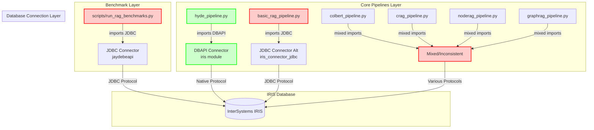
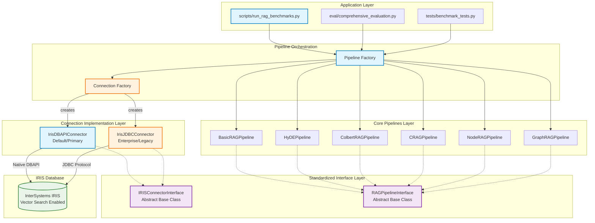

# RAG System Architecture Diagram

## Current State (Problematic)



## Recommended Architecture (Clean)



## Service Boundary Definitions

### 1. Application Service Boundary
**Responsibility:** User-facing functionality and orchestration
- Benchmark execution
- Evaluation frameworks  
- Test suites
- Configuration management

**Interface:** Pipeline Factory API

### 2. Pipeline Service Boundary  
**Responsibility:** RAG technique implementations
- Query processing
- Document retrieval
- Answer generation
- Result formatting

**Interface:** RAGPipelineInterface

### 3. Connection Service Boundary
**Responsibility:** Database connectivity abstraction
- Connection management
- Query execution
- Transaction handling
- Error recovery

**Interface:** IRISConnectorInterface

### 4. Data Service Boundary
**Responsibility:** IRIS database operations
- Vector storage
- Document indexing
- HNSW search
- Schema management

**Interface:** SQL/Vector APIs

## Connection Strategy Implementation

### Primary: DBAPI Connector (User Preference)
```python
class IrisDBAPIConnector(IRISConnectorInterface):
    """Primary connector using native IRIS Python bindings"""
    
    def __init__(self, host: str, port: int, namespace: str, 
                 username: str, password: str):
        self.connection_params = {
            "host": host, "port": port, "namespace": namespace,
            "username": username, "password": password
        }
    
    def connect(self) -> Any:
        import iris
        return iris.connect(**self.connection_params)
    
    def execute_query(self, query: str, params: List = None) -> Any:
        # Standardized query execution
        pass
```

### Secondary: JDBC Connector (Enterprise/Legacy)
```python
class IrisJDBCConnector(IRISConnectorInterface):
    """Secondary connector for enterprise environments"""
    
    def __init__(self, host: str, port: int, namespace: str,
                 username: str, password: str, jar_path: str):
        self.jdbc_url = f"jdbc:IRIS://{host}:{port}/{namespace}"
        self.credentials = [username, password]
        self.jar_path = jar_path
    
    def connect(self) -> Any:
        import jaydebeapi
        return jaydebeapi.connect(
            "com.intersystems.jdbc.IRISDriver",
            self.jdbc_url, self.credentials, self.jar_path
        )
```

## Pipeline Standardization

### Unified Pipeline Interface
```python
from abc import ABC, abstractmethod
from typing import Dict, Any, List, Callable

class RAGPipelineInterface(ABC):
    """Standard interface for all RAG pipeline implementations"""
    
    def __init__(self, 
                 iris_connector: IRISConnectorInterface,
                 embedding_func: Callable[[List[str]], List[List[float]]],
                 llm_func: Callable[[str], str],
                 **kwargs):
        self.iris_connector = iris_connector
        self.embedding_func = embedding_func
        self.llm_func = llm_func
    
    @abstractmethod
    def run(self, query: str, **kwargs) -> Dict[str, Any]:
        """
        Execute the RAG pipeline for a given query.
        
        Returns:
            {
                "query": str,
                "answer": str, 
                "retrieved_documents": List[Document],
                "metadata": Dict[str, Any]
            }
        """
        pass
    
    @abstractmethod
    def retrieve_documents(self, query: str, top_k: int = 5) -> List[Document]:
        """Retrieve relevant documents for the query"""
        pass
```

## Factory Pattern Implementation

### Connection Factory
```python
class ConnectionFactory:
    """Factory for creating standardized database connections"""
    
    @staticmethod
    def create_connector(connection_type: str = "dbapi", **config) -> IRISConnectorInterface:
        if connection_type == "dbapi":
            return IrisDBAPIConnector(**config)
        elif connection_type == "jdbc":
            return IrisJDBCConnector(**config)
        else:
            raise ValueError(f"Unknown connection type: {connection_type}")
    
    @staticmethod
    def from_config(config_path: str) -> IRISConnectorInterface:
        """Create connector from configuration file"""
        config = load_config(config_path)
        return ConnectionFactory.create_connector(**config)
```

### Pipeline Factory
```python
class PipelineFactory:
    """Factory for creating standardized RAG pipelines"""
    
    def __init__(self, iris_connector: IRISConnectorInterface,
                 embedding_func: Callable, llm_func: Callable):
        self.iris_connector = iris_connector
        self.embedding_func = embedding_func
        self.llm_func = llm_func
    
    def create_pipeline(self, pipeline_type: str, **kwargs) -> RAGPipelineInterface:
        pipeline_map = {
            "basic_rag": BasicRAGPipeline,
            "hyde": HyDEPipeline,
            "colbert": ColbertRAGPipeline,
            "crag": CRAGPipeline,
            "noderag": NodeRAGPipeline,
            "graphrag": GraphRAGPipeline
        }
        
        if pipeline_type not in pipeline_map:
            raise ValueError(f"Unknown pipeline type: {pipeline_type}")
        
        pipeline_class = pipeline_map[pipeline_type]
        return pipeline_class(
            iris_connector=self.iris_connector,
            embedding_func=self.embedding_func,
            llm_func=self.llm_func,
            **kwargs
        )
```

## Migration Path

### Phase 1: Interface Standardization
1. Create `IRISConnectorInterface` and `RAGPipelineInterface`
2. Update `IrisDBAPIConnector` to implement interface
3. Update `IrisJDBCConnector` to implement interface

### Phase 2: Pipeline Updates
1. Update all core pipelines to implement `RAGPipelineInterface`
2. Standardize constructor parameters
3. Ensure consistent return formats

### Phase 3: Factory Implementation
1. Implement `ConnectionFactory` and `PipelineFactory`
2. Update benchmark script to use factories
3. Update evaluation frameworks

### Phase 4: Legacy Cleanup
1. Remove duplicate connector implementations
2. Archive legacy pipeline versions
3. Update documentation

## Benefits of Recommended Architecture

### 1. Clean Separation of Concerns
- **Application Layer:** Focuses on user workflows
- **Pipeline Layer:** Focuses on RAG implementations  
- **Connection Layer:** Focuses on database connectivity
- **Data Layer:** Focuses on storage and retrieval

### 2. Extensibility
- Easy to add new pipeline types
- Easy to add new connection types
- Pluggable components via interfaces

### 3. Maintainability
- Single source of truth for each component
- Standardized interfaces reduce coupling
- Factory patterns simplify object creation

### 4. Testability
- Mock implementations via interfaces
- Isolated testing of each layer
- Dependency injection support

### 5. User Preference Alignment
- DBAPI as primary connection method
- JDBC available for enterprise needs
- Configuration-driven selection