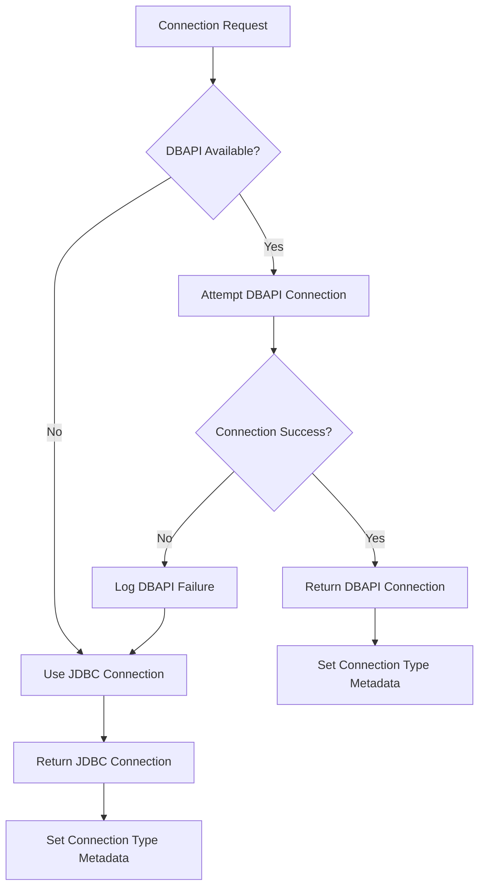
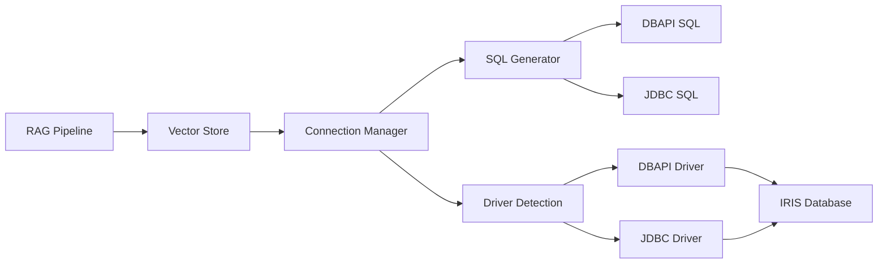

# IRIS Database Driver Compatibility Architecture

## Executive Summary

This document outlines the architectural solution for managing compatibility between InterSystems IRIS database drivers in the RAG templates project. The solution addresses critical limitations in the JDBC driver that prevent vector similarity search operations from functioning correctly.

## Problem Statement

### JDBC Driver Limitations

The InterSystems IRIS JDBC driver (version 3.10.3) exhibits aggressive auto-parameterization behavior that breaks vector similarity search operations:

1. **Auto-Parameterization Bug**: The driver incorrectly converts fully interpolated SQL strings into parameterized queries by replacing literal values with `:%qpar(n)` parameter markers
2. **TOP Clause Issues**: `SELECT TOP 1` becomes `SELECT TOP :%qpar(1)`, causing syntax errors
3. **TO_VECTOR Function Issues**: `TO_VECTOR('[0.1,0.2]', FLOAT, 384)` becomes `TO_VECTOR(:%qpar(2), :%qpar(3))`, breaking vector operations
4. **CLOB Column Limitations**: CTEs and derived tables fail with CLOB columns in vector similarity contexts
5. **Segmentation Faults**: Alternative SQL approaches cause driver crashes

### DBAPI Driver Advantages

The InterSystems IRIS DBAPI driver (`intersystems-irispython`) provides:

1. **Native Python Integration**: Direct Python API without Java dependencies
2. **Proper SQL Handling**: No aggressive auto-parameterization
3. **Vector Operation Support**: Full support for `TO_VECTOR()` and `VECTOR_COSINE()` functions
4. **Performance Benefits**: Lower overhead than JDBC bridge

## Architectural Solution

### 1. Driver Detection and Selection Strategy



### 2. Connection Manager Architecture

```python
class IRISConnectionManager:
    """
    Manages IRIS database connections with driver-aware capabilities.
    
    Priority Order:
    1. DBAPI (intersystems-irispython) - Preferred
    2. JDBC (jaydebeapi) - Fallback
    """
    
    def get_connection(self) -> Tuple[Any, str]:
        """Returns (connection, driver_type)"""
        
    def _get_dbapi_connection(self) -> Any:
        """Native Python DBAPI connection"""
        
    def _get_jdbc_connection(self) -> Any:
        """JDBC fallback connection"""
        
    def get_connection_info(self) -> Dict[str, Any]:
        """Returns connection metadata including driver type"""
```

### 3. Driver-Aware SQL Generation

```python
class DriverAwareSQL:
    """
    Generates SQL optimized for specific driver capabilities.
    """
    
    def generate_vector_search_sql(
        self, 
        driver_type: str,
        table: str,
        vector: List[float],
        top_k: int
    ) -> str:
        """
        Generates driver-specific SQL for vector similarity search.
        
        DBAPI: Uses standard IRIS SQL syntax
        JDBC: Uses workarounds for auto-parameterization issues
        """
```

### 4. Service Boundary Design



## Implementation Strategy

### Phase 1: Enhanced Connection Management

1. **Driver Detection Logic**
   - Automatic detection of available drivers
   - Graceful fallback mechanisms
   - Connection metadata tracking

2. **Connection Type Awareness**
   - Expose driver type to consuming services
   - Enable driver-specific optimizations
   - Maintain backward compatibility

### Phase 2: SQL Optimization Layer

1. **Driver-Specific SQL Generation**
   - DBAPI: Standard IRIS SQL syntax
   - JDBC: Workaround implementations
   - Centralized SQL template management

2. **Vector Operation Handling**
   - Native vector functions for DBAPI
   - Alternative approaches for JDBC
   - Performance optimization per driver

### Phase 3: Testing and Validation

1. **Driver Compatibility Tests**
   - Automated testing for both drivers
   - Vector operation validation
   - Performance benchmarking

2. **Integration Testing**
   - End-to-end pipeline testing
   - Fallback mechanism validation
   - Error handling verification

## Driver Compatibility Matrix

| Feature | DBAPI | JDBC | Notes |
|---------|-------|------|-------|
| Basic SQL | ✅ | ✅ | Both support standard operations |
| Vector Operations | ✅ | ❌ | JDBC has auto-parameterization issues |
| TOP Clause | ✅ | ❌ | JDBC converts to parameters |
| TO_VECTOR() | ✅ | ❌ | JDBC breaks function calls |
| VECTOR_COSINE() | ✅ | ⚠️ | JDBC requires workarounds |
| Performance | ✅ | ⚠️ | DBAPI has lower overhead |
| Stability | ✅ | ❌ | JDBC causes segmentation faults |

## Recommended Configuration

### Production Environment
```yaml
iris:
  connection:
    preferred_driver: "dbapi"
    fallback_enabled: true
    connection_timeout: 30
    retry_attempts: 3
```

### Development Environment
```yaml
iris:
  connection:
    preferred_driver: "dbapi"
    fallback_enabled: true
    debug_driver_selection: true
    log_sql_generation: true
```

## Migration Path

### Immediate Actions
1. ✅ Fix DBAPI connection parameter format
2. 🔄 Implement driver detection logic
3. ⏳ Create driver-aware SQL generation
4. ⏳ Add comprehensive testing

### Long-term Strategy
1. **Phase out JDBC dependency** for vector operations
2. **Optimize DBAPI performance** for large-scale operations
3. **Implement connection pooling** for DBAPI connections
4. **Create monitoring** for driver performance metrics

## Risk Mitigation

### DBAPI Unavailability
- **Fallback**: Automatic JDBC fallback
- **Monitoring**: Alert on driver selection failures
- **Documentation**: Clear installation instructions

### JDBC Limitations
- **Workarounds**: Alternative SQL approaches where possible
- **Graceful Degradation**: Disable vector operations if necessary
- **User Notification**: Clear error messages about limitations

### Performance Considerations
- **Connection Pooling**: Implement for both driver types
- **Caching**: Cache driver detection results
- **Monitoring**: Track performance metrics per driver

## Success Metrics

1. **Functionality**: 100% vector operation success rate with DBAPI
2. **Reliability**: Zero segmentation faults in production
3. **Performance**: <100ms vector search latency
4. **Compatibility**: Support for both driver types
5. **Maintainability**: Clean separation of driver-specific logic

## Conclusion

This architectural solution provides a robust, extensible framework for managing IRIS database driver compatibility. By prioritizing the DBAPI driver while maintaining JDBC fallback capabilities, we ensure both optimal performance and broad compatibility across different deployment environments.

The modular design with clear service boundaries enables future enhancements while maintaining clean separation of concerns between connection management, SQL generation, and business logic.