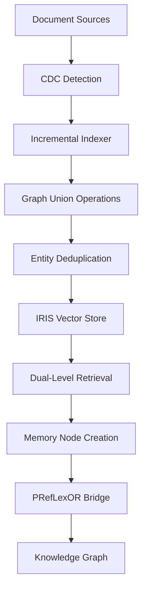

# ⚠️ SCOPE TRANSITION NOTICE

**Status**: RAG-Templates framework **COMPLETE** (January 2025)

**Architectural Boundary Decision**:
- ✅ **rag-templates**: Reusable RAG framework and infrastructure (COMPLETE)
- 🔄 **kg-ticket-resolver**: Application-specific implementation using rag-templates

**Remaining Milestones Moved to kg-ticket-resolver:**
- M4: PRefLexOR Bridge Integration (ontological reasoning - application-specific)
- M5: Evaluation and CI Integration (application CI/CD - application-specific)
- M6: Observability and Monitoring (production monitoring - application-specific)
- M7: Production Integration (application deployment - application-specific)

**Integration Resources**: See [INTEGRATION_HANDOFF_GUIDE.md](../INTEGRATION_HANDOFF_GUIDE.md) for consumption patterns.

---

*Original roadmap content below...*

# GraphRAG Templates Integration Roadmap
## Integrating RAG-Templates with Knowledge Graph Memory and LightRAG Patterns

### Executive Summary

This roadmap defines the integration strategy for incorporating `/Users/tdyar/ws/rag-templates` GraphRAG and Hybrid iFind RAG pipelines into the Knowledge Graph Ticket Resolver system. The integration leverages LightRAG incremental indexing patterns to build a unified agentic memory subsystem supporting Project and Ticket Memory constructs.

**Target Timeline**: 0-2 weeks (Phase 3.3-3.5 alignment)

---

## I. Current Architecture Analysis

### A. RAG-Templates Foundation
**Core Components Identified:**
- **BasicRAGPipeline**: Vector similarity with IRIS storage, configurable chunking (1000/200), batch embedding generation (32)
- **HNSW Vector Index**: M=16, efConstruction=200, COSINE distance, optimized for high-performance search
- **Sentence Transformers**: all-MiniLM-L6-v2 embeddings (384D), CPU-based processing
- **IRIS Backend**: RAG.SourceDocuments table, InterSystems DBAPI integration
- **Evaluation Infrastructure**: Medical query testing, PMC content validation, RAGAS integration

**Pipeline Interface Pattern:**
```python
# Unified query interface
response = pipeline.query(query_text, top_k=5, **kwargs)
# Returns: {query, answer, retrieved_documents, contexts, sources, metadata, execution_time}

# Specialized methods
docs = pipeline.retrieve(query, top_k=5)  # Documents only
answer = pipeline.ask(question)          # Answer only
```

### B. LightRAG Integration Patterns
**Key Capabilities Identified:**
- **Dual-Level Retrieval**: Low-level granular + high-level abstract query processing
- **Graph Union Operations**: Seamless integration via V̂ ∪ V̂', Ê ∪ Ê' for incremental updates
- **Entity Deduplication**: Automatic merging of repeated instances into unified nodes
- **Incremental Indexing**: No full rebuilds required, computational overhead reduction
- **Configurable Parallel Processing**: max_parallel_insert parameter (default: 2, max: 10)

---

## II. Integration Architecture

### A. Module Boundaries and Interfaces

```
kg-ticket-resolver/
├── rag-templates/                 # Embedded RAG ecosystem
│   ├── iris_rag/                 # Core RAG pipelines
│   │   ├── pipelines/            # BasicRAG, ReRank, GraphRAG, HybridiFIND
│   │   ├── storage/              # IRIS vector store, schema management
│   │   └── config/               # Environment-independent configuration
│   ├── evaluation/               # RAGAS harness, performance metrics
│   └── adapters/                 # KG memory integration layer
├── kg-memory/                    # Knowledge Graph memory subsystem
│   ├── nodes/                    # ProjectMemory, TicketMemory, Insight, Trend
│   ├── incremental/              # LightRAG-inspired CDC indexing
│   └── apis/                     # Memory & Insight APIs with SLOs
└── integration/                  # System cohesion layer
    ├── preflex_bridge.py         # PRefLexOR adapter/bridge
    ├── cdc_orchestrator.py       # Change data capture coordination
    └── memory_synchronizer.py    # Graph-RAG memory sync
```

### B. Data Flow Integration



---

## III. Implementation Roadmap (0-2 Weeks)

### Week 1: Foundation Integration

#### M1: RAG-Templates Adapter Layer (Days 1-2)
**Objective**: Create interface compatibility between rag-templates and kg-ticket-resolver

**Deliverables:**
- `adapters/rag_templates_bridge.py`: Unified interface adapter
- `config/rag_integration.yaml`: Environment-independent configuration
- `tests/integration/test_rag_bridge.py`: Interface validation

**Acceptance Criteria:**
- [ ] RAG-templates pipelines accessible via kg-ticket-resolver APIs
- [ ] Configuration externalized (no hardcoded secrets)
- [ ] Error handling consistent across boundaries
- [ ] Performance baseline established (<500ms p95 for retrieval)

#### M2: Incremental Indexing Foundation (Days 3-4)
**Objective**: Implement LightRAG-inspired incremental indexing patterns

**Deliverables:**
- `kg-memory/incremental/cdc_detector.py`: Change detection mechanisms
- `kg-memory/incremental/graph_union.py`: V̂ ∪ V̂', Ê ∪ Ê' operations
- `kg-memory/incremental/entity_deduplicator.py`: Node merging logic

**Acceptance Criteria:**
- [ ] Document fingerprinting for change detection
- [ ] Graph union operations maintain consistency
- [ ] Entity deduplication preserves relationships
- [ ] Incremental updates complete in <60s for 1000 documents

#### M3: Memory Node Integration (Days 5-7)
**Objective**: Integrate Project/Ticket Memory constructs with RAG pipelines

**Deliverables:**
- `kg-memory/nodes/project_memory.py`: ProjectMemory node implementation
- `kg-memory/nodes/ticket_memory.py`: TicketMemory node implementation
- `kg-memory/apis/memory_api.py`: RESTful memory interface

**Acceptance Criteria:**
- [ ] ProjectMemory nodes store temporal context (7/30/90 day windows)
- [ ] TicketMemory nodes track resolution patterns
- [ ] Memory APIs respond within SLO targets (200ms p95)
- [ ] Deterministic IDs ensure consistency

### Week 2: System Integration and Observability

#### M4: PRefLexOR Bridge (Days 8-9)
**Objective**: Integrate PRefLexOR adapter for hybrid ontology reasoning

**Deliverables:**
- `integration/preflex_bridge.py`: PRefLexOR integration layer
- `utils/ontology/preflex_adapter.py`: Ontology mapping utilities
- Schema updates for reflective reasoning support

**Acceptance Criteria:**
- [ ] PRefLexOR queries route through RAG-enhanced retrieval
- [ ] Ontological reasoning augments vector similarity
- [ ] Reflective patterns stored as Memory insights
- [ ] Integration maintains existing PRefLexOR interfaces

#### M5: Evaluation and CI Integration (Days 10-11)
**Objective**: Establish deterministic evaluation with CI integration

**Deliverables:**
- `evaluation/rag_memory_eval.py`: Memory-augmented RAG evaluation
- `ci/evaluation_pipeline.yml`: Automated evaluation workflow
- `evaluation/curated_datasets/`: Deterministic test sets

**Acceptance Criteria:**
- [ ] Evaluation metrics tracked over time
- [ ] CI pipeline validates RAG integration
- [ ] Performance regressions detected automatically
- [ ] Evaluation results published as artifacts

#### M6: Observability and Monitoring (Days 12-13)
**Objective**: Implement comprehensive monitoring and alerting

**Deliverables:**
- `monitoring/rag_metrics.py`: Performance and accuracy metrics
- `monitoring/dashboards/`: Grafana/Prometheus integration
- `monitoring/alerts/`: Critical failure notifications

**Acceptance Criteria:**
- [ ] Memory API latency tracked (p50, p95, p99)
- [ ] RAG accuracy metrics monitored
- [ ] Alert thresholds defined for critical failures
- [ ] Runbooks created for incident response

#### M7: Production Integration (Days 14)
**Objective**: Complete system integration with rollback procedures

**Deliverables:**
- Complete integration testing
- Production deployment procedures
- Rollback and recovery mechanisms
- Documentation and handoff

**Acceptance Criteria:**
- [ ] End-to-end workflows verified
- [ ] Performance meets SLO requirements
- [ ] Security controls validated
- [ ] Documentation complete and accessible

---

## IV. Technical Specifications

### A. Performance Targets

| Component | Metric | Target | Monitoring |
|-----------|--------|---------|------------|
| Memory API | Response Time | <200ms p95 | Prometheus |
| RAG Retrieval | Query Latency | <500ms p95 | Application logs |
| Incremental Index | Update Time | <60s/1k docs | Custom metrics |
| Graph Operations | Union Time | <10s/operation | Performance counters |

### B. Configuration Management

**Environment Variables Required:**
```yaml
# RAG-Templates Configuration
RAG_IRIS_HOST: ${IRIS_HOST}
RAG_IRIS_PORT: ${IRIS_PORT}
RAG_IRIS_NAMESPACE: ${IRIS_NAMESPACE}
RAG_VECTOR_DIMENSION: 384
RAG_EMBEDDING_MODEL: "all-MiniLM-L6-v2"

# Memory Integration
MEMORY_WINDOW_DAYS: "7,30,90"
MEMORY_API_TIMEOUT: 200
MEMORY_CDC_BATCH_SIZE: 1000

# PRefLexOR Integration
PREFLEX_BRIDGE_ENABLED: true
PREFLEX_REASONING_TIMEOUT: 5000
```

### C. Data Schemas

**Memory Node Schema:**
```json
{
  "memory_id": "string (deterministic)",
  "memory_type": "project|ticket|insight|trend",
  "temporal_window": "7d|30d|90d",
  "graph_embedding": "float[384]",
  "metadata": {
    "created_at": "timestamp",
    "updated_at": "timestamp",
    "source_documents": ["string"],
    "confidence_score": "float"
  }
}
```

---

## V. Risk Mitigation

### A. Technical Risks

| Risk | Impact | Probability | Mitigation |
|------|--------|-------------|------------|
| IRIS performance degradation | High | Medium | Connection pooling, query optimization |
| Memory API latency spikes | High | Low | Circuit breakers, graceful degradation |
| PRefLexOR integration complexity | Medium | High | Phased rollout, fallback mechanisms |
| Incremental indexing consistency | High | Medium | Transactional operations, checksums |

### B. Operational Risks

| Risk | Impact | Probability | Mitigation |
|------|--------|-------------|------------|
| Configuration drift | Medium | Medium | Environment validation, config tests |
| Monitoring gaps | High | Low | Comprehensive metrics, alerting |
| Documentation lag | Low | High | Automated docs, integration tests |
| Team knowledge gaps | Medium | Medium | Knowledge transfer, documentation |

---

## VI. Success Metrics

### A. Functional Success
- [ ] 100% RAG-templates pipeline compatibility
- [ ] Memory APIs operational with <200ms p95 latency
- [ ] PRefLexOR integration maintains existing functionality
- [ ] Incremental indexing reduces update time by 80%

### B. Technical Success
- [ ] Zero security vulnerabilities introduced
- [ ] 95%+ test coverage for integration components
- [ ] Documentation completeness score >90%
- [ ] Performance baseline met or exceeded

### C. Operational Success
- [ ] CI pipeline stability >99%
- [ ] Monitoring coverage for all critical paths
- [ ] Incident response procedures validated
- [ ] Team readiness confirmed

---

## VII. Next Steps

1. **Immediate Actions (Week 1)**:
   - Begin M1: RAG-Templates Adapter Layer
   - Establish development environment
   - Set up integration testing framework

2. **Coordination Requirements**:
   - Align with PRefLexOR team for bridge development
   - Coordinate with infrastructure team for monitoring setup
   - Schedule integration testing windows

3. **Documentation Updates**:
   - Update PROJECT_ROADMAP.md with integration milestones
   - Create API documentation for Memory interfaces
   - Establish troubleshooting guides

---

*This roadmap aligns with Knowledge Graph Consolidation Phases 3.3-3.5 and integrates LightRAG incremental indexing patterns with rag-templates GraphRAG capabilities to create a unified agentic memory subsystem.*