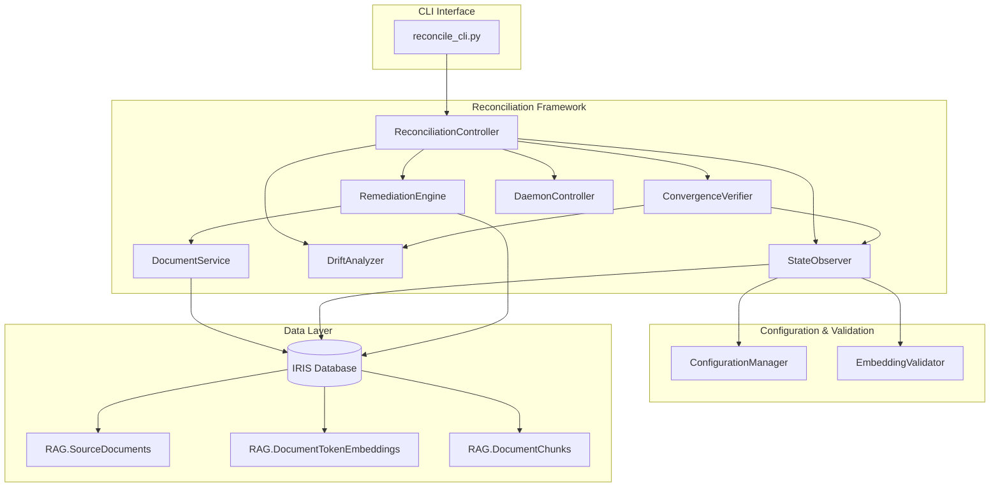
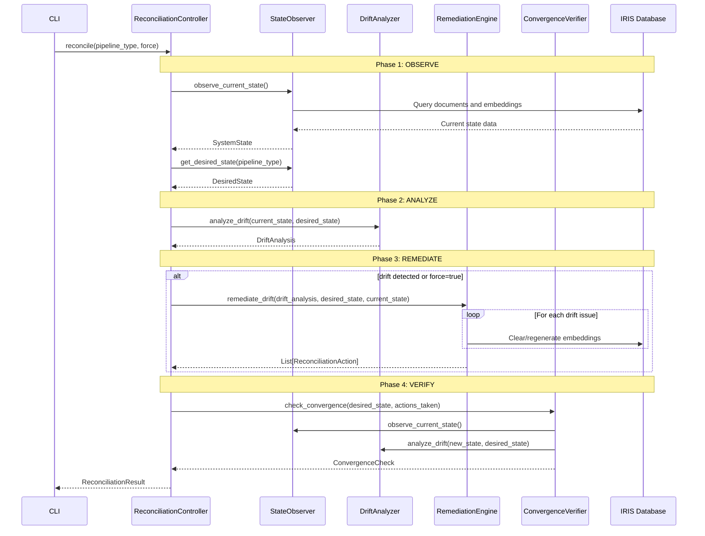

# Comprehensive Generalized Reconciliation Architecture Design

## Table of Contents

1. [Introduction & Objectives](#1-introduction--objectives)
2. [Architectural Design](#2-architectural-design)
3. [Core Logic & Algorithms](#3-core-logic--algorithms)
4. [Implementation Details](#4-implementation-details)
5. [Testing Strategy](#5-testing-strategy)
6. [Performance & Optimization Considerations](#6-performance--optimization-considerations)
7. [Security Considerations](#7-security-considerations)
8. [Deployment & Operational Plan](#8-deployment--operational-plan)
9. [Future Enhancements](#9-future-enhancements)

---

## 1. Introduction & Objectives

### 1.1 Executive Summary

This document presents the comprehensive design for a Desired-State Reconciliation framework that provides automatic data integrity management for RAG pipeline implementations. The architecture implements a focused reconciliation pattern that ensures consistent, reliable data states for ColBERT and other RAG pipelines through continuous monitoring and automated remediation.

### 1.2 Primary Objectives

**Core Goal**: Establish a Desired-State Reconciliation architecture that provides automatic data integrity management, quality validation, and state healing capabilities for RAG pipeline implementations.

**Specific Objectives**:
- **Automated Data Integrity**: Eliminate manual data validation through automated reconciliation processes
- **Quality Assurance**: Detect and remediate mock embeddings, low diversity, and incomplete data
- **Continuous Monitoring**: Provide daemon-mode operation for continuous system health monitoring
- **Scalable Operations**: Support data integrity from development (1K documents) to production scale
- **Zero-Maintenance Operations**: Achieve high pipeline reliability through proactive state reconciliation

### 1.3 In-Scope Components

**RAG Pipelines** (Primary focus on ColBERT):
- [`ColBERTRAGPipeline`](iris_rag/pipelines/colbert.py:21) - Token-level embeddings with MaxSim
- [`BasicRAGPipeline`](iris_rag/pipelines/basic.py:21) - Standard vector similarity retrieval
- Other RAG pipelines as configured

**Core Infrastructure Components**:
- [`ReconciliationController`](iris_rag/controllers/reconciliation.py:38) - Main orchestration controller
- [`StateObserver`](iris_rag/controllers/reconciliation_components/state_observer.py:26) - System state observation
- [`DriftAnalyzer`](iris_rag/controllers/reconciliation_components/drift_analyzer.py:23) - Drift detection and analysis
- [`RemediationEngine`](iris_rag/controllers/reconciliation_components/remediation_engine.py:29) - Automated remediation actions
- [`ConvergenceVerifier`](iris_rag/controllers/reconciliation_components/convergence_verifier.py:25) - Post-remediation verification
- [`DaemonController`](iris_rag/controllers/reconciliation_components/daemon_controller.py:23) - Continuous operation management
- [`DocumentService`](iris_rag/controllers/reconciliation_components/document_service.py:18) - Document and embedding operations
- [`ConfigurationManager`](iris_rag/config/manager.py:10) - Configuration management and validation
- [`ConnectionManager`](iris_rag/core/connection.py) - Database connection management

---

## 2. Architectural Design

### 2.1 High-Level Architecture



### 2.2 Core Design Principles

**1. Focused Reconciliation Design**
- Reconciliation logic operates on specific pipeline types (primarily ColBERT)
- Common interface through standardized data models and APIs
- Pipeline-specific configuration and validation patterns

**2. Observe-Analyze-Remediate-Verify Pattern**
- **Observe**: Current system state observation through [`StateObserver`](iris_rag/controllers/reconciliation_components/state_observer.py:51)
- **Analyze**: Drift detection through [`DriftAnalyzer`](iris_rag/controllers/reconciliation_components/drift_analyzer.py:36)
- **Remediate**: Automated healing through [`RemediationEngine`](iris_rag/controllers/reconciliation_components/remediation_engine.py:82)
- **Verify**: Convergence validation through [`ConvergenceVerifier`](iris_rag/controllers/reconciliation_components/convergence_verifier.py:46)

**3. Modular Component Architecture**
- Clean separation of concerns between observation, analysis, remediation, and verification
- Extensible design supporting new pipeline types through configuration
- Independent component lifecycle management

**4. Quality-First Data Management**
- Embedding quality analysis using [`EmbeddingValidator`](iris_rag/validation/embedding_validator.py)
- Mock embedding detection and remediation
- Diversity score analysis and low-quality embedding identification

### 2.3 Component Architecture

#### 2.3.1 ReconciliationController

**Service Boundary**: Main orchestration controller for reconciliation operations.

**Interface Definition**:
```python
class ReconciliationController:
    def reconcile(self, pipeline_type: str = "colbert", force: bool = False) -> ReconciliationResult
    def analyze_drift_only(self, pipeline_type: str = "colbert") -> Dict[str, Any]
    def get_status(self, pipeline_type: str = "colbert") -> Dict[str, Any]
    def run_daemon(self, interval: Optional[int] = None, max_iterations: Optional[int] = None) -> None
    def run_continuous_reconciliation(self, pipeline_type: str = "colbert") -> None
```

**Key Responsibilities**:
- Orchestrate the complete reconciliation workflow
- Coordinate between observation, analysis, remediation, and verification components
- Manage reconciliation sessions and progress tracking
- Provide status reporting and daemon mode operation

#### 2.3.2 StateObserver

**Service Boundary**: Observes current system state and determines desired state configurations.

**Interface Definition**:
```python
class StateObserver:
    def observe_current_state(self) -> SystemState
    def get_desired_state(self, pipeline_type: str = "colbert") -> DesiredState
```

**Key Responsibilities**:
- Query current document and embedding counts from database
- Analyze embedding quality using [`EmbeddingValidator`](iris_rag/validation/embedding_validator.py)
- Determine desired state from configuration
- Identify documents with missing or incomplete embeddings

#### 2.3.3 DriftAnalyzer

**Service Boundary**: Analyzes drift between current and desired system states.

**Interface Definition**:
```python
class DriftAnalyzer:
    def analyze_drift(self, current_state: SystemState, desired_state: DesiredState) -> DriftAnalysis
```

**Key Responsibilities**:
- Detect mock embedding contamination
- Identify low diversity embeddings
- Find missing or incomplete token embeddings
- Assess document count discrepancies
- Generate prioritized drift issue reports

#### 2.3.4 RemediationEngine

**Service Boundary**: Executes remediation actions to fix detected drift issues.

**Interface Definition**:
```python
class RemediationEngine:
    def remediate_drift(self, drift_analysis: DriftAnalysis, desired_state: DesiredState, 
                       current_state: SystemState) -> List[ReconciliationAction]
```

**Key Responsibilities**:
- Clear and regenerate contaminated embeddings
- Generate missing embeddings for documents
- Process documents in optimized batches
- Handle CLOB stream processing for document content
- Use [`insert_vector`](common/db_vector_utils.py) utility for consistent vector storage

#### 2.3.5 ConvergenceVerifier

**Service Boundary**: Verifies system convergence to desired state after remediation.

**Interface Definition**:
```python
class ConvergenceVerifier:
    def check_convergence(self, desired_state: DesiredState, actions_taken: List[ReconciliationAction]) -> ConvergenceCheck
```

**Key Responsibilities**:
- Re-observe system state after remediation
- Re-analyze drift to confirm convergence
- Report remaining issues if convergence not achieved
- Provide convergence status and recommendations

#### 2.3.6 DaemonController

**Service Boundary**: Manages continuous reconciliation operations and daemon mode execution.

**Interface Definition**:
```python
class DaemonController:
    def run_daemon(self, interval: Optional[int] = None, max_iterations: Optional[int] = None) -> None
    def stop(self) -> None
    def force_run(self) -> None
    def get_status(self) -> dict
```

**Key Responsibilities**:
- Execute continuous reconciliation loops
- Handle signal-based graceful shutdown
- Manage iteration counting and interval timing
- Provide daemon status reporting

### 2.4 Data Flow Architecture

#### 2.4.1 Reconciliation Loop Data Flow



---

## 3. Core Logic & Algorithms

### 3.1 Core Data Structures

#### Configuration Models
```python
@dataclass
class SystemState:
    total_documents: int
    total_token_embeddings: int
    avg_embedding_size: float
    quality_issues: QualityIssues
    documents_without_any_embeddings: int = 0
    documents_with_incomplete_embeddings_count: int = 0
    observed_at: datetime = field(default_factory=datetime.now)

@dataclass
class DesiredState:
    target_document_count: int
    embedding_model: str
    vector_dimensions: int
    completeness_requirements: CompletenessRequirements
    diversity_threshold: float = 0.7
    schema_version: str = "2.1"

@dataclass
class CompletenessRequirements:
    require_all_docs: bool = True
    require_token_embeddings: bool = False
    min_embedding_quality_score: float = 0.8
    min_embeddings_per_doc: int = 5
```

#### Progress Tracking Models
```python
@dataclass
class DriftIssue:
    issue_type: str
    severity: str  # "low", "medium", "high", "critical"
    description: str
    affected_count: int = 0
    recommended_action: str = ""

@dataclass
class ReconciliationResult:
    reconciliation_id: str
    success: bool
    current_state: SystemState
    desired_state: DesiredState
    drift_analysis: DriftAnalysis
    actions_taken: List[ReconciliationAction] = field(default_factory=list)
    convergence_check: Optional[ConvergenceCheck] = None
    execution_time_seconds: float = 0.0
    error_message: Optional[str] = None
```

### 3.2 Reconciliation Algorithm

```python
def execute_reconciliation_operation(pipeline_type: str, force: bool = False) -> ReconciliationResult:
    """
    Main reconciliation operation executor.
    
    ALGORITHM:
    1. OBSERVE_CURRENT_STATE:
       - Query document count from RAG.SourceDocuments
       - Query token embedding count from RAG.DocumentTokenEmbeddings
       - Analyze embedding quality using EmbeddingValidator
       - Identify documents with missing/incomplete embeddings
       
    2. GET_DESIRED_STATE:
       - Load configuration for specified pipeline_type
       - Extract target document count and embedding requirements
       - Set quality thresholds and completeness requirements
       
    3. ANALYZE_DRIFT:
       - Compare current vs desired document counts
       - Check for mock embedding contamination
       - Identify low diversity embeddings
       - Find missing or incomplete token embeddings
       
    4. REMEDIATE_DRIFT:
       - Clear and regenerate contaminated embeddings
       - Generate missing embeddings for documents
       - Process in optimized batches with memory management
       - Use insert_vector utility for consistent storage
       
    5. VERIFY_CONVERGENCE:
       - Re-observe system state after remediation
       - Re-analyze drift to confirm convergence
       - Report success or remaining issues
    """
```

### 3.3 Pipeline-Specific Reconciliation Logic

#### ColBERT Pipeline Reconciliation
```python
def reconcile_colbert_pipeline(target_doc_count: int) -> ReconciliationResult:
    """
    ALGORITHM:
    1. Validate document completeness in RAG.SourceDocuments
    2. Check token-level embedding completeness in RAG.DocumentTokenEmbeddings
    3. Verify ColBERT model compatibility (fjmgAI/reason-colBERT-150M-GTE-ModernColBERT)
    4. Analyze embedding quality (diversity, mock detection)
    5. Generate missing token embeddings using ColBERT tokenization
    6. Clear and regenerate low-quality embeddings
    7. Verify convergence to desired state
    """
```

---

## 4. Implementation Details

### 4.1 Configuration Management

#### ColBERT Configuration Schema
```yaml
# ColBERT Reconciliation Configuration
reconciliation:
  enabled: true
  mode: "progressive"  # progressive | complete | emergency
  interval_hours: 24
  error_retry_minutes: 5
  
  performance:
    max_concurrent_pipelines: 3
    batch_size_documents: 100
    batch_size_embeddings: 50
    memory_limit_gb: 8
    cpu_limit_percent: 70
    
  error_handling:
    max_retries: 3
    retry_delay_seconds: 30
    rollback_on_failure: true

colbert:
  target_document_count: 1000
  model_name: "fjmgAI/reason-colBERT-150M-GTE-ModernColBERT"
  token_dimension: 768
  
  validation:
    diversity_threshold: 0.7
    mock_detection_enabled: true
    min_embedding_quality_score: 0.8
    
  completeness:
    require_all_docs: true
    require_token_embeddings: true
    min_completeness_percent: 95.0
    max_missing_documents: 50
    min_embeddings_per_doc: 5
    
  remediation:
    auto_heal_missing_embeddings: true
    auto_migrate_schema: false
    embedding_generation_batch_size: 32
    max_remediation_time_minutes: 120
    backup_before_remediation: true
```

#### Environment Variable Resolution
```python
# Environment variable resolution pattern
${ENV_VAR_NAME:default_value}

# Examples in configuration
database:
  db_host: "${IRIS_HOST:localhost}"
  db_port: "${IRIS_PORT:1972}"
  
reconciliation:
  performance:
    memory_limit_gb: "${RECONCILIATION_MEMORY_GB:8}"
```

### 4.2 Database Schema Design

#### Existing RAG Tables (Used by Reconciliation)

**RAG.SourceDocuments**:
```sql
-- Primary table for document storage
-- Contains document content and metadata
-- Used for document count validation
```

**RAG.DocumentTokenEmbeddings**:
```sql
-- Primary table for token-level embeddings
-- Contains token_text, token_embedding, doc_id, token_index
-- Used for embedding completeness and quality analysis
```

**RAG.DocumentChunks**:
```sql
-- Optional table for document chunking
-- Used by some pipelines for hierarchical processing
```

### 4.3 CLI Interface

#### Command Structure
```bash
# Execute reconciliation
python -m iris_rag.cli.reconcile_cli reconcile run --pipeline colbert
python -m iris_rag.cli.reconcile_cli reconcile run --pipeline colbert --force
python -m iris_rag.cli.reconcile_cli reconcile run --pipeline colbert --dry-run

# Check system status
python -m iris_rag.cli.reconcile_cli reconcile status --pipeline colbert

# Run daemon mode
python -m iris_rag.cli.reconcile_cli reconcile daemon --pipeline colbert --interval 3600
```

#### CLI Implementation Features
- **Dry-run mode**: Analyze drift without executing remediation
- **Force mode**: Execute reconciliation regardless of drift detection
- **Status reporting**: Detailed system state and drift analysis
- **Daemon mode**: Continuous reconciliation with configurable intervals
- **Progress tracking**: Real-time progress updates during operations
- **Error handling**: Comprehensive error reporting and exit codes

---

## 5. Testing Strategy

### 5.1 TDD Implementation Approach

**Core Principles**:
- **Test-First Development**: Write failing tests before implementing functional code (Red-Green-Refactor cycle)
- **pytest Framework**: All tests implemented using `pytest`, leveraging fixtures and assertion capabilities
- **Test Isolation**: Each test case independent, ensuring no reliance on state of other tests
- **Incremental Implementation**: Focus on fixing one failing test at a time
- **Assert Actual Results**: Tests make assertions on actual result properties, not just logs
- **Real Data for E2E**: E2E tests use real PMC documents (at least 1000) where applicable

### 5.2 Prioritized Test Areas

**P0: Core Components Unit Tests**
- [`ReconciliationController`](iris_rag/controllers/reconciliation.py:38)
- [`StateObserver`](iris_rag/controllers/reconciliation_components/state_observer.py:26)
- [`DriftAnalyzer`](iris_rag/controllers/reconciliation_components/drift_analyzer.py:23)
- [`RemediationEngine`](iris_rag/controllers/reconciliation_components/remediation_engine.py:29)

**P1: Configuration Management**
- Configuration loading and validation
- Environment variable resolution
- Pipeline-specific configuration parsing

**P2: Component Integration Tests**
- [`ReconciliationController`](iris_rag/controllers/reconciliation.py:38) with all components
- [`StateObserver`](iris_rag/controllers/reconciliation_components/state_observer.py:26) with [`ConfigurationManager`](iris_rag/config/manager.py:10) and [`ConnectionManager`](iris_rag/core/connection.py)
- [`RemediationEngine`](iris_rag/controllers/reconciliation_components/remediation_engine.py:29) with [`DocumentService`](iris_rag/controllers/reconciliation_components/document_service.py:18)

**P3: Database Operations**
- Document and embedding CRUD operations
- Vector insertion using [`insert_vector`](common/db_vector_utils.py) utility
- Quality analysis and mock detection

**P4: End-to-End Reconciliation**
- Full reconciliation cycle (Observe, Analyze, Remediate, Verify)
- Daemon mode operation and signal handling
- CLI interface and command execution

### 5.3 Test Data Requirements

**Mock Objects**:
- Mock [`ConnectionManager`](iris_rag/core/connection.py) to simulate various database states
- Mock [`ConfigurationManager`](iris_rag/config/manager.py:10) to provide different configurations
- Mock embedding functions for controlled testing

**Sample IRIS Database States**:
- Empty database (no documents or embeddings)
- Correctly populated state with complete embeddings
- State with missing embeddings for some documents
- State with mock/low-quality embeddings
- State with incomplete token embeddings

**Real Data**:
- Dataset of at least 1000 PMC documents for E2E tests requiring actual data processing and embedding generation

---

## 6. Performance & Optimization Considerations

### 6.1 Database Query Optimization

**Batch Query Optimization**:
```python
# Optimized approach for document processing
documents = retrieve_documents_batch(missing_doc_ids, batch_size=100)

# Use IRIS-specific optimizations like SELECT TOP n consistently
cursor.execute("SELECT TOP 5 token_embedding FROM RAG.DocumentTokenEmbeddings")
```

**Memory Management**:
- Process documents in configurable batches (default: 10 documents per batch)
- Use streaming for CLOB content reading
- Implement garbage collection triggers for large operations

### 6.2 Embedding Generation Optimization

**Batch Processing**:
```python
# Process embeddings in optimized batches
batch_size = config.get('embedding_generation_batch_size', 32)
for i in range(0, len(tokens), batch_size):
    batch_tokens = tokens[i:i + batch_size]
    batch_embeddings = embedding_func(batch_tokens)
```

**Vector Storage Optimization**:
- Use [`insert_vector`](common/db_vector_utils.py) utility for consistent vector handling
- Automatic dimension validation and padding/truncation
- Proper TO_VECTOR() syntax for IRIS database

### 6.3 Daemon Mode Optimization

**Responsive Shutdown**:
```python
# Sleep in chunks to allow for responsive shutdown
def _interruptible_sleep(self, sleep_interval: int) -> None:
    sleep_chunks = max(1, sleep_interval // 10)
    chunk_duration = sleep_interval / sleep_chunks
    
    for _ in range(sleep_chunks):
        if self._stop_event.is_set():
            break
        time.sleep(chunk_duration)
```

**Error Recovery**:
- Use shorter retry intervals after failures
- Implement exponential backoff for persistent errors
- Graceful degradation under resource constraints

---

## 7. Security Considerations

### 7.1 Input Validation

**Pipeline Type Validation**:
```python
ALLOWED_PIPELINE_TYPES = {'basic', 'colbert', 'noderag', 'graphrag', 'hyde', 'crag', 'hybrid_ifind'}

def validate_pipeline_type(pipeline_type: str) -> str:
    if pipeline_type not in ALLOWED_PIPELINE_TYPES:
        raise ValueError(f"Invalid pipeline type: {pipeline_type}")
    return pipeline_type
```

**SQL Injection Prevention**:
- Use parameterized queries exclusively
- Validate all user inputs before database operations
- Implement input sanitization for configuration values

### 7.2 Configuration Security

**Secure Configuration Management**:
```python
# Environment variable resolution with validation
def get_secure_config_value(key: str, default: Any = None) -> Any:
    value = os.getenv(key, default)
    if value is None:
        raise ConfigurationError(f"Required configuration not found: {key}")
    return value
```

**Credential Management**:
- Use environment variables for sensitive configuration
- Implement configuration validation and type checking
- Avoid logging sensitive configuration values

### 7.3 Database Security

**Connection Security**:
- Use connection pooling with proper timeout settings
- Implement proper error handling for database operations
- Validate database schema before operations

**Data Integrity**:
- Use transactions for multi-step operations
- Implement rollback mechanisms for failed operations
- Validate data consistency after modifications

---

## 8. Deployment & Operational Plan

### 8.1 Implementation Phases

#### Phase 1: Core Infrastructure (Weeks 1-2)
**Deliverables**:
- [`ReconciliationController`](iris_rag/controllers/reconciliation.py:38) implementation with basic reconciliation loop
- [`StateObserver`](iris_rag/controllers/reconciliation_components/state_observer.py:26) with current state observation
- [`ConfigurationManager`](iris_rag/config/manager.py:10) with environment variable resolution
- Basic unit tests for core components

**Success Criteria**:
- Can observe current system state from database
- Configuration loading works with environment variables
- Basic reconciliation loop executes without errors

#### Phase 2: Drift Analysis and Remediation (Weeks 3-4)
**Deliverables**:
- [`DriftAnalyzer`](iris_rag/controllers/reconciliation_components/drift_analyzer.py:23) implementation with quality analysis
- [`RemediationEngine`](iris_rag/controllers/reconciliation_components/remediation_engine.py:29) with embedding generation
- [`DocumentService`](iris_rag/controllers/reconciliation_components/document_service.py:18) with CRUD operations
- Integration tests between components

**Success Criteria**:
- Can detect mock embeddings and low diversity issues
- Can generate missing embeddings for documents
- Error recovery works for transient failures

#### Phase 3: Verification and CLI (Weeks 5-6)
**Deliverables**:
- [`ConvergenceVerifier`](iris_rag/controllers/reconciliation_components/convergence_verifier.py:25) implementation
- [`CLI interface`](iris_rag/cli/reconcile_cli.py) with all commands
- [`DaemonController`](iris_rag/controllers/reconciliation_components/daemon_controller.py:23) for continuous operation
- Comprehensive end-to-end testing

**Success Criteria**:
- Convergence verification works correctly
- CLI provides user-friendly interface
- Daemon mode operates reliably

#### Phase 4: Optimization and Production Readiness (Weeks 7-8)
**Deliverables**:
- Performance optimization and batch processing
- Security hardening implementation
- Monitoring and alerting capabilities
- Production deployment procedures

**Success Criteria**:
- Performance targets met for 1K+ document reconciliation
- Security vulnerabilities addressed
- Production deployment procedures validated

### 8.2 Operational Procedures

#### Daily Operations Checklist
1. **Health Check**: Verify reconciliation system status using CLI
2. **Resource Monitoring**: Check memory and CPU usage trends
3. **Error Review**: Analyze any reconciliation failures from previous day
4. **Performance Metrics**: Review reconciliation completion times
5. **Data Integrity**: Spot-check pipeline state completeness

#### Incident Response Procedures

**Reconciliation Failure Response**:
1. **Immediate**: Check system resources and database connectivity
2. **Investigate**: Review error logs and identify root cause
3. **Mitigate**: Execute rollback if data corruption detected
4. **Resolve**: Apply fix and re-run failed reconciliation
5. **Follow-up**: Update monitoring to prevent similar issues

**Performance Degradation Response**:
1. **Assess**: Identify which pipelines are affected
2. **Scale**: Reduce batch sizes or concurrent operations
3. **Optimize**: Review and adjust resource limits
4. **Monitor**: Track performance improvements
5. **Document**: Update operational procedures

---

## 9. Future Enhancements

### 9.1 Advanced Features Roadmap

#### Phase 2 Enhancements (Months 3-6)

**1. Multi-Pipeline Support**
- Extend reconciliation to support all RAG pipeline types
- Pipeline-specific validation and remediation strategies
- Cross-pipeline dependency management

**2. Advanced Quality Analysis**
- Machine learning-based quality scoring
- Anomaly detection for embedding patterns
- Automated quality threshold adjustment

**3. Performance Optimization**
- Parallel processing for multiple pipelines
- Advanced memory management and streaming
- Caching strategies for frequently accessed data

#### Phase 3 Enhancements (Months 6-12)

**1. Real-Time Reconciliation**
- Event-driven reconciliation triggers
- Stream processing for continuous validation
- Real-time dashboard for system status

**2. Advanced Analytics**
- Reconciliation performance analytics and reporting
- Data quality metrics and trending
- Predictive maintenance for pipeline health

**3. Enterprise Features**
- Multi-tenant support with isolation
- Advanced security and compliance features
- Integration with enterprise monitoring systems

### 9.2 Extensibility Framework

#### Plugin Architecture
```python
class ReconciliationPlugin(ABC):
    @abstractmethod
    def validate_pipeline_data(self, pipeline_type: str, data_state: SystemState) -> ValidationResult:
        """Custom validation logic for specific pipeline types."""
        pass
    
    @abstractmethod
    def remediate_data_issues(self, issues: List[DriftIssue]) -> RemediationResult:
        """Custom remediation logic for specific data issues."""
        pass
```

#### API Extensions
```python
class ReconciliationAPI:
    def register_custom_validator(self, pipeline_type: str, validator: CustomValidator) -> None:
        """Register custom validation logic for specific pipeline types."""
        pass
    
    def register_custom_remediator(self, issue_type: str, remediator: CustomRemediator) -> None:
        """Register custom remediation logic for specific data issues."""
        pass
```

### 9.3 Integration Opportunities

#### External System Integration
- **Monitoring Systems**: Integration with Prometheus/Grafana for advanced monitoring
- **Workflow Orchestration**: Integration with Apache Airflow for scheduled reconciliation
- **CI/CD Pipelines**: Integration with GitLab CI/CD for automated reconciliation testing
- **Alerting Systems**: Integration with PagerDuty or similar for incident management

#### Enterprise Features
- **Authentication**: Integration with LDAP/Active Directory for user management
- **Logging**: Integration with ELK stack for centralized logging
- **Compliance**: GDPR and SOX compliance features for data handling
- **Audit Trails**: Comprehensive audit logging for regulatory requirements

---

## Conclusion

The Comprehensive Generalized Reconciliation Architecture provides a robust, focused, and scalable foundation for maintaining data integrity across RAG pipeline implementations. The current implementation delivers:

**Key Benefits**:
- **Automated Data Integrity**: Continuous monitoring and healing of data quality issues
mode operation with minimal manual intervention
- **Developer Experience**: Clear APIs and comprehensive CLI interface
- **Quality Assurance**: Advanced embedding quality analysis and mock detection
- **Scalability**: Performance-optimized design supporting production-scale deployments

**Implementation Success Factors**:
- **Test-Driven Development**: Comprehensive test coverage ensuring reliability
- **Modular Architecture**: Clean separation of concerns enabling maintainability
- **Security-First Design**: Input validation and secure configuration management
- **Performance Optimization**: Memory-aware processing and batch operations
- **Operational Readiness**: Monitoring, daemon mode, and incident response procedures

This architecture serves as the definitive guide for implementing a production-ready reconciliation system that ensures the long-term reliability and maintainability of RAG pipeline data integrity.

**Next Steps**:
1. Begin Phase 1 implementation with core infrastructure components
2. Establish TDD workflow with initial test cases for [`ReconciliationController`](iris_rag/controllers/reconciliation.py:38)
3. Set up development environment with proper configuration management
4. Create initial performance benchmarks for optimization targets
5. Establish monitoring and operational procedures for daemon mode

The successful implementation of this architecture provides a solid foundation for scaling RAG operations while maintaining the highest standards of data integrity, quality assurance, and operational reliability.
- **Operational Excellence**: Daemon-