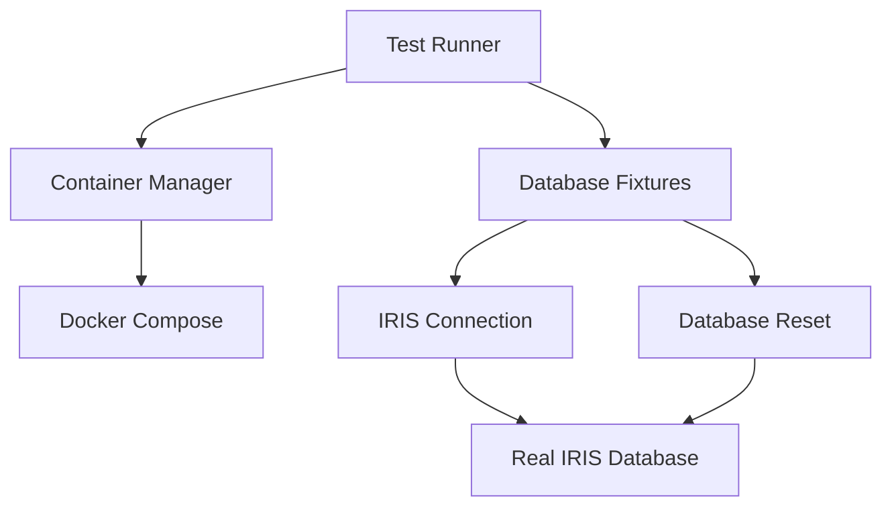

# Simplified Test Architecture Design

## Executive Summary

The current test system suffers from excessive complexity with multiple layers of abstraction, circular import issues, and unreliable mock systems. This document outlines a simplified, robust test architecture that eliminates mocks, simplifies state management, and solves circular import problems.

## Current System Problems

### 1. **Excessive Complexity**
- **Test Mode Framework**: Complex 3-mode system (UNIT/INTEGRATION/E2E) with MockController
- **Multiple Configuration Files**: [`conftest.py`](tests/conftest.py:1), [`conftest_test_modes.py`](tests/conftest_test_modes.py:1), [`test_modes.py`](tests/test_modes.py:1)
- **Layered Abstractions**: Real data fixtures, mock fixtures, auto-detection logic
- **433-line conftest.py**: Violates single responsibility principle

### 2. **Mock System Issues**
- **Widespread Mock Usage**: 40+ mock fixtures across test files
- **Mock Reliability**: Complex mock setups that don't reflect real behavior
- **Mock Maintenance**: Constant updates needed when real systems change
- **Test Confidence**: Mocks passing while real systems fail

### 3. **Circular Import Problems**
- **IRIS DBAPI Imports**: "partially initialized module 'intersystems_iris' has no attribute 'dbapi'"
- **Cross-Module Dependencies**: Test modules importing from each other
- **Import Order Issues**: Fixtures trying to import modules that import them back

### 4. **Container State Management**
- **Testcontainer Complexity**: Unnecessary abstraction over Docker Compose
- **State Detection**: Complex logic to determine if containers are running
- **Resource Management**: Inconsistent cleanup and teardown

## Simplified Architecture Design

### Core Principles

1. **Real Database Only**: All tests run against real IRIS database
2. **Simple Container Management**: Direct Docker Compose usage
3. **Clean State Management**: Database reset between test runs
4. **No Circular Imports**: Clear module boundaries and import hierarchy

### Architecture Components

```
tests/
├── conftest.py                 # Single, simple configuration file (~150 lines)
├── fixtures/
│   ├── database.py            # Database connection and state management
│   ├── container.py           # Docker container management
│   └── data.py               # Test data fixtures
└── utils/
    ├── db_reset.py           # Database cleanup utilities
    └── container_manager.py  # Simple container operations
```

### Service Boundaries



## New Test Setup Design

### 1. Container Management Service

**Purpose**: Simple, robust Docker container lifecycle management

**Responsibilities**:
- Detect if IRIS container is running
- Start container if needed using Docker Compose
- Wait for container health check
- Provide connection parameters

**Interface**:
```python
class ContainerManager:
    def ensure_iris_running() -> bool
    def get_connection_params() -> dict
    def is_container_healthy() -> bool
```

### 2. Database State Service

**Purpose**: Clean database state management for tests

**Responsibilities**:
- Reset database to clean state
- Verify minimum data requirements
- Handle schema initialization

**Interface**:
```python
class DatabaseState:
    def reset_to_clean_state(connection) -> None
    def ensure_test_schema(connection) -> None
    def verify_data_requirements(connection, min_docs: int) -> bool
```

### 3. Connection Service

**Purpose**: Simple, reliable database connections

**Responsibilities**:
- Provide database connections
- Handle connection pooling
- Manage connection lifecycle

**Interface**:
```python
class ConnectionService:
    def get_connection() -> Connection
    def close_connection(connection) -> None
    def test_connection() -> bool
```

## Pseudocode for New Fixtures

### Core Database Fixture

```python
# tests/fixtures/database.py

import pytest
from tests.utils.container_manager import ContainerManager
from tests.utils.db_reset import DatabaseReset

@pytest.fixture(scope="session")
def iris_container():
    """Ensure IRIS container is running for the test session."""
    container_mgr = ContainerManager()
    
    # Start container if not running
    if not container_mgr.is_iris_running():
        container_mgr.start_iris()
        container_mgr.wait_for_health()
    
    yield container_mgr.get_connection_params()
    
    # Container stays running for potential next test runs

@pytest.fixture(scope="function")
def clean_database(iris_container):
    """Provide a clean database state for each test."""
    import intersystems_iris.dbapi as iris
    
    # Get connection using container params
    conn = iris.connect(**iris_container)
    
    # Reset to clean state
    db_reset = DatabaseReset()
    db_reset.clean_test_tables(conn)
    
    yield conn
    
    # Cleanup after test
    conn.close()

@pytest.fixture(scope="session")
def test_data_1000(iris_container):
    """Ensure 1000+ documents are available for testing."""
    import intersystems_iris.dbapi as iris
    
    conn = iris.connect(**iris_container)
    
    # Check if we have enough data
    cursor = conn.cursor()
    cursor.execute("SELECT COUNT(*) FROM RAG.SourceDocuments")
    count = cursor.fetchone()[0]
    
    if count < 1000:
        pytest.skip(f"Test requires 1000+ documents, found {count}")
    
    yield count
    conn.close()
```

### Container Management Utility

```python
# tests/utils/container_manager.py

import subprocess
import time
import logging

class ContainerManager:
    """Simple Docker container management for IRIS."""
    
    CONTAINER_NAME = "iris_db_rag_standalone_community"
    COMPOSE_FILE = "docker-compose.yml"
    
    def is_iris_running(self) -> bool:
        """Check if IRIS container is running."""
        try:
            result = subprocess.run([
                "docker", "ps", "--filter", f"name={self.CONTAINER_NAME}",
                "--format", "{{.Names}}"
            ], capture_output=True, text=True, check=True)
            
            return self.CONTAINER_NAME in result.stdout
        except subprocess.CalledProcessError:
            return False
    
    def start_iris(self) -> None:
        """Start IRIS container using Docker Compose."""
        if self.is_iris_running():
            logging.info("IRIS container already running")
            return
        
        logging.info("Starting IRIS container...")
        subprocess.run([
            "docker-compose", "-f", self.COMPOSE_FILE, "up", "-d", "iris_db"
        ], check=True)
    
    def wait_for_health(self, timeout: int = 120) -> None:
        """Wait for IRIS container to be healthy."""
        start_time = time.time()
        
        while time.time() - start_time < timeout:
            if self.is_container_healthy():
                logging.info("IRIS container is healthy")
                return
            
            time.sleep(5)
        
        raise TimeoutError("IRIS container failed to become healthy")
    
    def is_container_healthy(self) -> bool:
        """Check if IRIS container is healthy."""
        try:
            result = subprocess.run([
                "docker", "inspect", "--format", "{{.State.Health.Status}}",
                self.CONTAINER_NAME
            ], capture_output=True, text=True, check=True)
            
            return "healthy" in result.stdout
        except subprocess.CalledProcessError:
            return False
    
    def get_connection_params(self) -> dict:
        """Get connection parameters for IRIS."""
        return {
            "hostname": "localhost",
            "port": 1972,
            "namespace": "USER",
            "username": "_SYSTEM",
            "password": "SYS"
        }
```

### Database Reset Utility

```python
# tests/utils/db_reset.py

import logging

class DatabaseReset:
    """Utilities for resetting database state between tests."""
    
    def clean_test_tables(self, connection) -> None:
        """Clean test tables to ensure isolated test state."""
        cursor = connection.cursor()
        
        # List of tables to clean (preserve data, clean test artifacts)
        test_tables = [
            "RAG.TestResults",
            "RAG.TestDocuments", 
            "RAG.TestEmbeddings"
        ]
        
        for table in test_tables:
            try:
                cursor.execute(f"DELETE FROM {table}")
                logging.debug(f"Cleaned table {table}")
            except Exception as e:
                # Table might not exist, which is fine
                logging.debug(f"Could not clean {table}: {e}")
        
        connection.commit()
        cursor.close()
    
    def ensure_test_schema(self, connection) -> None:
        """Ensure test schema exists."""
        cursor = connection.cursor()
        
        # Create schema if it doesn't exist
        try:
            cursor.execute("CREATE SCHEMA IF NOT EXISTS RAG")
            connection.commit()
        except Exception as e:
            logging.debug(f"Schema creation note: {e}")
        
        cursor.close()
```

### Simplified conftest.py

```python
# tests/conftest.py

import pytest
import sys
import os

# Add project root to path
sys.path.insert(0, os.path.dirname(os.path.dirname(__file__)))

# Import fixtures from organized modules
from tests.fixtures.database import iris_container, clean_database, test_data_1000

# Simple pytest configuration
def pytest_configure(config):
    """Configure pytest markers."""
    config.addinivalue_line("markers", "requires_1000_docs: Test requires 1000+ documents")
    config.addinivalue_line("markers", "slow: Slow running test")

# Session-scoped fixtures for expensive operations
@pytest.fixture(scope="session")
def embedding_model():
    """Load embedding model once per session."""
    from common.utils import get_embedding_func
    return get_embedding_func()

@pytest.fixture(scope="session") 
def llm_client():
    """Initialize LLM client once per session."""
    from common.utils import get_llm_func
    return get_llm_func()

# Test data fixtures
@pytest.fixture
def sample_documents():
    """Provide sample documents for testing."""
    return [
        {"id": "test_1", "content": "Sample medical document about diabetes."},
        {"id": "test_2", "content": "Research paper on cardiovascular disease."},
        {"id": "test_3", "content": "Clinical trial results for new medication."}
    ]

@pytest.fixture
def sample_queries():
    """Provide sample queries for testing."""
    return [
        "What are the symptoms of diabetes?",
        "How is cardiovascular disease treated?",
        "What are the side effects of the new medication?"
    ]
```

## How This Design Solves Current Problems

### 1. **Eliminates Mocks**
- **Real Database Only**: All tests use real IRIS database
- **Authentic Behavior**: Tests reflect actual system behavior
- **Reduced Maintenance**: No mock updates when real systems change
- **Higher Confidence**: Tests that pass actually work in production

### 2. **Simplifies State Management**
- **Single Container Strategy**: Use existing Docker Compose setup
- **Simple Detection**: Direct Docker commands instead of complex abstractions
- **Clean State**: Database reset between tests ensures isolation
- **Predictable Startup**: Container health checks ensure readiness

### 3. **Removes Unnecessary Abstractions**
- **No Test Mode Framework**: Single approach for all tests
- **Direct Docker Usage**: No testcontainer wrapper
- **Simple Fixtures**: Clear, single-purpose fixtures
- **Reduced Configuration**: One conftest.py instead of multiple

### 4. **Solves Circular Imports**
- **Clear Module Hierarchy**: Tests → Fixtures → Utils → Common
- **No Cross-Imports**: Fixtures don't import from test modules
- **Delayed Imports**: Import IRIS modules only when needed
- **Isolated Utilities**: Self-contained utility modules

### 5. **Improves Maintainability**
- **Single Responsibility**: Each module has one clear purpose
- **Under 500 Lines**: All files follow size constraints
- **Clear Interfaces**: Well-defined service boundaries
- **Simple Dependencies**: Minimal, clear dependency graph

## Migration Strategy

### Phase 1: Create New Infrastructure
1. Create new fixture modules
2. Implement container manager utility
3. Implement database reset utility
4. Create simplified conftest.py

### Phase 2: Migrate Tests
1. Update existing tests to use new fixtures
2. Remove mock dependencies
3. Ensure tests work with real database

### Phase 3: Cleanup
1. Remove old test mode framework
2. Remove mock fixtures
3. Remove complex configuration files
4. Update documentation

## Benefits

### For Developers
- **Faster Test Development**: Simple, predictable fixtures
- **Higher Confidence**: Tests that actually work
- **Easier Debugging**: Real system behavior
- **Less Maintenance**: No mock updates needed

### For System Reliability
- **Authentic Testing**: Real database interactions
- **Early Problem Detection**: Issues found in tests, not production
- **Consistent Behavior**: Same database in tests and production
- **Reduced Test Flakiness**: Stable, real system behavior

### For Project Maintenance
- **Simpler Codebase**: Fewer abstractions and configurations
- **Clear Architecture**: Well-defined service boundaries
- **Easier Onboarding**: Straightforward test setup
- **Reduced Complexity**: Single approach instead of multiple modes