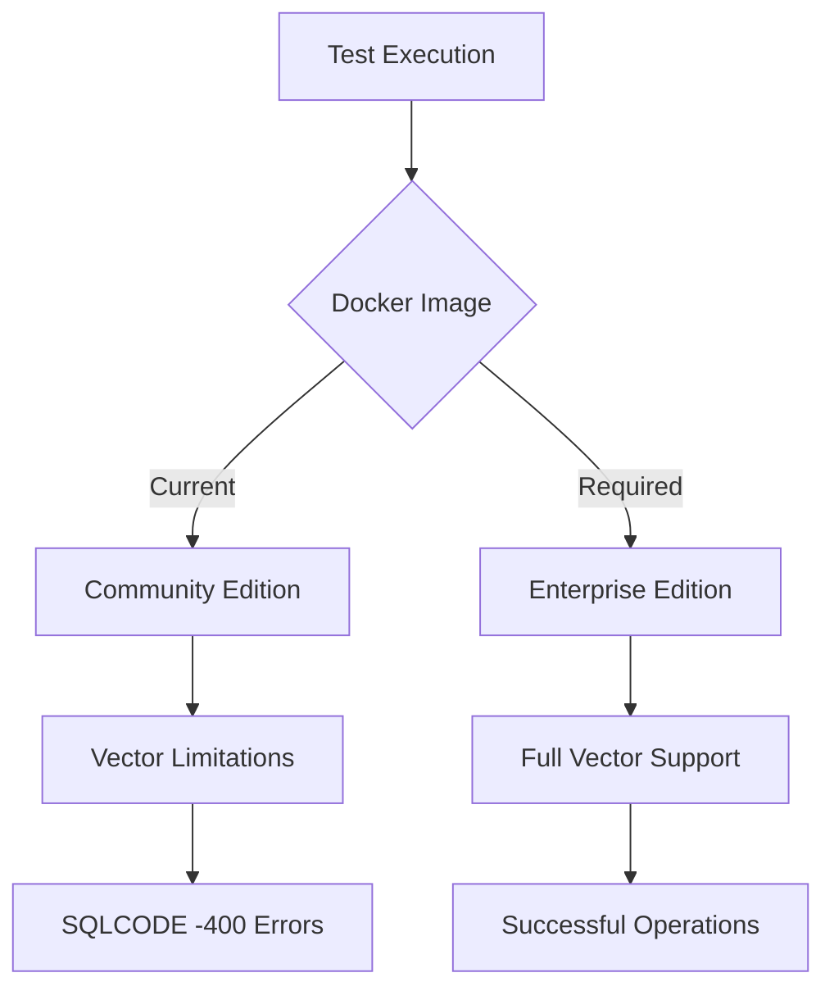
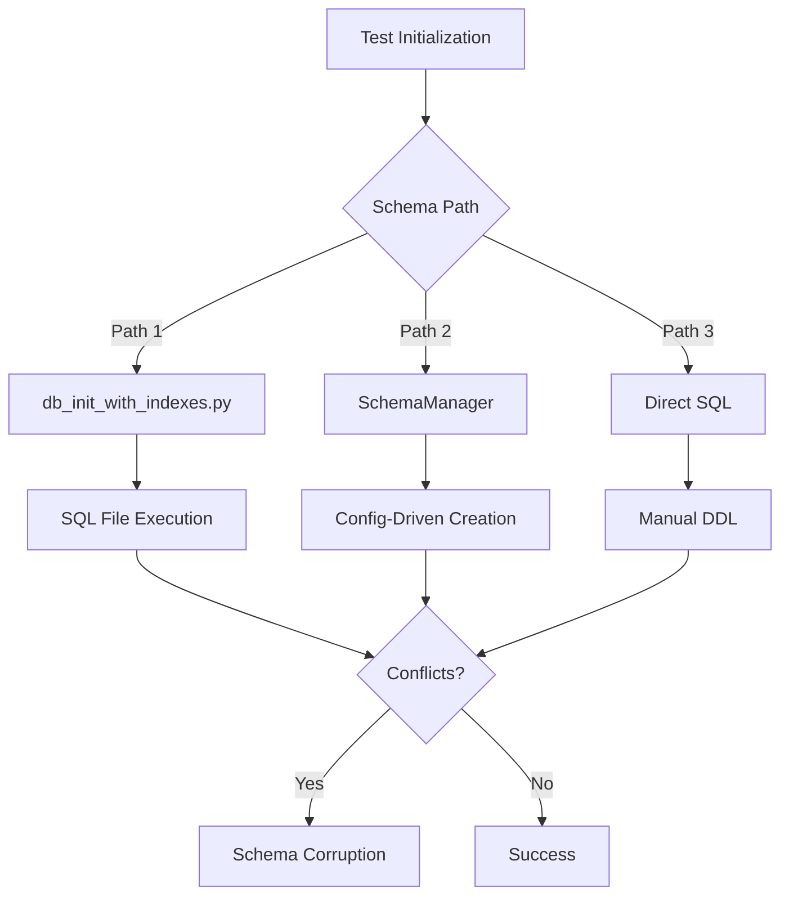

# SQLCODE -400 Error Analysis and Fix Specification

## Executive Summary

The test suite is experiencing widespread `SQLCODE: <-400>:<Fatal error occurred>` errors that prevent schema creation and cause cascading test failures. This document provides a comprehensive analysis of the root cause and detailed fix specification.

## Error Pattern Analysis

### Observed Error Signature
```
[SQLCODE: <-400>:<Fatal error occurred>]
[Location: <ServerLoop - Query Open()>]
[%msg: <Unexpected error occurred: <VECTOR>%C0o+19^%sqlcq.USER.cls47.1>]
```

**Key Observations:**
- Error occurs during SQL query execution (`ServerLoop - Query Open()`)
- References VECTOR operations (`<VECTOR>%C0o+19^%sqlcq.USER.cls47.1>`)
- Affects schema creation and table operations
- Widespread across all RAG technique validations

## Root Cause Analysis

### Primary Hypothesis: IRIS Community Edition Vector Limitations

**Evidence:**
1. **Docker Configuration Issue**: The project uses `intersystemsdc/iris-community:latest` in [`docker-compose.yml`](docker-compose.yml:3) but requires Enterprise edition for vector operations
2. **Vector Operation Failures**: Error message contains `<VECTOR>` indicating vector-related SQL failures
3. **Schema Creation Context**: Errors occur during table creation with vector columns (`VECTOR(FLOAT, 384)`)
4. **Community Edition Constraints**: Per project rules, Community Edition has 10GB limit and may lack full vector support

### Secondary Issues

#### 1. Connection Management Architecture Mismatch
- **Issue**: [`IRISConnectionManager`](common/iris_connection_manager.py:36) attempts DBAPI first, then JDBC fallback
- **Problem**: Test containers use different connection parameters than production
- **Evidence**: Container uses `_SYSTEM/SYS` but connection manager defaults to `SuperUser/SYS`

#### 2. Schema Initialization Race Conditions
- **Issue**: Multiple initialization paths create conflicts
- **Paths Identified**:
  - [`db_init_with_indexes.py`](common/db_init_with_indexes.py:19) - Direct SQL execution
  - [`SchemaManager`](iris_rag/storage/schema_manager.py:15) - Configuration-driven approach
  - [`database.py` fixture](tests/fixtures/database.py:25) - Test-specific initialization

#### 3. Vector SQL Syntax Incompatibility
- **Issue**: Community Edition may not support advanced vector operations
- **Evidence**: [`db_init_complete.sql`](common/db_init_complete.sql:23) uses `AS HNSW` syntax which requires Enterprise features

## Architectural Issues Identified

### 1. Database Edition Management


### 2. Connection Management Flow
```mermaid
graph TD
    A[Test Start] --> B[Container Manager]
    B --> C[Docker Compose Up]
    C --> D[IRIS Community Container]
    D --> E[Connection Attempt]
    E --> F{Connection Type}
    F -->|DBAPI| G[iris.connect()]
    F -->|JDBC| H[jaydebeapi.connect()]
    G --> I{Credentials Match}
    H --> I
    I -->|No| J[Auth Failure]
    I -->|Yes| K[Schema Creation]
    K --> L{Vector Support}
    L -->|No| M[SQLCODE -400]
    L -->|Yes| N[Success]
```

### 3. Schema Management Conflicts


## Fix Specification

### Phase 1: Immediate Fixes (Critical)

#### 1.1 Docker Image Upgrade
**File**: [`docker-compose.yml`](docker-compose.yml)
**Change**: Replace Community Edition with Enterprise/ML Edition
```yaml
# BEFORE
image: intersystemsdc/iris-community:latest

# AFTER  
image: containers.intersystems.com/intersystems/iris-ml:latest
# OR use environment variable override
image: ${IRIS_DOCKER_IMAGE:-containers.intersystems.com/intersystems/iris-ml:latest}
```

#### 1.2 Connection Parameter Alignment
**File**: [`tests/utils/container_manager.py`](tests/utils/container_manager.py:57)
**Change**: Align connection parameters with container configuration
```python
# CURRENT
"username": "_SYSTEM",
"password": "SYS"

# SHOULD MATCH docker-compose.yml environment
"username": "SuperUser",  # or _SYSTEM if container uses that
"password": "SYS"
```

#### 1.3 Schema Initialization Consolidation
**Action**: Standardize on single schema initialization path
**Primary Path**: Use [`SchemaManager`](iris_rag/storage/schema_manager.py) exclusively
**Deprecated Paths**: 
- Direct SQL file execution in [`db_init_with_indexes.py`](common/db_init_with_indexes.py)
- Manual DDL in test fixtures

### Phase 2: Architecture Improvements (Important)

#### 2.1 Environment Detection Enhancement
**File**: [`common/iris_connection_manager.py`](common/iris_connection_manager.py:26)
**Enhancement**: Add IRIS edition detection and capability validation
```python
def _detect_iris_capabilities(self):
    """Detect IRIS edition and vector support capabilities."""
    # Query IRIS system tables to determine edition and features
    # Fail fast if vector operations not supported
```

#### 2.2 Test Container Management
**File**: [`tests/utils/container_manager.py`](tests/utils/container_manager.py:7)
**Enhancement**: Add edition-aware container management
```python
def get_iris_image(self):
    """Get appropriate IRIS image based on requirements."""
    return os.environ.get("IRIS_DOCKER_IMAGE", 
                         "containers.intersystems.com/intersystems/iris-ml:latest")
```

#### 2.3 Vector Operation Validation
**New File**: `common/iris_capability_validator.py`
**Purpose**: Validate IRIS capabilities before attempting vector operations
```python
class IRISCapabilityValidator:
    def validate_vector_support(self):
        """Validate vector operations are supported."""
    
    def validate_hnsw_support(self):
        """Validate HNSW index support."""
```

### Phase 3: Monitoring and Prevention (Nice-to-have)

#### 3.1 Error Classification System
**Enhancement**: Categorize SQLCODE errors for better debugging
- Vector operation errors (SQLCODE -400 with VECTOR context)
- Permission errors (SQLCODE -99, etc.)
- Schema conflicts (SQLCODE -370, etc.)

#### 3.2 Health Check Enhancement
**File**: [`docker-compose.yml`](docker-compose.yml:15)
**Enhancement**: Add vector operation validation to health check
```yaml
healthcheck:
  test: ["CMD", "/usr/irissys/bin/iris", "session", "iris", "-U%SYS", 
         "##class(%SYSTEM.SQL).Execute(\"SELECT TO_VECTOR('[1,2,3]')\")"]
```

## Implementation Priority

### Critical (Fix Immediately)
1. **Docker Image Upgrade** - Resolves core vector support issue
2. **Connection Parameter Alignment** - Fixes authentication failures
3. **Schema Path Consolidation** - Eliminates initialization conflicts

### Important (Fix Soon)
1. **Capability Detection** - Prevents future compatibility issues
2. **Container Management Enhancement** - Improves test reliability
3. **Vector Validation** - Provides early failure detection

### Nice-to-have (Future Enhancement)
1. **Error Classification** - Improves debugging experience
2. **Enhanced Health Checks** - Better container readiness detection
3. **Monitoring Integration** - Proactive issue detection

## Validation Plan

### 1. Immediate Validation
```bash
# Test with Enterprise edition
export IRIS_DOCKER_IMAGE=containers.intersystems.com/intersystems/iris-ml:latest
docker-compose down && docker-compose up -d
uv run pytest tests/test_core/test_models.py -v
```

### 2. Schema Creation Validation
```bash
# Test schema manager directly
uv run python -c "
from iris_rag.storage.schema_manager import SchemaManager
from common.iris_connection_manager import IRISConnectionManager
from iris_rag.config.manager import ConfigurationManager

manager = SchemaManager(IRISConnectionManager(), ConfigurationManager())
manager.ensure_table_schema('SourceDocuments')
print('✅ Schema creation successful')
"
```

### 3. Vector Operation Validation
```bash
# Test vector operations directly
uv run python -c "
from common.iris_connection_manager import get_iris_connection
conn = get_iris_connection()
cursor = conn.cursor()
cursor.execute('SELECT TO_VECTOR(\"[1,2,3]\")')
print('✅ Vector operations supported')
"
```

## Success Criteria

1. **Zero SQLCODE -400 errors** in test suite execution
2. **Successful schema creation** for all RAG techniques
3. **Vector operations working** (TO_VECTOR, HNSW indexes)
4. **Test suite passes** with 1000+ document validation
5. **Container health checks pass** consistently

## Risk Assessment

### High Risk
- **Data Loss**: Schema recreation may lose existing test data
- **License Requirements**: Enterprise edition requires valid license

### Medium Risk  
- **Performance Impact**: Enterprise edition may have different resource requirements
- **Configuration Drift**: Multiple docker-compose files need alignment

### Low Risk
- **Test Timing**: Longer container startup with Enterprise edition
- **Development Workflow**: Developers need Enterprise edition access

## Conclusion

The SQLCODE -400 errors are primarily caused by using IRIS Community Edition for vector operations that require Enterprise edition capabilities. The fix requires upgrading the Docker image and aligning connection management, with additional architectural improvements to prevent future issues.

**Immediate Action Required**: Upgrade to IRIS Enterprise/ML edition and align connection parameters.

**Long-term Strategy**: Implement capability detection and standardize schema management to prevent similar issues.