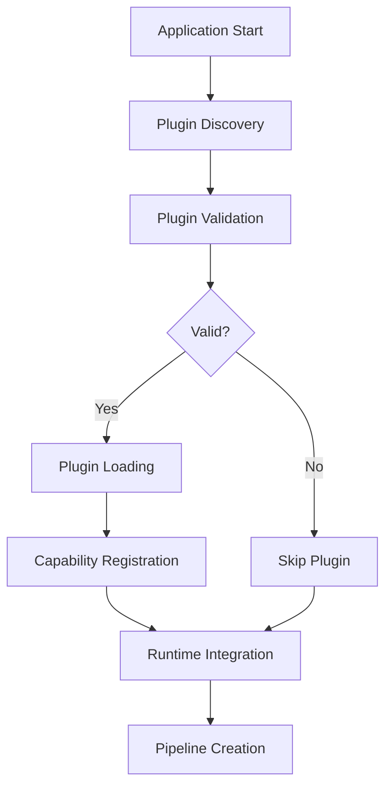

# RAG-Templates Plugin System Specification

## 🎯 Overview

This specification defines a modular plugin architecture for rag-templates that enables external packages to contribute RAG pipelines, schema managers, and other extensions while maintaining the declarative configuration approach.

## 🏗️ Plugin Architecture

### Core Principles

1. **Declarative Configuration**: Plugins are configured through YAML, not code
2. **Dynamic Discovery**: Plugins are discovered and loaded at runtime
3. **Graceful Degradation**: Missing plugins don't break core functionality
4. **Version Compatibility**: Plugins declare rag-templates compatibility requirements
5. **Dependency Isolation**: Plugin dependencies don't pollute core framework

### Plugin Lifecycle



## 📋 Plugin Manifest Format

### Standard Manifest (plugin.yaml)

```yaml
# plugin.yaml - Required in plugin root
plugin:
  # Identity
  name: "hybridgraphrag"
  display_name: "HybridGraphRAG Advanced Search"
  version: "1.0.0"
  description: "Advanced hybrid search with graph traversal and vector fusion"
  author: "InterSystems"
  license: "MIT"
  homepage: "https://github.com/intersystems/hybridgraphrag-plugin"

  # Compatibility
  rag_templates:
    minimum_version: "1.0.0"
    maximum_version: "2.0.0"
    required_features:
      - "schema_manager_factory"
      - "pipeline_base_v2"
      - "configuration_v2"

  # Dependencies
  dependencies:
    python:
      minimum_version: "3.8"
    external_packages:
      - name: "iris-vector-graph"
        version: ">=2.0.0,<3.0.0"
        optional: false
      - name: "numpy"
        version: ">=1.20.0"
        optional: true
    system:
      - name: "IRIS Database"
        version: ">=2023.1"
        description: "InterSystems IRIS with vector support"

  # Capabilities
  provides:
    pipelines:
      - name: "HybridGraphRAG"
        class: "hybridgraphrag.pipeline.HybridGraphRAGPipeline"
        description: "Hybrid search combining vector, text, and graph signals"
        schema_manager: "hybridgraphrag.schema.HybridGraphRAGSchemaManager"
        tags: ["advanced", "graph", "vector", "hybrid"]

    schema_managers:
      - name: "HybridGraphRAGSchemaManager"
        class: "hybridgraphrag.schema.HybridGraphRAGSchemaManager"
        description: "Manages iris_graph_core tables and HNSW indexes"

    configuration_schemas:
      - name: "hybridgraphrag_config"
        schema_file: "config/schema.json"
        defaults_file: "config/defaults.yaml"

  # Schema Requirements
  schema_requirements:
    tables:
      - name: "KG_NODEEMBEDDINGS_OPTIMIZED"
        description: "Optimized node embeddings for HNSW search"
        required: true
      - name: "RDF_EDGES"
        description: "RDF graph edges for traversal"
        required: true
      - name: "RDF_LABELS"
        description: "Entity labels and classifications"
        required: true
      - name: "RDF_PROPS"
        description: "Entity properties and attributes"
        required: true

    indexes:
      - name: "idx_kg_nodeembeddings_vector"
        table: "KG_NODEEMBEDDINGS_OPTIMIZED"
        type: "HNSW"
        required: false
        description: "HNSW index for fast vector similarity"

  # Integration Points
  hooks:
    pre_pipeline_creation:
      - "hybridgraphrag.hooks.validate_iris_graph_core"
    post_schema_setup:
      - "hybridgraphrag.hooks.optimize_vector_indexes"

  # Plugin-specific Configuration
  configuration:
    default_retrieval_method: "hybrid"
    fusion_weights:
      vector: 0.4
      text: 0.3
      graph: 0.3
    fallback_to_graphrag: true
    auto_setup_schema: true
```

## 🔌 Plugin Interface

### Core Plugin Interface

```python
# iris_rag/plugins/interface.py
from abc import ABC, abstractmethod
from typing import Dict, Any, List, Optional, Type
from dataclasses import dataclass

@dataclass
class PluginManifest:
    name: str
    version: str
    description: str
    rag_templates_compatibility: Dict[str, str]
    dependencies: Dict[str, List[Dict[str, Any]]]
    provides: Dict[str, List[Dict[str, Any]]]
    schema_requirements: Dict[str, List[Dict[str, Any]]]
    configuration: Dict[str, Any]

@dataclass
class ValidationResult:
    is_valid: bool
    message: str
    missing_dependencies: List[str] = None
    warnings: List[str] = None

class RAGPlugin(ABC):
    """Base interface for all RAG plugins."""

    @abstractmethod
    def get_manifest(self) -> PluginManifest:
        """Return plugin manifest."""

    @abstractmethod
    def get_pipeline_classes(self) -> Dict[str, Type['RAGPipeline']]:
        """Return pipeline implementations provided by this plugin."""

    @abstractmethod
    def get_schema_managers(self) -> Dict[str, Type['SchemaManager']]:
        """Return schema managers provided by this plugin."""

    @abstractmethod
    def validate_environment(self) -> ValidationResult:
        """Validate plugin dependencies and environment."""

    @abstractmethod
    def initialize(self, config: Dict[str, Any]) -> None:
        """Initialize plugin with configuration."""

    def get_configuration_schema(self) -> Optional[Dict[str, Any]]:
        """Return JSON schema for plugin configuration."""
        return None

    def get_default_configuration(self) -> Dict[str, Any]:
        """Return default configuration values."""
        return {}

    def pre_pipeline_creation_hook(self, pipeline_type: str, config: Dict[str, Any]) -> Dict[str, Any]:
        """Hook called before pipeline creation. Can modify config."""
        return config

    def post_schema_setup_hook(self, schema_manager: 'SchemaManager') -> None:
        """Hook called after schema setup is complete."""
        pass
```

### Plugin Discovery Interface

```python
# iris_rag/plugins/discovery.py
class PluginDiscovery:
    """Discovers and loads RAG plugins from various sources."""

    @staticmethod
    def discover_entry_point_plugins() -> List[PluginManifest]:
        """Discover plugins via Python entry points."""
        import pkg_resources
        plugins = []
        for entry_point in pkg_resources.iter_entry_points('rag_templates_plugins'):
            try:
                plugin_class = entry_point.load()
                plugin = plugin_class()
                plugins.append(plugin.get_manifest())
            except Exception as e:
                logger.warning(f"Failed to load plugin {entry_point.name}: {e}")
        return plugins

    @staticmethod
    def discover_directory_plugins(search_paths: List[str]) -> List[PluginManifest]:
        """Discover plugins in specified directories."""
        plugins = []
        for search_path in search_paths:
            for plugin_dir in Path(search_path).glob("*"):
                manifest_path = plugin_dir / "plugin.yaml"
                if manifest_path.exists():
                    manifest = PluginManifest.from_yaml(manifest_path)
                    plugins.append(manifest)
        return plugins

    @staticmethod
    def discover_configured_plugins(config: Dict[str, Any]) -> List[PluginManifest]:
        """Discover plugins specified in configuration."""
        # Implementation for config-specified plugins
        pass
```

## 🔧 Core Framework Modifications

### Enhanced Configuration Manager

```python
# iris_rag/config/manager.py - Plugin support additions
class ConfigurationManager:
    def __init__(self, config_path: Optional[str] = None):
        # ... existing initialization
        self.plugin_manager = None  # Will be set by application

    def get_plugin_configuration(self, plugin_name: str) -> Dict[str, Any]:
        """Get configuration for a specific plugin."""
        plugin_config = self.get(f"plugins:configuration:{plugin_name}", {})

        # Merge with plugin defaults if available
        if self.plugin_manager:
            plugin = self.plugin_manager.get_plugin(plugin_name)
            if plugin:
                defaults = plugin.get_default_configuration()
                merged_config = {**defaults, **plugin_config}
                return merged_config

        return plugin_config

    def get_enabled_plugins(self) -> List[str]:
        """Get list of enabled plugins."""
        return self.get("plugins:enabled", [])

    def validate_plugin_configuration(self, plugin_name: str) -> ValidationResult:
        """Validate plugin configuration against its schema."""
        if not self.plugin_manager:
            return ValidationResult(False, "Plugin manager not initialized")

        plugin = self.plugin_manager.get_plugin(plugin_name)
        if not plugin:
            return ValidationResult(False, f"Plugin {plugin_name} not found")

        schema = plugin.get_configuration_schema()
        if not schema:
            return ValidationResult(True, "No schema validation required")

        config = self.get_plugin_configuration(plugin_name)
        # Validate config against schema (use jsonschema or similar)
        return self._validate_against_schema(config, schema)
```

### Plugin Manager Implementation

```python
# iris_rag/plugins/manager.py
class PluginManager:
    """Manages plugin discovery, loading, and lifecycle."""

    def __init__(self, config_manager: ConfigurationManager):
        self.config_manager = config_manager
        self.loaded_plugins: Dict[str, RAGPlugin] = {}
        self.plugin_manifests: Dict[str, PluginManifest] = {}
        self.pipeline_registry: Dict[str, Tuple[RAGPlugin, str]] = {}
        self.schema_manager_registry: Dict[str, Tuple[RAGPlugin, str]] = {}

    def initialize(self) -> None:
        """Initialize plugin system and load enabled plugins."""
        # Discover available plugins
        manifests = self._discover_all_plugins()

        # Load enabled plugins
        enabled_plugins = self.config_manager.get_enabled_plugins()

        for plugin_name in enabled_plugins:
            if plugin_name in manifests:
                self._load_plugin(plugin_name, manifests[plugin_name])
            else:
                logger.warning(f"Enabled plugin '{plugin_name}' not found")

    def _discover_all_plugins(self) -> Dict[str, PluginManifest]:
        """Discover plugins from all sources."""
        manifests = {}

        # Entry point plugins
        for manifest in PluginDiscovery.discover_entry_point_plugins():
            manifests[manifest.name] = manifest

        # Directory plugins
        search_paths = self.config_manager.get("plugins:discovery:search_paths", [])
        for manifest in PluginDiscovery.discover_directory_plugins(search_paths):
            manifests[manifest.name] = manifest

        return manifests

    def _load_plugin(self, plugin_name: str, manifest: PluginManifest) -> None:
        """Load and initialize a specific plugin."""
        try:
            # Validate compatibility
            if not self._validate_compatibility(manifest):
                logger.error(f"Plugin {plugin_name} is not compatible")
                return

            # Load plugin class
            plugin_class = self._import_plugin_class(manifest)
            plugin = plugin_class()

            # Validate environment
            validation = plugin.validate_environment()
            if not validation.is_valid:
                logger.error(f"Plugin {plugin_name} environment validation failed: {validation.message}")
                return

            # Initialize plugin
            config = self.config_manager.get_plugin_configuration(plugin_name)
            plugin.initialize(config)

            # Register plugin
            self.loaded_plugins[plugin_name] = plugin
            self.plugin_manifests[plugin_name] = manifest
            self._register_plugin_capabilities(plugin, manifest)

            logger.info(f"Successfully loaded plugin: {plugin_name}")

        except Exception as e:
            logger.error(f"Failed to load plugin {plugin_name}: {e}")

    def _register_plugin_capabilities(self, plugin: RAGPlugin, manifest: PluginManifest) -> None:
        """Register plugin's capabilities with the framework."""
        # Register pipelines
        pipeline_classes = plugin.get_pipeline_classes()
        for pipeline_name, pipeline_class in pipeline_classes.items():
            self.pipeline_registry[pipeline_name] = (plugin, pipeline_class)

        # Register schema managers
        schema_managers = plugin.get_schema_managers()
        for manager_name, manager_class in schema_managers.items():
            self.schema_manager_registry[manager_name] = (plugin, manager_class)

    def get_plugin_pipeline_class(self, pipeline_name: str) -> Optional[Type['RAGPipeline']]:
        """Get pipeline class from plugins."""
        if pipeline_name in self.pipeline_registry:
            plugin, pipeline_class = self.pipeline_registry[pipeline_name]
            return pipeline_class
        return None

    def get_plugin_schema_manager_class(self, manager_name: str) -> Optional[Type['SchemaManager']]:
        """Get schema manager class from plugins."""
        if manager_name in self.schema_manager_registry:
            plugin, manager_class = self.schema_manager_registry[manager_name]
            return manager_class
        return None

    def execute_pre_pipeline_creation_hooks(self, pipeline_type: str, config: Dict[str, Any]) -> Dict[str, Any]:
        """Execute pre-pipeline creation hooks from all loaded plugins."""
        for plugin in self.loaded_plugins.values():
            config = plugin.pre_pipeline_creation_hook(pipeline_type, config)
        return config

    def execute_post_schema_setup_hooks(self, schema_manager: 'SchemaManager') -> None:
        """Execute post-schema setup hooks from all loaded plugins."""
        for plugin in self.loaded_plugins.values():
            plugin.post_schema_setup_hook(schema_manager)
```

### Enhanced Pipeline Factory

```python
# iris_rag/pipelines/factory.py - Plugin integration
def create_pipeline(
    pipeline_type: str,
    config_path: Optional[str] = None,
    plugin_manager: Optional[PluginManager] = None,
    **kwargs
) -> RAGPipeline:
    """Enhanced factory with plugin support."""

    config_manager = ConfigurationManager(config_path)

    # Initialize plugin manager if not provided
    if plugin_manager is None:
        plugin_manager = PluginManager(config_manager)
        plugin_manager.initialize()

    # Set plugin manager reference for configuration
    config_manager.plugin_manager = plugin_manager

    # Check for plugin-provided pipelines first
    plugin_pipeline_class = plugin_manager.get_plugin_pipeline_class(pipeline_type)
    if plugin_pipeline_class:
        return _create_plugin_pipeline(
            plugin_pipeline_class,
            config_manager,
            plugin_manager,
            pipeline_type,
            **kwargs
        )

    # Fall back to core pipelines
    return _create_core_pipeline(pipeline_type, config_manager, **kwargs)

def _create_plugin_pipeline(
    pipeline_class: Type[RAGPipeline],
    config_manager: ConfigurationManager,
    plugin_manager: PluginManager,
    pipeline_type: str,
    **kwargs
) -> RAGPipeline:
    """Create plugin-provided pipeline with proper integration."""

    # Execute pre-creation hooks
    config = plugin_manager.execute_pre_pipeline_creation_hooks(pipeline_type, kwargs)

    # Get plugin-specific configuration
    plugin_config = config_manager.get_plugin_configuration(pipeline_type.lower())
    merged_config = {**config, **plugin_config}

    # Create connection manager
    connection_manager = ConnectionManager(config_manager)

    # Create appropriate schema manager
    from iris_rag.storage.schema_manager import SchemaManager
    schema_manager = SchemaManager.create_schema_manager(
        pipeline_type, connection_manager, config_manager, plugin_manager
    )

    # Create pipeline instance
    pipeline = pipeline_class(
        connection_manager=connection_manager,
        config_manager=config_manager,
        schema_manager=schema_manager,
        **merged_config
    )

    # Execute post-schema setup hooks
    plugin_manager.execute_post_schema_setup_hooks(schema_manager)

    return pipeline
```

## 📦 Plugin Package Template

### Setup.py Template

```python
# setup.py template for plugin packages
from setuptools import setup, find_packages

setup(
    name="hybridgraphrag-plugin",
    version="1.0.0",
    description="HybridGraphRAG plugin for rag-templates",
    author="Your Name",
    author_email="your.email@example.com",
    packages=find_packages(),
    include_package_data=True,
    package_data={
        "hybridgraphrag": ["config/*.yaml", "config/*.json", "plugin.yaml"]
    },
    install_requires=[
        "rag-templates>=1.0.0",
        "iris-vector-graph>=2.0.0",
        "numpy>=1.20.0",
    ],
    entry_points={
        "rag_templates_plugins": [
            "hybridgraphrag = hybridgraphrag:HybridGraphRAGPlugin"
        ]
    },
    classifiers=[
        "Development Status :: 4 - Beta",
        "Intended Audience :: Developers",
        "License :: OSI Approved :: MIT License",
        "Programming Language :: Python :: 3.8",
        "Programming Language :: Python :: 3.9",
        "Programming Language :: Python :: 3.10",
        "Programming Language :: Python :: 3.11",
    ],
    python_requires=">=3.8",
    keywords="rag, retrieval, augmented, generation, iris, graph, vector",
    url="https://github.com/your-org/hybridgraphrag-plugin",
)
```

### Plugin Implementation Template

```python
# hybridgraphrag/__init__.py
from iris_rag.plugins.interface import RAGPlugin, PluginManifest, ValidationResult
from .pipeline import HybridGraphRAGPipeline
from .schema_manager import HybridGraphRAGSchemaManager
import yaml
from pathlib import Path
from typing import Dict, Any, Type, Optional

class HybridGraphRAGPlugin(RAGPlugin):
    """HybridGraphRAG plugin implementation."""

    def __init__(self):
        self._manifest = None
        self._config = {}

    def get_manifest(self) -> PluginManifest:
        """Load and return plugin manifest."""
        if self._manifest is None:
            manifest_path = Path(__file__).parent / "plugin.yaml"
            with open(manifest_path) as f:
                manifest_data = yaml.safe_load(f)
            self._manifest = PluginManifest(**manifest_data["plugin"])
        return self._manifest

    def get_pipeline_classes(self) -> Dict[str, Type['RAGPipeline']]:
        """Return pipeline classes provided by this plugin."""
        return {
            "HybridGraphRAG": HybridGraphRAGPipeline
        }

    def get_schema_managers(self) -> Dict[str, Type['SchemaManager']]:
        """Return schema manager classes provided by this plugin."""
        return {
            "HybridGraphRAGSchemaManager": HybridGraphRAGSchemaManager
        }

    def validate_environment(self) -> ValidationResult:
        """Validate that required dependencies are available."""
        missing_deps = []
        warnings = []

        # Check iris-vector-graph
        try:
            import iris_graph_core
        except ImportError:
            missing_deps.append("iris-vector-graph")

        # Check IRIS connectivity (non-blocking)
        try:
            from iris_rag.core.connection import ConnectionManager
            from iris_rag.config.manager import ConfigurationManager

            config = ConfigurationManager()
            conn_mgr = ConnectionManager(config)
            conn_mgr.get_connection()  # Test connection
        except Exception as e:
            warnings.append(f"IRIS connection test failed: {e}")

        is_valid = len(missing_deps) == 0
        message = "Environment validation passed"

        if missing_deps:
            message = f"Missing required dependencies: {', '.join(missing_deps)}"
        elif warnings:
            message = f"Validation passed with warnings: {'; '.join(warnings)}"

        return ValidationResult(
            is_valid=is_valid,
            message=message,
            missing_dependencies=missing_deps,
            warnings=warnings
        )

    def initialize(self, config: Dict[str, Any]) -> None:
        """Initialize plugin with configuration."""
        self._config = config

        # Plugin-specific initialization
        if config.get("auto_setup_schema", True):
            # Prepare for automatic schema setup
            pass

    def get_configuration_schema(self) -> Optional[Dict[str, Any]]:
        """Return JSON schema for configuration validation."""
        schema_path = Path(__file__).parent / "config" / "schema.json"
        if schema_path.exists():
            import json
            with open(schema_path) as f:
                return json.load(f)
        return None

    def get_default_configuration(self) -> Dict[str, Any]:
        """Return default configuration values."""
        defaults_path = Path(__file__).parent / "config" / "defaults.yaml"
        if defaults_path.exists():
            with open(defaults_path) as f:
                return yaml.safe_load(f)
        return {}

    def pre_pipeline_creation_hook(self, pipeline_type: str, config: Dict[str, Any]) -> Dict[str, Any]:
        """Hook called before HybridGraphRAG pipeline creation."""
        if pipeline_type == "HybridGraphRAG":
            # Inject plugin-specific configuration
            plugin_config = self._config
            config.update(plugin_config)
        return config

    def post_schema_setup_hook(self, schema_manager) -> None:
        """Hook called after schema setup for optimization."""
        if isinstance(schema_manager, HybridGraphRAGSchemaManager):
            # Perform post-setup optimizations
            schema_manager.optimize_vector_indexes()
```

## 🚀 Implementation Benefits

This plugin architecture provides:

1. **Dependency Isolation**: Heavy dependencies like iris-vector-graph are contained in plugins
2. **Modular Deployment**: Users install only needed capabilities
3. **Community Ecosystem**: Third parties can contribute specialized pipelines
4. **Declarative Configuration**: Plugins are configured through YAML, not code
5. **Version Management**: Independent versioning of core framework and plugins
6. **Graceful Degradation**: Missing plugins don't break core functionality

The separation enables rag-templates to remain a lean, focused framework while supporting advanced capabilities through a rich plugin ecosystem.