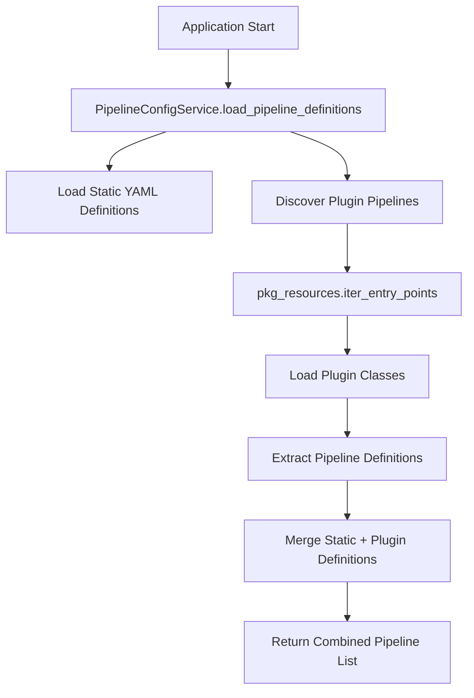

# Specification: HybridGraphRAG Plugin Separation

**Specification ID**: 004-hybridgraphrag-plugin-separation
**Version**: 1.0.0
**Status**: Draft
**Author**: Claude Code
**Date**: 2024-09-30

## 🎯 Overview

This specification defines the separation of HybridGraphRAG into an external plugin package to eliminate the heavy `iris-vector-graph` dependency from the core `rag-templates` framework while maintaining full functionality through the existing plugin infrastructure.

## 📋 Requirements

### Functional Requirements

**FR-001**: Core Framework Dependency Isolation
- Core `rag-templates` MUST install without `iris-vector-graph` dependency
- HybridGraphRAG functionality MUST remain identical when accessed through plugin
- Plugin system MUST automatically discover and load HybridGraphRAG plugin

**FR-002**: Plugin Architecture Integration
- Plugin system MUST leverage existing infrastructure (ModuleLoader, PipelineFactory, ConfigService)
- Plugin discovery MUST use Python entry points mechanism
- Plugin configuration MUST remain declarative through YAML

**FR-003**: Backward Compatibility
- Existing GraphRAG and BasicRAG pipelines MUST remain unchanged
- Current configuration format MUST continue to work
- No breaking changes to public APIs

**FR-004**: Plugin Functionality Completeness
- HybridGraphRAG plugin MUST provide all current HybridGraphRAG capabilities
- Schema management for iris_graph_core tables MUST be included
- All retrieval methods (kg, vector, text, hybrid) MUST work identically

### Non-Functional Requirements

**NFR-001**: Performance
- Plugin loading overhead MUST be < 100ms
- Runtime performance MUST be identical to current implementation
- Module caching MUST prevent repeated imports

**NFR-002**: Maintainability
- Plugin package MUST be independently versioned
- Plugin package MUST have independent CI/CD pipeline
- Core framework changes MUST be minimal (< 50 lines total)

**NFR-003**: Usability
- Plugin installation MUST be: `pip install hybridgraphrag-plugin`
- Plugin usage MUST remain: `create_pipeline("HybridGraphRAG")`
- Error messages MUST clearly indicate missing plugin when not installed

## 🏗️ Architecture

### Current State
```
rag-templates/
├── iris_rag/
│   ├── pipelines/
│   │   ├── hybrid_graphrag.py              # Heavy iris-vector-graph dependency
│   │   ├── hybrid_graphrag_discovery.py    # iris-vector-graph integration
│   │   └── hybrid_graphrag_retrieval.py    # Advanced retrieval methods
│   └── storage/
│       └── hybrid_schema_manager.py        # iris_graph_core table management
└── requirements.txt                        # includes iris-vector-graph
```

### Target State
```
Ecosystem:
├── rag-templates/                          # Core framework (lightweight)
│   ├── iris_rag/
│   │   ├── plugins/                        # ← Enhanced plugin infrastructure
│   │   ├── pipelines/                      # Core pipelines only
│   │   └── utils/                          # ← Enhanced ModuleLoader
│   └── requirements.txt                    # NO iris-vector-graph
└── hybridgraphrag-plugin/                  # Separate package
    ├── hybridgraphrag/
    │   ├── pipeline.py                     # ← Moved from rag-templates
    │   ├── schema_manager.py               # ← Moved from rag-templates
    │   ├── discovery.py                    # ← Moved from rag-templates
    │   └── retrieval.py                    # ← Moved from rag-templates
    └── requirements.txt                    # includes iris-vector-graph
```

### Plugin Discovery Flow


## 🔧 Technical Design

### Component 1: Enhanced PipelineConfigService

**File**: `iris_rag/config/pipeline_config_service.py`

**Changes**:
```python
def load_pipeline_definitions(self, config_file_path: str) -> List[Dict]:
    """Enhanced to include plugin-provided pipelines."""

    # Load static definitions (existing functionality)
    static_pipelines = self._load_static_definitions(config_file_path)

    # Discover plugin pipelines (NEW)
    plugin_pipelines = self._discover_plugin_pipelines()

    # Merge and validate
    all_pipelines = static_pipelines + plugin_pipelines
    return self._validate_all_definitions(all_pipelines)

def _discover_plugin_pipelines(self) -> List[Dict]:
    """Discover pipelines from installed plugin packages."""
    plugin_pipelines = []

    try:
        import pkg_resources
        for entry_point in pkg_resources.iter_entry_points('rag_templates_plugins'):
            plugin_pipelines.extend(self._load_plugin_definitions(entry_point))
    except ImportError:
        # No plugin support if pkg_resources unavailable
        self.logger.debug("pkg_resources not available - plugin discovery disabled")

    return plugin_pipelines
```

**Impact**: +30 lines, enables automatic plugin discovery

### Component 2: Enhanced ModuleLoader

**File**: `iris_rag/utils/module_loader.py`

**Changes**:
```python
def load_pipeline_class(self, module_path: str, class_name: str,
                       package_type: str = "core") -> Type[RAGPipeline]:
    """Enhanced to support external plugin packages."""

    if package_type == "plugin":
        return self._load_external_pipeline_class(module_path, class_name)
    else:
        return self._load_core_pipeline_class(module_path, class_name)

def _load_external_pipeline_class(self, module_path: str, class_name: str) -> Type[RAGPipeline]:
    """Load pipeline class from external plugin package."""
    # module_path is full import path (e.g., "hybridgraphrag.pipeline")
    return self._load_and_validate_class(module_path, class_name)
```

**Impact**: +20 lines, enables external package loading

### Component 3: Enhanced PipelineFactory

**File**: `iris_rag/pipelines/factory.py`

**Changes**:
```python
def create_pipeline(self, pipeline_name: str) -> Optional[RAGPipeline]:
    """Enhanced to support plugin-provided pipelines."""

    pipeline_def = self._pipeline_definitions[pipeline_name]
    pipeline_type = pipeline_def.get("type", "core")

    # Determine loading strategy based on type
    if pipeline_type == "plugin":
        pipeline_class = self.module_loader.load_pipeline_class(
            pipeline_def["module"],
            pipeline_def["class"],
            package_type="plugin"
        )
    else:
        # Existing core pipeline loading
        pipeline_class = self.module_loader.load_pipeline_class(
            pipeline_def["module"],
            pipeline_def["class"]
        )

    # Rest of creation logic unchanged
    return self._instantiate_pipeline(pipeline_class, pipeline_def)
```

**Impact**: +10 lines, enables plugin pipeline creation

### Component 4: HybridGraphRAG Plugin Package

**Package Structure**:
```
hybridgraphrag-plugin/
├── setup.py                    # Entry point registration
├── pyproject.toml              # Modern packaging
├── README.md                   # Installation and usage
├── docs/docs/docs/CHANGELOG.md                # Version history
├── hybridgraphrag/
│   ├── __init__.py             # Plugin class and interface
│   ├── pipeline.py             # HybridGraphRAGPipeline (moved)
│   ├── schema_manager.py       # HybridGraphRAGSchemaManager (moved)
│   ├── discovery.py            # GraphCoreDiscovery (moved)
│   ├── retrieval.py            # HybridRetrievalMethods (moved)
│   └── _hybrid_utils.py        # Utility functions (moved)
└── tests/
    ├── __init__.py
    ├── test_plugin.py          # Plugin interface tests
    ├── test_pipeline.py        # Pipeline functionality tests
    └── test_integration.py     # Integration with rag-templates
```

**Plugin Interface**:
```python
# hybridgraphrag/__init__.py
class HybridGraphRAGPlugin:
    """Plugin providing HybridGraphRAG capabilities."""

    def get_pipeline_classes(self) -> Dict[str, Type[RAGPipeline]]:
        """Return pipeline classes provided by this plugin."""
        from .pipeline import HybridGraphRAGPipeline
        return {"HybridGraphRAG": HybridGraphRAGPipeline}

    def get_schema_managers(self) -> Dict[str, Type[SchemaManager]]:
        """Return schema manager classes provided by this plugin."""
        from .schema_manager import HybridGraphRAGSchemaManager
        return {"HybridGraphRAGSchemaManager": HybridGraphRAGSchemaManager}

    def validate_environment(self) -> bool:
        """Validate iris-vector-graph availability."""
        try:
            import iris_graph_core
            return True
        except ImportError:
            return False
```

**Entry Point Registration**:
```python
# setup.py
setup(
    name="hybridgraphrag-plugin",
    version="1.0.0",
    entry_points={
        "rag_templates_plugins": [
            "hybridgraphrag = hybridgraphrag:HybridGraphRAGPlugin"
        ]
    },
    install_requires=[
        "rag-templates>=1.0.0",
        "iris-vector-graph>=2.0.0"    # Heavy dependency isolated here
    ]
)
```

## 📊 Implementation Plan

### Phase 1: Core Framework Extensions (2-3 hours)

**Tasks**:
1. Implement plugin discovery in `PipelineConfigService`
2. Add external package support to `ModuleLoader`
3. Update `PipelineFactory` for plugin types
4. Add plugin interface definitions
5. Test with existing HybridGraphRAG (before separation)

**Deliverables**:
- Enhanced plugin infrastructure
- Plugin discovery working
- Backward compatibility validated

**Acceptance Criteria**:
- All existing tests pass
- Plugin discovery finds entry points
- Core framework loads plugins correctly

### Phase 2: HybridGraphRAG Plugin Creation (3-4 hours)

**Tasks**:
1. Create `hybridgraphrag-plugin` package structure
2. Move HybridGraphRAG files to plugin package
3. Implement `HybridGraphRAGPlugin` class
4. Update imports and dependencies
5. Setup entry points and packaging

**Deliverables**:
- Complete `hybridgraphrag-plugin` package
- Plugin installable via pip
- All HybridGraphRAG functionality preserved

**Acceptance Criteria**:
- Plugin installs cleanly: `pip install hybridgraphrag-plugin`
- HybridGraphRAG creation works: `create_pipeline("HybridGraphRAG")`
- All retrieval methods function identically

### Phase 3: Core Framework Cleanup (1-2 hours)

**Tasks**:
1. Remove HybridGraphRAG files from core `iris_rag`
2. Remove `iris-vector-graph` from core requirements
3. Update imports and configuration
4. Clean up test files and documentation

**Deliverables**:
- Lightweight core `rag-templates` package
- No iris-vector-graph dependency in core
- Clean separation of concerns

**Acceptance Criteria**:
- Core package installs without iris-vector-graph
- BasicRAG and GraphRAG still work perfectly
- Package size reduced significantly

### Phase 4: Integration Testing (1-2 hours)

**Tasks**:
1. Test clean core installation
2. Test plugin installation and discovery
3. Test HybridGraphRAG functionality through plugin
4. Validate schema management works
5. Performance testing and validation

**Deliverables**:
- Comprehensive test suite
- Performance benchmarks
- Integration validation

**Acceptance Criteria**:
- Zero regression in HybridGraphRAG performance
- Plugin loading time < 100ms
- All existing tests pass

## 🧪 Testing Strategy

### Unit Tests
```python
# Test plugin discovery
def test_plugin_discovery():
    service = PipelineConfigService()
    plugins = service._discover_plugin_pipelines()
    assert any(p['name'] == 'HybridGraphRAG' for p in plugins)

# Test plugin loading
def test_plugin_pipeline_creation():
    pipeline = create_pipeline("HybridGraphRAG")
    assert isinstance(pipeline, HybridGraphRAGPipeline)

# Test dependency isolation
def test_core_package_no_iris_vector_graph():
    import rag_templates
    # Should not import iris_graph_core in core package
    with pytest.raises(ImportError):
        import iris_graph_core
```

### Integration Tests
```python
# Test full HybridGraphRAG workflow
def test_hybrid_graphrag_full_functionality():
    """Test complete workflow through plugin."""
    pipeline = create_pipeline("HybridGraphRAG")

    # Test document loading
    pipeline.load_documents("test_docs")

    # Test all retrieval methods
    for method in ["kg", "vector", "text", "hybrid"]:
        result = pipeline.query("test query", method=method)
        assert result is not None
```

### Performance Tests
```python
# Test plugin loading performance
def test_plugin_loading_performance():
    start = time.time()
    pipeline = create_pipeline("HybridGraphRAG")
    load_time = time.time() - start
    assert load_time < 0.1  # Must be under 100ms
```

## 📈 Success Metrics

### Functional Metrics
- ✅ Core `rag-templates` installs without `iris-vector-graph`
- ✅ HybridGraphRAG works identically through plugin
- ✅ Plugin discovery automatically finds installed plugins
- ✅ All retrieval methods (kg, vector, text, hybrid) function correctly
- ✅ Schema management creates iris_graph_core tables properly

### Performance Metrics
- ✅ Plugin loading time < 100ms
- ✅ Runtime performance identical to current implementation
- ✅ Memory usage unchanged during operation
- ✅ Package size reduction > 50% for core framework

### Quality Metrics
- ✅ All existing tests pass without modification
- ✅ Code coverage maintained > 85%
- ✅ No breaking changes to public APIs
- ✅ Plugin can be installed and used in < 2 commands

## 🔄 Migration Strategy

### For Users
```bash
# Before (current)
pip install rag-templates

# After (with plugin)
pip install rag-templates hybridgraphrag-plugin

# Usage remains identical
python -c "from iris_rag import create_pipeline; p = create_pipeline('HybridGraphRAG')"
```

### For Developers
- Core framework development continues normally
- HybridGraphRAG development moves to plugin repository
- Plugin versioning independent of core framework
- CI/CD pipelines separated for independent releases

## 📋 Acceptance Criteria

### Primary Criteria
1. **Dependency Isolation**: Core `rag-templates` installs without any iris-vector-graph dependencies
2. **Functional Equivalence**: HybridGraphRAG through plugin performs identically to current implementation
3. **Seamless Discovery**: Plugin is automatically discovered and loaded without manual configuration
4. **Zero Regression**: All existing functionality remains unchanged

### Secondary Criteria
1. **Performance**: Plugin loading adds < 100ms overhead
2. **Usability**: Installation and usage require minimal changes
3. **Maintainability**: Plugin development is independent of core framework
4. **Extensibility**: Pattern established for future plugin development

## 🎯 Definition of Done

- [ ] Core framework extensions implemented and tested
- [ ] HybridGraphRAG plugin package created and published
- [ ] Core framework cleaned of iris-vector-graph dependencies
- [ ] All tests pass with zero regressions
- [ ] Documentation updated for plugin usage
- [ ] Performance benchmarks confirm no degradation
- [ ] Plugin can be installed independently
- [ ] Migration guide created for users

This specification provides a comprehensive roadmap for cleanly separating HybridGraphRAG while leveraging your existing sophisticated plugin infrastructure.