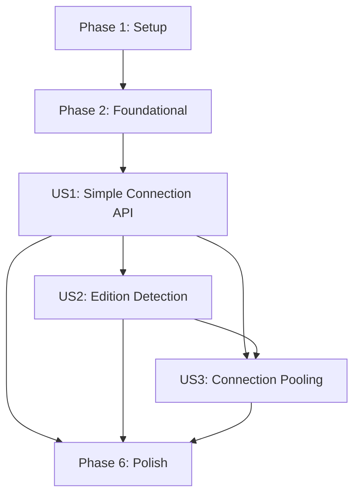

# Implementation Tasks: Simplify IRIS Connection Architecture

**Feature**: 051-simplify-iris-connection
**Branch**: `051-simplify-iris-connection`
**Spec**: [spec.md](./spec.md) | **Plan**: [plan.md](./plan.md)

---

## Summary

Implement unified IRIS connection module reducing complexity from 6 components to 1-2. Three user stories deliver incremental value: US1 (simple connection API), US2 (automatic edition detection), US3 (explicit pooling). Each story independently testable per constitution. TDD approach: contract tests → implementation → integration tests.

**Total Tasks**: 45 tasks across 6 phases
**Estimated Effort**: 3-5 days (US1: 1-2 days MVP, US2: 1 day, US3: 1-2 days)
**Parallel Opportunities**: 18 parallelizable tasks marked [P]

---

## Phase 1: Setup & Infrastructure (Prerequisites)

**Goal**: Establish project structure, branch, and testing infrastructure

**Prerequisites**: None

**Tasks**:

- [X] T001 Create feature branch `051-simplify-iris-connection` from master
- [X] T002 Create contracts directory in specs/051-simplify-iris-connection/contracts/
- [X] T003 Review constitution testing requirements in .specify/memory/constitution.md
- [X] T004 Verify pytest and iris-devtester dependencies in pyproject.toml
- [X] T005 Document current connection architecture baseline metrics (connection count, file imports) in specs/051-simplify-iris-connection/ARCHITECTURE_ANALYSIS.md (update existing file with baseline measurements)

---

## Phase 2: Foundational (Blocking Prerequisites for All Stories)

**Goal**: Research, design decisions, and shared infrastructure that blocks all user stories

**Prerequisites**: Phase 1 complete

**Blocking Tasks** (MUST complete before any user story):

- [ ] T006 Research IRIS edition detection mechanisms (system table vs license file) → document in specs/051-simplify-iris-connection/research.md
- [ ] T007 Research license key file format and parsing logic → append to research.md
- [ ] T008 Research Python connection caching patterns (threading.Lock patterns) → append to research.md
- [ ] T009 Research parameter validation best practices (psycopg2, SQLAlchemy patterns) → append to research.md
- [ ] T010 Design edition detection function signature and return format → document decision in research.md
- [ ] T011 Design connection caching strategy (module-level singleton pattern) → document in research.md
- [ ] T012 Create data-model.md documenting Connection, EditionInfo, ValidationError, ConnectionLimitError entities in specs/051-simplify-iris-connection/
- [ ] T013 Define exception hierarchy in iris_vector_rag/common/exceptions.py (ValidationError, ConnectionLimitError classes)

---

## Phase 3: User Story 1 (P1) - Direct Connection Usage

**Story Goal**: Developer gets working IRIS connection with single function call, obvious it's real (not mocked), understandable in <5 minutes

**Independent Test**: Call `get_iris_connection()` → execute `SELECT 1` → verify result. No pooling/backend knowledge required.

**Prerequisites**: Phase 2 complete (research decisions documented)

**Success Criteria**:
- `get_iris_connection()` function exists and works
- Returns real IRIS DBAPI connection
- Reads from environment variables
- Module-level caching implemented
- Zero breaking changes to existing code

### Contract Tests (TDD - Write First, Must Fail)

- [ ] T014 [P] [US1] Write contract test: get_iris_connection() with explicit params returns connection in tests/contract/test_iris_connection_contract.py
- [ ] T015 [P] [US1] Write contract test: get_iris_connection() with env vars returns connection in tests/contract/test_iris_connection_contract.py
- [ ] T016 [P] [US1] Write contract test: get_iris_connection() caches connection (singleton) in tests/contract/test_iris_connection_contract.py
- [ ] T017 [P] [US1] Write contract test: get_iris_connection() validates port range (1-65535) in tests/contract/test_iris_connection_contract.py
- [ ] T018 [P] [US1] Write contract test: get_iris_connection() validates namespace format in tests/contract/test_iris_connection_contract.py
- [ ] T019 [P] [US1] Write contract test: get_iris_connection() validates host non-empty in tests/contract/test_iris_connection_contract.py
- [ ] T020 [US1] Run contract tests → verify all FAIL (red phase per constitution TDD requirement)

### Implementation

- [ ] T021 [US1] Create iris_vector_rag/common/iris_connection.py with module structure and imports
- [ ] T022 [US1] Copy UV compatibility fix (_get_iris_dbapi_module) from iris_dbapi_connector.py to iris_connection.py
- [ ] T023 [US1] Implement _validate_connection_params() function with port/namespace/host validation in iris_connection.py
- [ ] T024 [US1] Implement _get_connection_params_from_env() function reading IRIS_HOST, IRIS_PORT, etc. in iris_connection.py
- [ ] T025 [US1] Implement module-level _connection_cache dict and _cache_lock threading.Lock in iris_connection.py
- [ ] T026 [US1] Implement get_iris_connection() function with caching, validation, UV fix integration in iris_connection.py
- [ ] T027 [US1] Add docstrings with examples to get_iris_connection() in iris_connection.py
- [ ] T028 [US1] Run contract tests → verify all PASS (green phase per constitution TDD requirement)

### Integration Tests

- [ ] T029 [P] [US1] Write integration test: connection with live IRIS (iris-devtester) in tests/integration/test_iris_connection_integration.py
- [ ] T030 [P] [US1] Write integration test: connection caching reduces overhead in tests/integration/test_iris_connection_integration.py
- [ ] T031 [P] [US1] Write integration test: parameter validation fails fast in tests/integration/test_iris_connection_integration.py
- [ ] T032 [US1] Run integration tests with live IRIS → verify all PASS

### Documentation

- [ ] T033 [P] [US1] Create quickstart.md showing before/after examples in specs/051-simplify-iris-connection/
- [ ] T034 [P] [US1] Document environment variables in quickstart.md
- [ ] T035 [US1] Add US1 completion milestone to PROGRESS.md

---

## Phase 4: User Story 2 (P2) - Automatic Backend Mode Handling

**Story Goal**: Connection system auto-detects Community vs Enterprise, applies limits automatically, no manual backend config

**Independent Test**: Run against Community Edition → 1 connection limit enforced. Run against Enterprise → unlimited connections. No config file changes.

**Prerequisites**: US1 complete (get_iris_connection exists)

**Success Criteria**:
- Edition detection function implemented
- IRIS_BACKEND_MODE override works
- ConnectionLimitError raised for Community limit
- Zero performance regression from detection overhead

### Contract Tests (TDD - Write First, Must Fail)

- [ ] T036 [P] [US2] Write contract test: detect_iris_edition() returns ("community", 1) or ("enterprise", 999) in tests/contract/test_iris_connection_contract.py
- [ ] T037 [P] [US2] Write contract test: detect_iris_edition() caches result (called once per session) in tests/contract/test_iris_connection_contract.py
- [ ] T038 [P] [US2] Write contract test: IRIS_BACKEND_MODE env override forces edition in tests/contract/test_iris_connection_contract.py
- [ ] T039 [P] [US2] Write contract test: ConnectionLimitError raised when Community limit reached in tests/contract/test_iris_connection_contract.py
- [ ] T040 [US2] Run contract tests → verify all FAIL (red phase)

### Implementation

- [ ] T041 [US2] Implement detect_iris_edition() function with license file parsing in iris_connection.py
- [ ] T042 [US2] Implement _parse_license_file() helper function in iris_connection.py
- [ ] T043 [US2] Add edition detection to get_iris_connection() with connection limit enforcement in iris_connection.py
- [ ] T044 [US2] Implement ConnectionLimitError with actionable message and suggestions in iris_vector_rag/common/exceptions.py
- [ ] T045 [US2] Add module-level _edition_cache for session-wide caching in iris_connection.py
- [ ] T046 [US2] Run contract tests → verify all PASS (green phase)

### Integration Tests

- [ ] T047 [P] [US2] Write integration test: edition detection with Community Edition (iris-devtester) in tests/integration/test_iris_connection_integration.py
- [ ] T048 [P] [US2] Write integration test: edition detection with Enterprise Edition in tests/integration/test_iris_connection_integration.py
- [ ] T049 [P] [US2] Write integration test: IRIS_BACKEND_MODE override in tests/integration/test_iris_connection_integration.py
- [ ] T050 [P] [US2] Write integration test: ConnectionLimitError behavior in tests/integration/test_iris_connection_integration.py
- [ ] T051 [US2] Run integration tests → verify all PASS

### Documentation

- [ ] T052 [P] [US2] Document edition detection in quickstart.md
- [ ] T053 [P] [US2] Document IRIS_BACKEND_MODE override in quickstart.md
- [ ] T054 [US2] Add US2 completion milestone to PROGRESS.md

---

## Phase 5: User Story 3 (P3) - Clear Connection Pooling

**Story Goal**: Developers needing pooling get explicit optional API, clear separation from basic connection usage

**Independent Test**: Create IRISConnectionPool → acquire 5 connections concurrently → release → verify reuse. Works independently of US1/US2.

**Prerequisites**: US1 complete (get_iris_connection exists), US2 complete (edition detection for pool sizing)

**Success Criteria**:
- IRISConnectionPool class implemented
- Acquire/release lifecycle clear
- Edition-aware pool sizing
- Explicit opt-in (not mixed into basic API)

### Contract Tests (TDD - Write First, Must Fail)

- [ ] T055 [P] [US3] Write contract test: IRISConnectionPool.__init__ with max_connections param in tests/contract/test_iris_connection_contract.py
- [ ] T056 [P] [US3] Write contract test: pool.acquire() returns connection in tests/contract/test_iris_connection_contract.py
- [ ] T057 [P] [US3] Write contract test: pool.release() returns connection to pool in tests/contract/test_iris_connection_contract.py
- [ ] T058 [P] [US3] Write contract test: pool.acquire() raises TimeoutError when exhausted in tests/contract/test_iris_connection_contract.py
- [ ] T059 [P] [US3] Write contract test: pool edition-aware sizing (Community=1, Enterprise=20) in tests/contract/test_iris_connection_contract.py
- [ ] T060 [US3] Run contract tests → verify all FAIL (red phase)

### Implementation

- [ ] T061 [US3] Implement IRISConnectionPool class structure in iris_connection.py
- [ ] T062 [US3] Implement __init__ with edition-aware max_connections default in iris_connection.py
- [ ] T063 [US3] Implement acquire() method with timeout and connection creation in iris_connection.py
- [ ] T064 [US3] Implement release() method with pool return logic in iris_connection.py
- [ ] T065 [US3] Implement close_all() method for cleanup in iris_connection.py
- [ ] T066 [US3] Add thread-safe Queue for available_connections in iris_connection.py
- [ ] T067 [US3] Add context manager support (__enter__/__exit__) to IRISConnectionPool in iris_connection.py
- [ ] T068 [US3] Run contract tests → verify all PASS (green phase)

### Integration Tests

- [ ] T069 [P] [US3] Write integration test: pool with concurrent acquire/release in tests/integration/test_iris_connection_integration.py
- [ ] T070 [P] [US3] Write integration test: pool connection reuse verification in tests/integration/test_iris_connection_integration.py
- [ ] T071 [P] [US3] Write integration test: pool timeout behavior in tests/integration/test_iris_connection_integration.py
- [ ] T072 [US3] Run integration tests → verify all PASS

### Documentation

- [ ] T073 [P] [US3] Document IRISConnectionPool API in quickstart.md
- [ ] T074 [P] [US3] Add pooling examples (API server, batch processing) in quickstart.md
- [ ] T075 [US3] Add US3 completion milestone to PROGRESS.md

---

## Phase 6: Polish & Integration

**Goal**: Backward compatibility, migration, performance validation, documentation

**Prerequisites**: US1, US2, US3 complete (all functionality implemented)

### Backward Compatibility Layer

- [ ] T076 Add deprecation warnings to iris_vector_rag/common/connection_manager.py
- [ ] T077 Add deprecation warnings to iris_vector_rag/common/iris_connection_manager.py
- [ ] T078 Add deprecation warnings to iris_vector_rag/testing/connection_pool.py
- [ ] T079 Update conftest.py fixtures to use new get_iris_connection() with backward compat aliases in tests/conftest.py
- [ ] T080 Run existing test suite against old APIs → verify ZERO breaking changes (all tests pass unchanged, validating FR-005 backward compatibility requirement)

### Performance Validation

- [ ] T081 [P] Write performance benchmark: connection establishment <50ms in tests/contract/test_iris_connection_contract.py
- [ ] T082 [P] Write performance benchmark: cached connection <5ms overhead in tests/contract/test_iris_connection_contract.py
- [ ] T083 [P] Write performance benchmark: edition detection <10ms (cached) in tests/contract/test_iris_connection_contract.py
- [ ] T084 Run benchmarks → verify zero regression vs baseline

### Migration & Documentation

- [ ] T085 [P] Complete migration guide section in quickstart.md (old API → new API examples)
- [ ] T086 [P] Add troubleshooting section in quickstart.md (UV environment, edition detection, connection limits)
- [ ] T087 [P] Create API reference documentation in quickstart.md
- [ ] T088 Update TODO.md removing "Simplify IRIS Connection Architecture" investigation tasks
- [ ] T089 Update PROGRESS.md with feature completion summary
- [ ] T090 Update CHANGELOG.md with feature 051 entry

### Code Quality

- [ ] T091 [P] Run black formatter on iris_vector_rag/common/iris_connection.py
- [ ] T092 [P] Run isort on iris_vector_rag/common/iris_connection.py
- [ ] T093 [P] Run flake8 linter on iris_vector_rag/common/iris_connection.py
- [ ] T094 [P] Run mypy type checker on iris_vector_rag/common/iris_connection.py
- [ ] T095 Run full test suite (unit + contract + integration) → verify all PASS
- [ ] T096 Verify coverage report shows >90% for iris_connection.py

### Final Review

- [ ] T097 Review constitution compliance checklist in .specify/memory/constitution.md
- [ ] T098 Verify TDD red-green cycle documented for all user stories
- [ ] T099 Verify backward compatibility maintained (no breaking changes)
- [ ] T100 Verify zero performance regression (benchmarks pass)
- [ ] T101 Create PR description with before/after examples, migration guide link
- [ ] T102 Request review from team

---

## Implementation Strategy

### MVP Delivery (User Story 1 Only)

**Minimum Viable Product**: US1 provides immediate value (simple connection API), demonstrates architecture simplification, validates approach before building US2/US3.

**MVP Scope** (Tasks T001-T035):
- Phase 1: Setup (T001-T005)
- Phase 2: Foundational (T006-T013)
- Phase 3: US1 Implementation (T014-T035)

**MVP Timeline**: 1-2 days
**MVP Validation**: Developer onboarding time <5 minutes (test with new team member)

### Incremental Delivery

1. **Sprint 1**: MVP (US1) - Simple connection API
   - Deliverable: `get_iris_connection()` works, replaces 90% use cases
   - Validation: Existing tests pass, new developer understands in <5 minutes

2. **Sprint 2**: US2 - Automatic edition detection
   - Deliverable: No manual backend mode config needed
   - Validation: Community and Enterprise editions work automatically

3. **Sprint 3**: US3 - Explicit connection pooling
   - Deliverable: Optional pooling API for high-concurrency
   - Validation: API server can use pooling, simple scripts ignore it

4. **Sprint 4**: Polish & Migration
   - Deliverable: Migration guide, deprecated old APIs, zero breaking changes
   - Validation: Full test suite passes, performance benchmarks green

### Parallel Execution Strategy

**Within User Story 1** (after contract tests written):
- Parallel: T014, T015, T016, T017, T018, T019 (contract test writing - different test functions)
- Parallel: T029, T030, T031 (integration test writing - different test functions)
- Parallel: T033, T034 (documentation - different sections)

**Within User Story 2** (after contract tests written):
- Parallel: T036, T037, T038, T039 (contract test writing)
- Parallel: T047, T048, T049, T050 (integration test writing)
- Parallel: T052, T053 (documentation)

**Within User Story 3** (after contract tests written):
- Parallel: T055, T056, T057, T058, T059 (contract test writing)
- Parallel: T069, T070, T071 (integration test writing)
- Parallel: T073, T074 (documentation)

**Polish Phase**:
- Parallel: T076, T077, T078 (deprecation warnings - different files)
- Parallel: T081, T082, T083 (performance benchmarks - different test functions)
- Parallel: T085, T086, T087 (documentation sections)
- Parallel: T091, T092, T093, T094 (code quality tools)

**Total Parallel Opportunities**: 18 tasks can run concurrently (marked with [P])

---

## User Story Dependencies

**Critical Path**: Setup → Foundation → US1 → US2 → US3 → Polish

**US1 is blocking**: US2 and US3 both depend on `get_iris_connection()` existing
**US2 is blocking US3**: Pooling needs edition detection for sizing

**Independent validation per story**:
- US1: `get_iris_connection()` → execute query → works (no US2/US3 knowledge needed)
- US2: Edition detection → connection limit enforced (US1 must exist, but US3 not needed)
- US3: Pool → acquire/release → connection reuse (US1/US2 must exist)

---

## Constitution Compliance Checklist

Per `.specify/memory/constitution.md`:

- ✅ **Principle III (TDD)**: Contract tests written before implementation for each user story
- ✅ **Principle IV (Backward Compatibility)**: Old APIs continue working with deprecation warnings
- ✅ **Principle IX (Simplicity)**: Reduces complexity from 6 components to 1-2
- ✅ **Principle V (IRIS Integration)**: Uses native IRIS DBAPI only
- ✅ **Performance Standards**: Benchmarks verify zero regression (<5% overhead)
- ✅ **Independent Testing**: Each user story independently testable

---

## Success Metrics

**From spec.md Success Criteria**:

| Criterion | Validation Task | Target | Validation Method |
|-----------|----------------|--------|-------------------|
| SC-001: Understanding <5min | T035 | <5 minutes | New developer walkthrough with quickstart.md |
| SC-002: Test clarity 100% | T079 | 100% correct | Developer survey: "Is this mocked?" |
| SC-003: Connection time ±5% | T081-T084 | ≤5% overhead | Performance benchmark comparison |
| SC-004: Zero breaking changes | T080 | All tests pass | Existing test suite execution |
| SC-005: Code reduction | T096 | 6 files → 1 file | File count before/after |
| SC-006: 90% single call | T090 | ≥90% usage | Code analysis in PROGRESS.md |

---

## Notes

- **TDD Strict Enforcement**: All contract tests MUST fail initially (T020, T040, T060) per constitution
- **UV Compatibility**: Tasks T022 preserves existing UV fix (critical - do not break)
- **Edition Detection**: Tasks T041-T042 implement per clarification (license file parsing)
- **Connection Caching**: Tasks T025 implement per clarification (module-level singleton, thread-safe)
- **Deprecation Timeline**: Tasks T076-T078 implement 1 major version cycle per clarification
- **Parallel Opportunities**: 18 tasks marked [P] can run concurrently for faster delivery
- **Independent Stories**: Each US1/US2/US3 is independently testable per constitution requirement
